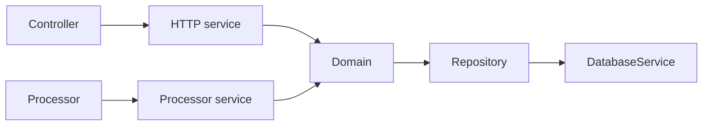

# Project Structure Documentation

## Overview

- A feature module that persists data holds a repository layer. `analytic`, `auth`, `health`, `hello`, and `onboarding` have none (see [Modules](#modules)).
- Layout is one folder per feature under `src/modules/`.

## Table of Contents

- [Overview](#overview)
- [Structure](#structure)
- [App Module](#app-module)
- [Common Module](#common-module)
- [Configs](#configs)
- [Languages](#languages)
- [Migration](#migration)
- [Queues](#queues)
- [Router](#router)
- [Instrument](#instrument)
- [Migration Entrypoint](#migration-entrypoint)
- [Modules](#modules)
- [Other Modules](#other-modules)
    - [Folders](#folders)
    - [Files](#files)

## Structure

Below is an overview of the main project structure:

```
src
  ├── app
  ├── common
  ├── configs
  ├── generated
  ├── languages
  ├── migration
  ├── modules
  ├── router
  ├── queues
  ├── configure.ts
  ├── instrument.ts
  ├── main.ts
  ├── migration.ts
  └── swagger.ts
```

`src/generated/` is written by `pnpm generate` and not tracked by git:

- `prisma-client/` (the Prisma client, from `pnpm db:generate`)
- `package/package.ts` (the `version`, `author`, and `repository` fields of `package.json`, from `pnpm generate:package`)

Application code imports both through the `@generated/*` alias.

The project is native ESM (`"type": "module"`, `module: nodenext`, `verbatimModuleSyntax`).

Every import between `src/` folders goes through a `tsconfig.json` path alias:

- `@app/*`, `@common/*`, `@configs/*`, `@modules/*`, `@router/*`, `@migration/*`, `@queues/*`, `@generated/*`
- plus `@configure`, `@instrument`, `@swagger`, `@main`, and `@migration` for the root files

## App Module

**Location:** `src/app/app.module.ts`

The App Module is the root module. It:

- Imports `CommonModule` (shared infrastructure and global feature modules) and the project's own `RouterModule` from `src/router/router.module.ts` (HTTP route mounting and the queue processor mount)
- Registers four global exception filters: general, HTTP, validation, and import validation

## Common Module

**Location:** `src/common/common.module.ts`

CommonModule registers shared infrastructure and the global feature modules. Its `imports` array holds three groups, in this order:

- **Infrastructure:** `ConfigModule` (loading `src/configs/index.ts`), `MessageModule`, `LoggerModule`, `SentryModule` (which exports `SentryService`), `RedisCacheModule`, `QueueModule` (the BullMQ producer and processor connections), `CacheMainModule`, `DatabaseModule`, `RequestModule`, and `ResponseModule`
- **Shared utilities:** `HelperModule`, `PaginationModule`, `FileModule`, and `FirebaseModule`
- **The `@Global()` feature domains:** `ActivityLogDomainModule`, `ApiKeyDomainModule`, `AuthDomainModule`, `FeatureFlagDomainModule`, `RoleDomainModule`, `PolicyDomainModule`, `TermPolicyDomainModule`, `SessionDomainModule`, and `NotificationDomainModule`

## Configs

**Location:** `src/configs/`

Typed `registerAs` files:

- `src/configs/index.ts` loads every `*.config.ts` in that folder into `ConfigModule`.
- Each file maps the env vars and literal settings of its concern.
- `AppEnvSchema` (`src/app/dtos/app.env.dto.ts`) validates the env vars.

The catalog is [Configuration](configuration.md).

## Languages

**Location:** `src/languages/`

i18n JSON, one folder per locale. It contains:

- Subfolders for each supported language (e.g., `en/` for English)
- JSON files for each domain or feature (e.g., `user.json`, `auth.json`, `policy.json`) containing translation strings and messages

## Migration

**Location:** `src/migration/`

The migration folder seeds initial data.

MongoDB has no migration files. `pnpm db:migrate` (`prisma db push`) applies the schema shape.

It includes:

- `migration.module.ts`: registers every seed command as a provider
- Subfolders for migration bases, data, enums, interfaces, and seeds

Seed commands:

- Eight commands populate the reference and bootstrap rows an empty database needs, and `pnpm migration:seed` bundles them:
    - api keys
    - countries
    - feature flags
    - roles
    - policies
    - term policies
    - users
    - workspaces
- Three on-demand commands sit outside `pnpm migration:seed`:
    - `awsS3Config`: S3 bucket setup (see [Third Party Integration](third-party-integration.md#bucket-setup))
    - `templateEmailNotification`: see [Email](email.md)
    - `templateTermPolicy`: see [Term Policy](term-policy.md#migration--seeding)

## Queues

**Location:** `src/queues/`

The queues folder is the BullMQ framework layer. It includes:

- `queue.module.ts`: `QueueModule.forRoot()` holds the two BullMQ root connections (producer and processor)
- Subfolders for queue bases, constants, decorators, enums, exceptions, interfaces

Named queues:

- The owning feature's `<feature>.domain.module.ts` registers each one through a `RegisterQueueOptionsFactory`.
- `queue.config.ts` supplies the per-queue job defaults.
- Processor classes live in their owning feature module (`<module>/processors/`), wired by that module's `<feature>.processor.module.ts`.
- Jobs are immediate, delayed, or recurring.

## Router

**Location:** `src/router/`

The router folder mounts everything the application exposes. It includes:

- `router.module.ts`: the project's `RouterModule`. It imports the five access-level modules, registers their path prefixes through `RouterModule.register` from `@nestjs/core` (imported there as `NestJsRouterModule`, a different class), and mounts the processor module.
- `http/`: one module per access level, each holding its controllers, the `<feature>.http.module.ts` imports they need, and the `<feature>.domain.module.ts` of each non-`@Global()` feature whose domains the guards on its controllers inject:
    - `router.http.public.module.ts` mounts under `/public`
    - `router.http.system.module.ts` mounts under `/system`
    - `router.http.admin.module.ts` mounts under `/admin`
    - `router.http.user.module.ts` mounts under `/user`
    - `router.http.shared.module.ts` mounts under `/shared`
- `processor/router.processor.module.ts`: aggregates every `<feature>.processor.module.ts`, so the BullMQ workers boot with the HTTP application.

## Instrument

**Location:** `src/instrument.ts`

The instrument file configures Sentry.

It loads before the application code, so Sentry is initialized before anything else:

- The start scripts load it through `node --import ./dist/instrument.js`.
- `src/main.ts` imports it with `import '@instrument'` at the top.

The file:

- Initializes Sentry only when `SENTRY_DSN` is set, with the environment and the release version.
- Sets the sampling rates for traces and profiles from `logger.sentry`.
    - The `*Production` rates apply in production.
    - They are lower than the rates every other environment uses.
- `beforeSend` drops these events:
    - non-fatal `QueueException` events
    - requests to the `logger.excludedRoutes` config list (health, docs, hello, metrics, favicon, root)
    - responses with status below 500
    - events at `info` or `debug`
- Forwards Pino logs to Sentry Logs through `Sentry.pinoIntegration`: `warn`, `error`, and `fatal` in production, all levels elsewhere.
- Excludes the same noise routes from traces in `tracesSampler`.
- Scrubs every outgoing event, transaction, breadcrumb, and log (`beforeSend`, `beforeSendTransaction`, `beforeBreadcrumb`, `beforeSendLog`). See [Logger](logger.md):
    - URLs are masked
    - query strings are dropped
    - sensitive headers, cookies, and body fields are redacted
- Sets maximum breadcrumbs (30), value lengths, and the stack trace attachment policy.
- Sends no default PII (`sendDefaultPii: false`).

## Migration Entrypoint

**Location:** `src/migration.ts`

The migration file is the nest-commander entry point, which boots `MigrationModule` and runs seed commands.

- Creates a NestJS application context for CLI commands
- Logs through Pino
- Runs the named seed command, then closes the process
- Invoked as `pnpm migration` followed by the command name
- Wraps an error that is not an `AppBaseException` as `AppUnknownException` with the description `Running the migration command failed`
- Logs a failure at `fatal`, reports it to Sentry, and exits with code 1

## Modules

**Location:** `src/modules/`

One folder per feature:

- A request travels Controller to HTTP service to Domain to Repository.
- A job travels Processor to processor service to Domain.
- Lookup tables live under `contracts/` (`*.contract.ts`).


```mermaid
flowchart LR
    C[Controller] --> HS[HTTP service]
    HS --> D[Domain]
    D --> R[Repository]
    P[Processor] --> PS[Processor service]
    PS --> D
    R --> DB[DatabaseService]
```

**Feature modules:**

```
modules
  ├── activity-log
  ├── analytic
  ├── api-key
  ├── auth
  ├── country
  ├── device
  ├── feature-flag
  ├── health
  ├── hello
  ├── notification
  ├── onboarding
  ├── password-history
  ├── policy
  ├── project
  ├── role
  ├── session
  ├── term-policy
  ├── user
  └── workspace
```

`analytic`:

- It orchestrates live metrics through owner `*AnalyticDomain` / `*AnalyticRepository` siblings (for example `user.analytic.domain.ts` with `user.analytic.repository.ts`).
- It has no repository module of its own.
- See [Analytic](analytic.md).

`onboarding`:

- It holds `OnboardingDomain`, the cross-module sequences that create a user together with its workspace.
- Its methods are `signUp`, `loginWithSocial`, `createByAdmin`, and `importByAdmin`.
- Each one prepares the input through the user domains, commits through `WorkspaceDomain.commitOnboarding`, and notifies the created users.
- It has a domain module only, `OnboardingDomainModule`, which `UserHttpModule` imports. It owns no repository, HTTP, or processor layer.

**Per-layer Nest modules:**

Each layer of a feature gets its own Nest module file at the root of the feature folder. Only the files with something to provide exist:

```
modules/<feature>
  ├── <feature>.repository.module.ts  # repositories
  ├── <feature>.domain.module.ts      # domains, utils, caches, queue classes and factories
  │                                   #   (the only one another feature consumes)
  ├── <feature>.http.module.ts        # HTTP services, imported by a router http module
  └── <feature>.processor.module.ts   # processors and their processor services
```

- `<feature>.domain.module.ts` is present for every feature.
- `<feature>.processor.module.ts` exists only in `notification` and `workspace`, the two features with background jobs.
- `analytic`, `auth`, `health`, `hello`, and `onboarding` have no repository module.
- `auth` and `onboarding` have no HTTP module either.
- A `<feature>.http.module.ts` exports its HTTP services only, never a domain module.

**Folders:**

Each module includes only the folders its feature needs.

The folders fall into three tiers:

```
module
  # Core (present in almost every module)
  ├── constants
  ├── controllers
  ├── domains
  ├── dtos
  ├── enums
  ├── exceptions
  ├── interfaces
  ├── repositories
  ├── services
  ├── utils
  # Common (present when the feature needs them)
  ├── caches
  ├── decorators
  ├── guards
  # Specialized (a few modules only)
  ├── contracts
  ├── factories
  ├── indicators
  ├── interceptors
  ├── processors
  ├── queues
  └── templates
```

### Constants

Defines static values and configuration constants used throughout the module.

### Contracts

Static rule maps the module reads at runtime:

- One file per concept, named `<module>.<concept>.contract.ts` and exported with `@public`.
- A contract fixes what an enum member means for the feature.

Examples:

- `NotificationKindContract` holds the type, priority, i18n keys, and channels of each notification kind.
- `ActivityLogActionContract` holds the user and workspace resolution and the metadata schema of each action.
- `FileExtensionContract` holds the sniffed types each upload extension accepts.

Coverage skips `src/**/*.contract.ts` (`vitest.config.ts`).

### Controllers

- Controllers handle incoming HTTP requests, delegate to HTTP services, and return responses.
- Controllers define the API endpoints for the module.

### Decorators

- Custom decorators add metadata or modify behavior of classes, methods, or properties within the module.
- OpenAPI for auth and guard kits lives on `*Protected` / auth decorators here.
- Operation metadata and response envelopes live on `@Doc` and `@Response*` from `src/common/`.

### DTOs (Data Transfer Objects)

- Zod schemas define the shape of data sent and received on API endpoints, each paired with the type inferred from it.
- One `*.dto.ts` file holds one schema.

### Enums

Type-safe enumerations for status codes, types, or other fixed sets of values relevant to the module's domain.

### Exceptions

- Dedicated exception classes, one per error, each extending `AppBaseException`, or `AppUnknownException` for a runtime error outside a request.
- Files are named `<module>.<kebab-error>.exception.ts` (e.g., `user.not-found.exception.ts`).

### Factories

Factory classes or functions for creating instances of complex objects or aggregating dependencies.

### Indicators

Health-check indicators that report the status of a dependency or subsystem (used by the health module).

### Guards

- Authorization and access control logic, protecting routes and resources based on user roles or permissions.
- A guard that depends on the store entry of an earlier guard checks it when the request arrives and throws the guard-missing exception of that subject (for example `user.guard-missing.exception.ts`, or `workspace.member-guard-missing.exception.ts` for a member row).
- The identity subjects answer 401 and every other subject answers 403. See [Security and Middleware](security-and-middleware.md#guard-prerequisites).

### Interfaces

- TypeScript interfaces cover data shapes and repository contracts (`*.repository.interface.ts`).
- Services, domains, and utils are injected as classes and carry no header interface.

### Interceptors

Logic to intercept and modify requests or responses, such as logging, caching, or response transformation.

### Processors

Background job handlers, such as BullMQ processors, for asynchronous tasks related to the module.

### Queues

- The `@Injectable()` classes hold the BullMQ `Queue`, one method per job the feature enqueues.
- `<feature>.domain.module.ts` provides and exports them.

### Repositories

Implements the Repository design pattern for data access, abstracting database operations and providing a clean API for domains.

### Domains

- Domains hold the business logic and orchestration of the module.
- Domains interact with repositories, other domains, utils, and queue classes.
- Domains open `DatabaseService.withTransaction` when a write spans more than one repository.

### Services

HTTP services (`*.http.service.ts`) and processor services (`*.processor.service.ts`):

- They translate transport or job payloads into domain calls.
- They assemble response DTOs.
- They own no business rule and reach no repository.

### Caches

Dedicated cache classes that wrap a named cache provider for one feature concern (for example `SessionCache`, `FeatureFlagCache`).

### Templates

Reusable templates, such as email templates or message formats, used by the module.

### Utils

- Utils are pure shaping helpers specific to the module: mappers, predicates, and format checks.
- A util reaches no cache, repository, queue, request store, or file service.
- Work that needs one of those lives in a domain.

## Other Modules

Below are explanations for the root folders and files outside `src/`:

### Folders

- **.github/**: GitHub-specific configuration: Actions workflows, issue and pull request templates, and Dependabot settings.
    - `.github/workflows/test-unit.yml` runs `NODE_ENV=test pnpm test` on `workflow_dispatch`.
    - `.github/workflows/test-integration.yml` and `test-e2e.yml` run `pnpm test:integration` and `pnpm test:e2e` on `workflow_dispatch`. `package.json` defines neither script, so both fail.
    - `.github/workflows/linter.yml` runs on `pull_request` and `workflow_dispatch`.
    - The three `release-with-*.yml` workflows build `ci/dockerfile.production` and deploy it, as described in [Release](release.md).
    - Dependabot bumps the production Dockerfile and `ci/docker-compose.production.yml` within the current major version.
- **.husky/**: Git hooks.
    - `pre-commit` runs `pnpm lint:staged`, `pnpm typecheck`, `pnpm deadcode`, `pnpm spell`, and `NODE_ENV=test pnpm test`.
    - `commit-msg` runs commitlint.
- **.vscode/**: Shared editor settings, tasks, launch configurations, and recommended extensions.
- **ci/**: production and shared infrastructure files. The development image is the root `dockerfile`.
    - `dockerfile.production`: the production image
    - `docker-compose.production.yml`: the production Compose file
    - `jwks-server/`: the JWKS server nginx config
    - `mongo/entrypoint.sh`: the MongoDB replica-set entrypoint, shared by both Compose files
    - `vault/`: the Vault bootstrap scripts and policies
- **docs/**: Project documentation, including architecture, features, and usage guides.
- **generated/**: Auto-generated output, not tracked by git.
    - the Swagger JSON (`swagger.json`)
    - the Vault init material (`vault/`)
    - The Prisma client lives in `src/generated/` (see [Structure](#structure)).
- **coverage/**: Vitest coverage output from `pnpm test:cov`. Not tracked by git.
- **.vitest/**: A Vitest report directory. No reporter in `vitest.config.ts` writes to it.
    - Git, Docker, Prettier, ESLint, and cspell ignore it.
    - `tsconfig.json` and `tsconfig.build.json` list it in `exclude`.
- **node_modules/.vitest-cache**: Holds the `fsModuleCache` transforms.
- **keys/**: Everything `pnpm generate:secret` writes. Not tracked by git.
    - the JWT key pairs
    - the JWKS files
    - `encryption-secret.env`
    - the MongoDB keyfile `mongo-keyfile`
- **logs/**: Directory for application logs. Not tracked by git.
- **prisma/**: Contains `schema.prisma`, the single source of truth for the database schema. MongoDB has no migration files.
- **scripts/**: Node runs both scripts directly as TypeScript.
    - `generate-secret.ts` writes the JWT keys, JWKS, encryption secrets, and the MongoDB keyfile (`pnpm generate:secret`).
    - `generate-package.ts` writes `src/generated/package/package.ts` (`pnpm generate:package`).
- **test/**: The Vitest spec tree.
    - `test/` holds `unit/` and `helpers/`. The integration and e2e suites are held, so no folder exists for them.
    - `test/unit/` holds the unit specs.
        - They mirror `src/` (`test/unit/app/`, `test/unit/common/`, `test/unit/modules/`, `test/unit/queues/`).
        - Unit-only helpers sit in `test/unit/helpers/`.
        - A unit spec tests one class with its collaborators doubled.
    - `test/helpers/test.logger.helper.ts` is the `setupFiles` entry.
        - It mutes Nest `Logger` and `ConsoleLogger` by assigning no-ops onto instance and static methods.
        - Specs do not spy loggers or `console`.
    - `pnpm test` is `TZ=UTC vitest run --project unit` and does not collect coverage.
        - `pnpm test:cov` adds `--coverage`, which is when the 100% thresholds apply.
        - `coverage.enabled` is `false` in `vitest.config.ts`.
    - Controllers, processors, repositories, contracts, modules, enums, interfaces, and constants sit outside the coverage set. The doc kit in `src/common/doc/` is in it.
    - `pre-commit` and CI (`.github/workflows/test-unit.yml`, `workflow_dispatch`) run `NODE_ENV=test pnpm test`.
    - `testTimeout` is 5000ms.

### Files

- **.commitlintrc**: Configuration for commit message linting to enforce commit standards.
- **.dockerignore**: Specifies files and directories to exclude from Docker builds.
- **.env.example**: Example environment variable file for reference and onboarding. `.env` itself is not tracked by git.
- **.gitignore**: Specifies files and directories to exclude from Git version control.
- **.npmrc**: Package manager settings (`engine-strict = true`, so the `engines` versions are enforced on install).
- **.prettierignore**: Specifies files and directories to exclude from Prettier formatting.
- **.prettierrc**: Configuration for Prettier code formatter.
- **.swcrc**: Configuration for SWC JavaScript/TypeScript compiler.
- **cspell.json**: Configuration for code spell checking to maintain code quality and consistency.
- **docker-compose.yml**: Docker Compose configuration for local development: MongoDB replica set, Redis, BullBoard, and the JWKS server, with the `apis` and `vault` profiles. Production uses `ci/docker-compose.production.yml`.
- **dockerfile**: The development image behind the `apis` profile of `docker-compose.yml`.
- **eslint.config.mjs**: ESLint flat configuration.
    - It ignores `docs/`, `.github/`, `.husky/`, `generated/`, and `src/generated/`.
    - The groups below cover `src/` unless a group names another tree.
    - **Plugins**
        - `typescript-eslint` recommended rules
        - `eslint-plugin-security`, with every recommended rule at `error`
        - `security/detect-object-injection` is off
    - **General**
        - `@typescript-eslint/no-explicit-any`, explicit function return types, and explicit module boundary types are errors.
        - `eqeqeq` (with `null` allowed), `curly`, `prefer-const`, and `no-var` are errors.
        - `no-console` warns.
        - ESLint directive comments are rejected in `src/`, `test/`, `scripts/`, and `vitest.config.ts` (`noInlineConfig`).
        - A nullish default uses `??` (`@typescript-eslint/prefer-nullish-coalescing`).
    - **Import bans**
        - `crypto-js`
        - a bare `'crypto'` import (use `node:crypto`)
        - `lodash` (use named `lodash-es` imports)
        - a default `lodash-es` import (use named imports)
        - `@generated/prisma-client/internal`
        - a relative import path (use a `tsconfig.json` path alias)
    - **Import layout**
        - The import block ends with one blank line and holds none between imports (`padding-line-between-statements`).
        - `sort-imports` orders the members inside one import.
    - **Member ordering**
        - Private methods come before protected methods, which come before public methods, all under the constructor.
    - **Naming convention** (`@typescript-eslint/naming-convention`)
        - camelCase by default
        - PascalCase for types
        - an `I` prefix on interfaces
        - an `Enum` prefix on enum names
        - camelCase enum members
    - **The `this`-call rule**
        - A `this.`-rooted call is assigned to a `const` before the code uses its value.
        - The rule covers these positions: a call or `new` argument, a condition, a ternary branch, an object property value, an operand of a unary, logical, or binary expression, a template literal, a spread, a member access, a thrown value, a `for...of` iterable, and a computed property key.
    - **Strings and promises**
        - String concatenation goes through a template literal.
        - An awaited promise is guarded by try/catch, not `.then()` or `.catch()`.
    - **The `undefined` ban**
        - A literal `undefined` as a return value, a `??` fallback, a ternary branch, or an arrow body is rejected in `src/`, so the code writes `null`.
    - **Comments**
        - Warning markers are banned: `note`, `xxx`, `hack`, and JSDoc-style tags.
        - Inline comments are banned.
    - **`Date`, `process.env`, `Math.random`, and sort direction**
        - `new Date()` is banned in favor of `HelperDateService`.
        - `process.env` is banned in favor of `ConfigService`. The `ts/env-boundary` block lifts it for `src/configs/**`, `src/main.ts`, `src/instrument.ts`, and `src/queues/decorators/queue.decorator.ts`.
        - `Math.random` is banned in `src/` and `test/`, the env boundary included.
        - An `'asc'` or `'desc'` string literal is banned. An enum member declaring the value is exempt.
    - **Specs** (`test/**/*.ts`)
        - `fn.mock.*` access is banned. Assertions use `toHaveBeenCalledWith` and related matchers.
        - `vi.clearAllMocks` is banned. `beforeEach` uses `vi.resetAllMocks`.
        - A `class` declaration is banned.
        - `@ts-expect-error`, `@ts-ignore`, and `@ts-nocheck` are banned.
        - A relative import is banned.
        - The `crypto-js`, bare `crypto`, `lodash`, default `lodash-es`, and `@generated/prisma-client/internal` import bans of `src/` apply here too.
        - A `*.spec.ts` declares no function. A helper goes to a `helpers/` folder under `test/`.
        - A `*.spec.ts` stores no function in a variable.
        - A `*.spec.ts` writes an arrow only as a direct argument to `describe`, `it`, a hook, `expect`, or a `vi` mock.
- **knip.json**: The `pnpm deadcode` configuration.
    - Entries are `src/main.ts`, `src/migration.ts`, `src/instrument.ts`, and `scripts/*.ts`.
    - Unused files, exports, types, enum members, and dependencies report as warnings.
    - Every other knip rule (unlisted or unresolved imports, unlisted binaries, duplicate exports) is an error.
- **nest-cli.json**: Configuration for NestJS CLI, defining project structure and build options.
- **package.json**: Node.js project manifest, listing dependencies, scripts, and metadata.
- **pnpm-lock.yaml**: pnpm lockfile.
- **pnpm-workspace.yaml**: pnpm settings for this single-package repo.
    - `allowBuilds` lists the packages permitted to run install scripts, for example `prisma` and `@swc/core`.
    - `minimumReleaseAgeExclude` lists the packages exempted from the minimum release-age hold.
- **tsconfig.json**: TypeScript configuration read by `pnpm typecheck` (`tsc --noEmit`), by knip, by Vitest (`resolve.tsconfigPaths`), and by the editor.
    - It runs `strict` with `exactOptionalPropertyTypes` and `noUncheckedIndexedAccess`.
    - It targets native ESM: `module` and `moduleResolution` are `nodenext`, with `verbatimModuleSyntax` and `isolatedModules`.
    - `include` covers `src/**/*`, `test/**/*`, `scripts/**/*`, and `vitest.config.ts`.
    - `exclude` includes `.vitest`.
    - Path aliases: `@app/*`, `@common/*`, `@configs/*`, `@modules/*`, `@router/*`, `@migration/*`, `@queues/*`, `@test/*`, `@generated/*`, `@instrument`, `@swagger`, `@main`, `@migration`.
- **tsconfig.build.json**: The build-time TypeScript configuration, which `nest build` and `nest start` read because `nest-cli.json` names it under `compilerOptions.tsConfigPath`.
    - It extends `tsconfig.json`.
    - It narrows `include` to `src/**/*`.
    - It excludes `test`, `scripts`, and `.vitest`.
- **vitest.config.ts**: The Vitest configuration behind `pnpm test` and `pnpm test:cov`.
    - SWC compiles through `unplugin-swc`.
    - The tsconfig path aliases resolve.
    - `passWithNoTests` is `true`.
    - One project, `unit`, runs `test/unit/**/*.spec.ts` with these settings:
        - `test/helpers/test.logger.helper.ts` as `setupFiles`
        - `isolate: false`, so workers are reused across files
        - `pool` unset, so Vitest uses `forks`
        - `fsModuleCache: true` (transforms persist under `node_modules/.vitest-cache`)
        - `testTimeout` of 5000ms
    - Coverage is v8 over `src/**/*.ts` with a 100% threshold on branches, functions, lines, and statements.
    - Coverage excludes modules, enums, interfaces, constants, contracts, controllers, processors, repositories, `src/generated`, `src/migration`, `src/router`, `src/configs`, `src/languages`, and the root files. The doc kit in `src/common/doc/` is in the coverage set.
    - Coverage collection is off unless `--coverage` is passed.
- **README.md**: Project introduction, feature list, and entry point to the documentation.
- **CONTRIBUTING.md**: Contribution workflow and standards.
- **CODE_OF_CONDUCT.md**: Community code of conduct.
- **SECURITY.md**: Supported versions and vulnerability reporting process.
- **LICENSE.md**: Project license.
