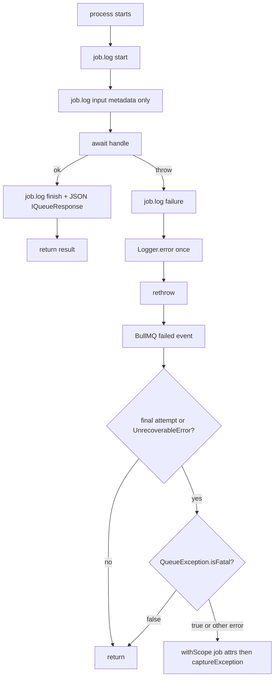

# Queue Documentation

The BullMQ framework layer lives in `src/queues`. Named queues are registered by the owning feature.

## Overview

Background jobs run on [BullMQ][ref-bullmq] with [Redis][ref-redis].

Config lives in two files:

- `src/configs/redis.config.ts`: queue Redis connection settings
- `src/configs/queue.config.ts`: job defaults (attempts, backoff, `keepLogs`, retention age)

Code lives in two places:

- `src/queues`: BullMQ framework layer (enums, decorator, base class, queue registration)
- owning feature modules: enqueue classes and processors; the router mounts the processors

## Related Documents

- [Configuration][ref-doc-configuration] - Queue Redis and BullMQ config keys
- [Environment][ref-doc-environment] - `QUEUE_REDIS_URL` and related vars
- [Notification][ref-doc-notification] - Notification queue consumers
- [Installation][ref-doc-installation] - Local Redis and BullBoard via Compose

## Table of Contents

- [Overview](#overview)
- [Related Documents](#related-documents)
- [Configuration](#configuration)
- [Queue Structure](#queue-structure)
- [Available Queues](#available-queues)
- [Usage](#usage)
  - [Adding Jobs to Queue](#adding-jobs-to-queue)
  - [Job Options](#job-options)
- [Creating New Queue](#creating-new-queue)
- [Creating New Processor](#creating-new-processor)
- [QueueProcessorBase](#queueprocessorbase)
  - [Implementation](#implementation)
  - [Behavior](#behavior)
- [QueueException](#queueexception)
  - [Usage](#usage-1)
  - [Properties](#properties)
  - [Behavior](#behavior-1)
- [Bull Board Dashboard](#bull-board-dashboard)

## Configuration

Redis connection for queues is managed in `src/configs/redis.config.ts`:

```typescript
// the queue half of IConfigRedis; the other half is `cache`
queue: {
    url: string;
    namespace: string;
};
```

Job defaults (attempts, backoff delays, `keepLogs`, completed and failed retention age) are in `src/configs/queue.config.ts`. `QueueModule.forRoot()` (`src/queues/queue.module.ts`) applies shared connection defaults; each named queue's owning feature sets its own backoff and `keepLogs` through a `RegisterQueueOptionsFactory` on that feature's domain module.

Environment variables:
- `QUEUE_REDIS_URL`: Redis connection URL (default: `redis://localhost:6379/1`). Queues live on Redis database `1`; the cache uses database `0` through `CACHE_REDIS_URL`
- `APP_NAME`: Application name for connection naming
- `APP_ENV`: Application environment for connection naming

## Queue Structure

The queue system consists of:

1. **Queue Module** (`src/queues/queue.module.ts`): `QueueModule.forRoot()` registers the two BullMQ Redis connections (producer and processor). It does not register named queues.
2. **Queue Processor Base** (`src/queues/bases/queue.processor.base.ts`): concrete `process` template (`job.log`, await `handle`, Nest `Logger.error` on failure), fatal-gate `onFailed` with Sentry `withScope`
3. **Queue Processor Decorator** (`src/queues/decorators/queue.decorator.ts`): Custom decorator for processor registration
4. **Queue Constants** (`src/queues/constants/queue.constant.ts`): `QueueConfigKey` and `QueueProcessorConfigKey`
5. **Queue Enums, Exception, Interface** (`src/queues/enums/queue.enum.ts`, `exceptions/queue.exception.ts`, `interfaces/queue.interface.ts`): `EnumQueue` and `EnumQueuePriority`, `QueueException`, `IQueueResponse`

**An enqueue lives in a queue class, never in a util or a service.** Path: `<feature>/queues/<feature>[.<concern>].queue.ts`. The class is `@Injectable()`, injects the BullMQ `Queue` with `@InjectQueue`, and the feature's `<feature>.domain.module.ts` both provides and exports it:

| Class | From |
|---|---|
| `NotificationQueue` | `NotificationDomainModule` |
| `NotificationEmailQueue` | `NotificationDomainModule` |
| `NotificationPushQueue` | `NotificationDomainModule` |
| `WorkspaceQueue` | `WorkspaceDomainModule` |

A caller in another module injects the exported class rather than the `Queue` itself.

Named queues are registered on the owning feature's domain module with `BullModule.registerQueueAsync({ name, configKey: QueueConfigKey, useClass: <Feature>[<Concern>]QueueFactory })`. The factory lives at `factories/<module>[.<concern>].queue.factory.ts` and sets that queue's job defaults.

Processors are not registered inside `src/queues`. Each one is a provider of its own feature's `<feature>.processor.module.ts` (`NotificationProcessorModule`, `WorkspaceProcessorModule`), and `RouterProcessorModule` (`src/router/processor/router.processor.module.ts`) imports every one of them. `RouterModule` imports `RouterProcessorModule` alongside the five HTTP route modules, so booting the API boots the workers in the same process.

Producers and workers do not share one connection. `queue.module.ts` calls `BullModule.forRootAsync` twice: once under `QueueConfigKey` for the producer side (connection name `{APP_NAME}-{APP_ENV}:queue`) and once under `QueueProcessorConfigKey` for the worker side (connection name `{APP_NAME}-{APP_ENV}:processor`). Both use `redis.queue.url` and the queue Redis namespace as prefix. A named queue registers with `configKey: QueueConfigKey`; the `@QueueProcessor` decorator binds `QueueProcessorConfigKey` itself.

## Available Queues

Currently available queues defined in `src/queues/enums/queue.enum.ts`:

- `EnumQueue.notification`: General notification processing queue
- `EnumQueue.notificationEmail`: Email notification processing queue
- `EnumQueue.notificationPush`: Push notification processing queue
- `EnumQueue.workspace`: Workspace background processing queue

Queue priorities defined in `EnumQueuePriority`:
- `high`: 1
- `medium`: 5
- `low`: 10

## Usage

### Adding Jobs to Queue

The queue class is the only place that holds a BullMQ `Queue`, and it exposes one method per job it enqueues:

```typescript
@Injectable()
export class NotificationPushQueue {
    private readonly dedupTtlInMs: number;

    constructor(
        @InjectQueue(EnumQueue.notificationPush)
        private readonly notificationPushQueue: Queue,
        private readonly configService: ConfigService
    ) {
        this.dedupTtlInMs = this.configService.get<number>(
            'notification.dedupTtlInMs'
        )!;
    }

    async sendNewDeviceLogin(
        sendPayload: INotificationSendPushPayload,
        data: INotificationNewDeviceLoginPayload
    ): Promise<void> {
        const payload: INotificationPushQueuePayload<INotificationNewDeviceLoginPayload> =
            {
                send: sendPayload,
                data,
            };

        await this.notificationPushQueue.add(
            EnumNotificationPushProcess.newDeviceLogin,
            payload,
            {
                priority: EnumQueuePriority.high,
                deduplication: {
                    id: `${EnumNotificationPushProcess.newDeviceLogin}-${sendPayload.userId}`,
                    ttl: this.dedupTtlInMs,
                },
            }
        );
    }
}
```

A domain that needs the job injects the queue class and calls that method:

```typescript
await this.notificationPushQueue.sendNewDeviceLogin(sendPayload, data);
```

### Job Options

Default job options come from `queue.config.ts` (interface `IConfigQueue`). Connection-level defaults on `QueueModule.forRoot()` use `notificationBackoffDelayInMs`; each queue factory overrides backoff for its own queue and sets `keepLogs` from `queue.job.keepLogs` (20). Retention is age-based: every queue shares `attempts: 3` and `keepLogs: 20`, keeps a completed job for `removeOnCompleteAgeInSeconds` (7 days) and a failed one for `removeOnFailAgeInSeconds` (14 days), and they differ in the exponential backoff `delay`:

| Queue | config key | backoff delay |
|-------|------------|---------------|
| `EnumQueue.notificationEmail` | `emailBackoffDelayInMs` | `10000` |
| `EnumQueue.notificationPush` | `pushBackoffDelayInMs` | `5000` |
| `EnumQueue.notification` | `notificationBackoffDelayInMs` | `3000` |
| `EnumQueue.workspace` | `workspaceBackoffDelayInMs` | `10000` |

For example, the `notificationEmail` queue:

```typescript
{
    attempts: 3,
    keepLogs: 20,
    backoff: {
        type: 'exponential',
        delay: 10000,
    },
    removeOnComplete: { age: 604800 },
    removeOnFail: { age: 1209600 },
}
```

A single `add()` call overrides any of these options for that job. `keepLogs` retains the BullMQ `job.log` lines the base writes for that retention window.

## Creating New Queue

1. Add new queue enum in `src/queues/enums/queue.enum.ts`:

```typescript
export enum EnumQueue {
    notification = 'notification',
    notificationEmail = 'notificationEmail',
    notificationPush = 'notificationPush',
    workspace = 'workspace',
    yourQueue = 'yourQueue', // New queue
}
```

2. Add its backoff delay to `IConfigQueue` in `src/configs/queue.config.ts`:

```typescript
job: {
    // ... existing delays
    yourQueueBackoffDelayInMs: ms('5s'),
}
```

3. Add a queue factory under `src/modules/<feature>/factories/` that implements `RegisterQueueOptionsFactory`, reading job defaults from config (see `NotificationEmailQueueFactory`). Register the queue on the feature's `<feature>.domain.module.ts`:

```typescript
BullModule.registerQueueAsync({
    name: EnumQueue.yourQueue,
    configKey: QueueConfigKey,
    useClass: YourQueueFactory,
})
```

4. Add the enqueue class in `src/modules/<feature>/queues/`, and provide plus export it from the feature's `<feature>.domain.module.ts`:

```typescript
@Injectable()
export class YourFeatureQueue {
    constructor(
        @InjectQueue(EnumQueue.yourQueue)
        private readonly yourQueue: Queue
    ) {}

    async sendSomething(data: IYourQueuePayload): Promise<void> {
        await this.yourQueue.add(EnumYourProcess.something, data, {
            priority: EnumQueuePriority.medium,
        });
    }
}
```

## Creating New Processor

1. Create the processor class inside its owning feature module, under `src/modules/<feature>/processors/`, extending `QueueProcessorBase`. The base owns the concrete `process` method; the subclass implements `protected abstract handle` only:

```typescript
@QueueProcessor(EnumQueue.notificationPush, {
    limiter: {
        max: FirebaseMaxRateLimitPerDuration,
        duration: FirebaseRateLimitDurationInMs,
    },
})
export class NotificationPushProcessor extends QueueProcessorBase {
    constructor(
        private readonly notificationPushProcessorService: NotificationPushProcessorService,
        sentryService: SentryService
    ) {
        super(sentryService);
    }

    protected async handle(
        job: Job<unknown, IQueueResponse, EnumNotificationPushProcess>
    ): Promise<IQueueResponse> {
        switch (job.name) {
            case EnumNotificationPushProcess.newDeviceLogin:
                return await this.notificationPushProcessorService.processNewDeviceLogin(
                    job as Job<
                        INotificationPushQueuePayload<INotificationNewDeviceLoginPayload>,
                        IQueueResponse,
                        EnumNotificationPushProcess
                    >
                );
            default:
                return {
                    message: `No notification processor found for the given job name ${job.name}`,
                };
        }
    }
}
```

`handle` is the dispatcher: it switches on `job.name` and awaits a `*.processor.service.ts` method. Feature remaps stay inside `handle` (for example `NotificationEmailProcessor` maps `HelperDecryptFailedException` to BullMQ `UnrecoverableError`). The subclass implements `handle` only; `QueueProcessorBase` owns `process`, Nest failure logging, and `job.log`.

The second argument of `@QueueProcessor` is `IQueueProcessorOptions`, a BullMQ `WorkerOptions` minus `name` and `connection` (the decorator owns the first, the shared Redis connection the second), so a worker that needs its own throughput ceiling passes one: `NotificationPushProcessor` sets `limiter` from the Firebase send-quota constants. The worker name itself is derived by the decorator as `{APP_NAME}-{APP_ENV}:{queue}:consumer`, read from `process.env` at decoration time.

2. Register the processor and its processor service in the feature's own `<feature>.processor.module.ts`:

```typescript
@Module({
    controllers: [],
    providers: [
        NotificationProcessor,
        NotificationEmailProcessor,
        NotificationPushProcessor,
        NotificationProcessorService,
        NotificationEmailProcessorService,
        NotificationPushProcessorService,
        YourNewProcessor, // Add processor
    ],
    exports: [],
    imports: [],
})
export class NotificationProcessorModule {}
```

3. For a feature that has no processor module yet, create one and add it to `RouterProcessorModule`:

```typescript
@Module({
    imports: [
        NotificationProcessorModule,
        WorkspaceProcessorModule,
        YourFeatureProcessorModule, // Add module
    ],
})
export class RouterProcessorModule {}
```

A processor module imports whatever its processor services depend on: `WorkspaceProcessorModule` imports `WorkspaceDomainModule`, while `NotificationProcessorModule` needs no imports because everything it injects is global.

## QueueProcessorBase

`QueueProcessorBase` is the base class for all queue processors. It extends `WorkerHost` from BullMQ, takes the global `SentryService` in its constructor, owns the concrete `process` template (including BullMQ `job.log` lines), and reports a fatal job failure to Sentry once from the `failed` worker event.

### Implementation

Location: `src/queues/bases/queue.processor.base.ts`

```typescript
export abstract class QueueProcessorBase extends WorkerHost {
    private readonly logger = new Logger(QueueProcessorBase.name);

    constructor(protected readonly sentryService: SentryService) {
        super();
    }

    async process(job: Job): Promise<IQueueResponse> {
        const maxAttempts = job.opts.attempts ?? 1;

        await this.writeJobLog(job, 'Job started');
        await this.writeJobLog(
            job,
            `Job input id=${job.id} name=${job.name} attemptsMade=${job.attemptsMade} maxAttempts=${maxAttempts}`
        );

        try {
            const result = await this.handle(job);

            await this.writeJobLog(
                job,
                `Job finished ${JSON.stringify(result)}`
            );

            return result;
        } catch (error: unknown) {
            const failureMessage =
                error instanceof Error ? error.message : String(error);

            await this.writeJobLog(job, `Job failed ${failureMessage}`);
            this.logger.error(error, 'Queue job failed');
            throw error;
        }
    }

    @OnWorkerEvent('failed')
    onFailed(job: Job<unknown, null, string>, error: Error): void {
        const maxAttempts = job.opts.attempts ?? 1;
        const isLastAttempt =
            error instanceof UnrecoverableError ||
            error.name === 'UnrecoverableError' ||
            job.attemptsMade >= maxAttempts;

        if (!isLastAttempt) {
            return;
        }

        let isFatal = true;

        if (error instanceof QueueException) {
            isFatal = !!error.isFatal;
        }

        if (!isFatal) {
            return;
        }

        this.sentryService.withScope(scope => {
            scope.setAttribute('job.id', String(job.id));
            scope.setAttribute('job.name', job.name);
            scope.setAttribute('job.attemptsMade', job.attemptsMade);
            scope.setAttribute('job.maxAttempts', maxAttempts);
            this.sentryService.captureException(error);
        });
    }

    protected abstract handle(job: Job): Promise<IQueueResponse>;
}
```

`writeJobLog` wraps `job.log` and swallows a logging fault (Nest `Logger.warn` at most). A `job.log` fault leaves the job outcome unchanged.

### Behavior



1. **`process` template**: start log, input metadata log (`job.id`, `job.name`, `attemptsMade`, `maxAttempts` from `job.opts.attempts`), await `handle`, then finish log with `JSON.stringify` of the returned `IQueueResponse`. The input line never includes `job.data`.
2. **On throw inside `process`**: one failure `job.log` line, one Nest `Logger.error` (object-first) for Pino, then rethrow so BullMQ can retry or mark the job failed.
3. **On Job Failure (`onFailed`)**: triggered by the BullMQ `failed` worker event after the rethrow.
4. **Retry Check**: the failure is final when BullMQ will not retry it: `attemptsMade` (which already counts the failed attempt) has reached `attempts`, or the error is an `UnrecoverableError`.
5. **Error Classification**:
   - `QueueException` with `isFatal: true` → Reports to Sentry
   - `QueueException` with `isFatal: false` → Does not report to Sentry
   - Other exceptions, `UnrecoverableError` included → Reports to Sentry (treated as fatal)
6. **Sentry Reporting**: on that final fatal failure, `withScope` sets `job.id`, `job.name`, `job.attemptsMade`, and `job.maxAttempts`, then `SentryService.captureException` runs once.

A processor throws `UnrecoverableError` for a failure no retry can fix; `NotificationEmailProcessor.handle` does so for a payload that fails to decrypt (see [Notification][ref-doc-notification]).

## QueueException

`QueueException` is a custom exception class for queue error handling with Sentry integration control.

### Usage

```typescript
// Fatal error - reported to Sentry on the final failure
throw new QueueException('Critical payment processing failed', true);

// Non-fatal error - will not be reported to Sentry
throw new QueueException('Temporary service unavailable', false);

// Default behavior (non-fatal)
throw new QueueException('Minor validation error');
```

### Properties

- `message`: Error message
- `isFatal`: Boolean flag to control Sentry reporting (default: `false`)

### Behavior

When a job fails:
1. `QueueProcessorBase.process` writes a failure `job.log` line, calls Nest `Logger.error` once, and rethrows
2. On the final failure (last attempt, or an `UnrecoverableError`), `onFailed` classifies the error:
   - If error is `QueueException` with `isFatal: true` → Reports to Sentry (with job attributes on the scope)
   - If error is `QueueException` with `isFatal: false` → Does not report to Sentry
   - If error is any other exception → Reports to Sentry (treated as fatal)
3. On a failure BullMQ will retry → Does not report to Sentry

## Bull Board Dashboard

ACK NestJS Boilerplate includes Bull Board for queue monitoring and management.

Access the dashboard:
```bash
docker-compose up
```

Dashboard URL: `http://localhost:3010`

Default credentials:
- Username: `admin`
- Password: `admin123`

Configuration in `docker-compose.yml`:
```yaml
redis-bullboard:
    image: venatum/bull-board:latest
    ports:
        - 3010:3000
    environment:
        - REDIS_HOST=redis
        - REDIS_PORT=6379
        - BULL_PREFIX=Queue
        - USER_LOGIN=admin
        - USER_PASSWORD=admin123
        - REDIS_DB=1
```


<!-- REFERENCES -->

[ref-bullmq]: https://bullmq.io
[ref-redis]: https://redis.io

[ref-doc-configuration]: configuration.md
[ref-doc-environment]: environment.md
[ref-doc-notification]: notification.md
[ref-doc-installation]: installation.md
