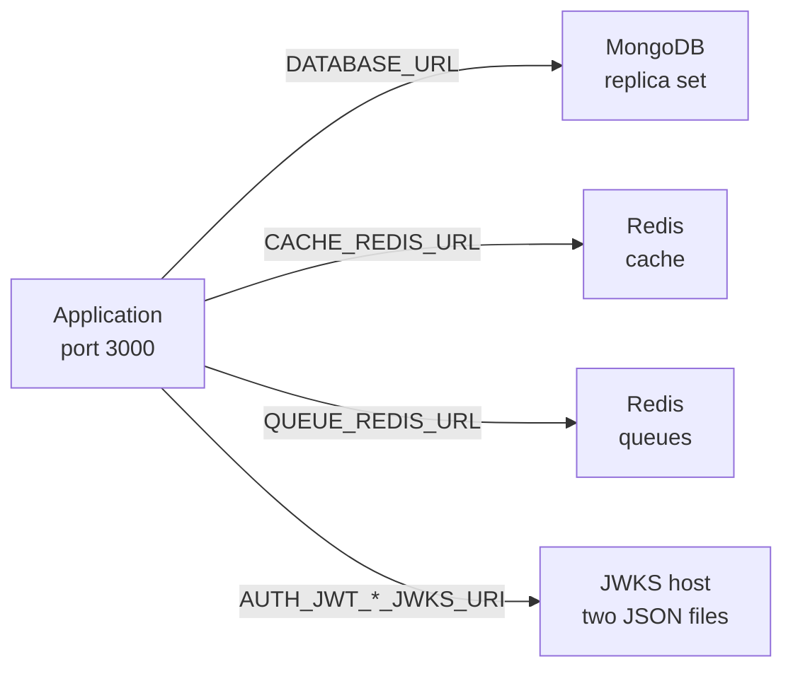
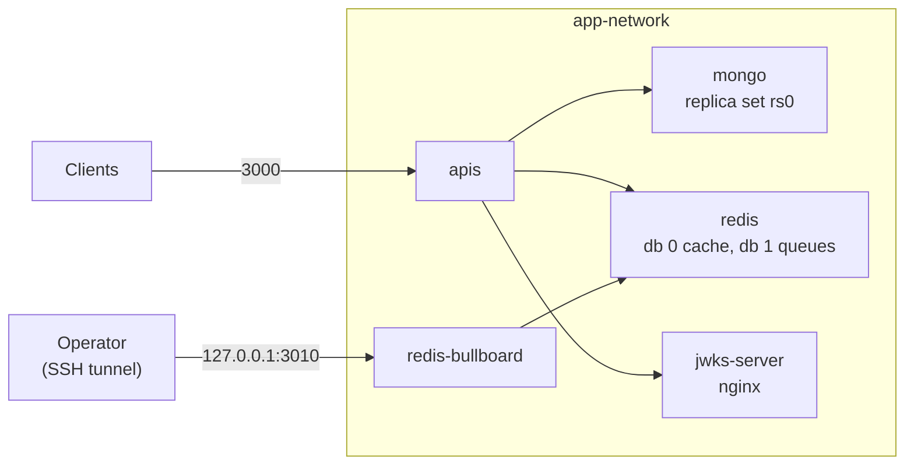
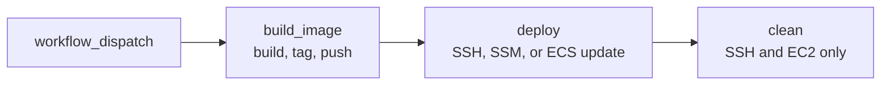

# Release Documentation

Release files live in `ci/`. The release workflows live in `.github/workflows/`.

## Overview

The application ships as one image built from `ci/dockerfile.production`.

- The base is `node:24.15.0-alpine`.
- The image holds production dependencies only.
- The process runs as the non-root user `ec2-user`.
- The application reads its settings from a mounted `.env` file or from the process environment.
- An ECS task definition's environment variables satisfy validation.
- MongoDB, Redis, and a JWKS host are separate services the application connects to.

Three release paths exist. Each one ends with the application running and answering `GET /api/public/hello`:

- [Path 1: Existing dependencies](#path-1-existing-dependencies): MongoDB, Redis, and a JWKS host already exist.
    - The section states what the application needs from them.
    - It then builds and runs the image, or runs the application without a container.
- [Path 2: Single instance with Docker Compose](#path-2-single-instance-with-docker-compose): one host runs the application, MongoDB, Redis, the JWKS server, and BullBoard from one Compose file.
- [Path 3: CI/CD](#path-3-cicd): the workflows under `.github/workflows/` build the image, push it, and start it on a host or an ECS service.
    - The section also lists the steps another pipeline needs.

The sections under [Shared by every path](#shared-by-every-path) apply to all three paths.

- Neither the image nor any workflow runs the schema push or the seeds.
- The operator runs both (see [Schema push and seed data](#schema-push-and-seed-data)).

## Related Documents

- [Installation Documentation][ref-doc-installation]: Local setup, key generation, Compose for development
- [Environment Documentation][ref-doc-environment]: Every `.env` variable, including the `DOCKER_*` ones
- [Database Documentation][ref-doc-database]: Schema sync and seeding
- [Vault Documentation][ref-doc-vault]: Optional secret store behind the `vault` profile
- [Queue Documentation][ref-doc-queue]: BullBoard

## Table of Contents

- [Overview](#overview)
- [Related Documents](#related-documents)
- [Shared by every path](#shared-by-every-path)
    - [Generate keys and secrets](#generate-keys-and-secrets)
    - [Variables set by hand](#variables-set-by-hand)
    - [The application image](#the-application-image)
    - [Schema push and seed data](#schema-push-and-seed-data)
    - [Check the application](#check-the-application)
- [Path 1: Existing dependencies](#path-1-existing-dependencies)
    - [What the application needs](#what-the-application-needs)
    - [Steps](#steps)
- [Path 2: Single instance with Docker Compose](#path-2-single-instance-with-docker-compose)
    - [Prerequisites](#prerequisites)
    - [Stack on the host](#stack-on-the-host)
    - [Steps](#steps-1)
    - [Ports and access](#ports-and-access)
    - [Vault profile](#vault-profile)
- [Path 3: CI/CD](#path-3-cicd)
    - [Behaviour shared by the three release-with workflows](#behaviour-shared-by-the-three-release-with-workflows)
    - [release-with-ssh.yml](#release-with-sshyml)
    - [release-with-aws-sdk-ec2.yml](#release-with-aws-sdk-ec2yml)
    - [release-with-aws-sdk-ecs.yml](#release-with-aws-sdk-ecsyml)
    - [release-version.yml](#release-versionyml)
    - [Another CI/CD system](#another-cicd-system)

## Shared by every path

### Generate keys and secrets

The release needs these files:

- `.env`, which carries the JWT key pairs, the KIDs, and both encryption secrets for the API
- `keys/access-jwks.json` and `keys/refresh-jwks.json`, which a JWKS host serves
- `keys/mongo-keyfile`, which only the Compose `mongo` service mounts (Path 2)
    - The `mongo` entrypoint copies it only when `DOCKER_MONGO_ROOT_PASSWORD` is set.

One script writes all of it, and it runs in either place:

- On a machine with Node.js and the repository dependencies:
    ```bash
    pnpm generate:secret --direct-insert
    ```
- On the host itself, with Node.js >= 24.15.0 and no `pnpm install`, because the script uses only built-in modules:
    ```bash
    node scripts/generate-secret.ts all --direct-insert
    ```

The script writes into the `keys/` and `.env` of the checkout it runs in. After it runs:

- `.env` goes to where the API runs.
- The JWKS files go to the JWKS host.
- For a Compose host, both go into its checkout, for example with `scp -r keys .env <user>@<host>:<checkout path>/`.

The script writes:

- the JWT key pairs (access ES256, refresh ES512) as PEM files under `keys/`, the private keys at mode `0600`
- the two JWKS files under `keys/`
- both encryption secrets to `keys/encryption-secret.env`, mode `0600`
- `keys/mongo-keyfile`, the base64 text of 756 random bytes, mode `0400`
- with `--direct-insert`, the JWT keys, KIDs, and encryption secrets into `.env`, created from `.env.example` when missing, mode `0644` so the non-root container user can read it

Running the script:

- Run the script once per host and environment before the first start, not per release, because each run replaces the keys.
- [Installation][ref-doc-installation] lists the per-target commands.

### Variables set by hand

The script leaves these variables for the operator. The other variables come from `.env.example` and are described in the [Environment Documentation][ref-doc-environment].

- `APP_ENV` is one of `production`, `staging`, `development`, or `local`. A release sets `production`, `staging`, or `development`.
- `HTTP_HOST=0.0.0.0` in a container. With `localhost` the application listens on the container's loopback and the published port resets connections.
- `HTTP_PORT=3000`. The image exposes 3000, and its health check calls port 3000.
- `AUTH_TWO_FACTOR_ISSUER`, which the script leaves empty and the schema requires non-empty.
- `CORS_ALLOWED_ORIGIN`.
- `HTTP_TRUSTED_PROXY`, behind a proxy or load balancer.
- `DATABASE_URL`, `CACHE_REDIS_URL`, `QUEUE_REDIS_URL`, and the two JWKS URIs. Their values depend on the path.

Where the application reads its settings:

- The application reads the process environment and `.env` once at boot.
- The process environment wins over `.env`.
- No `.env.<NODE_ENV>` file is loaded.
- A variable set in the process environment satisfies validation without any file, so an ECS task definition's environment variables are enough.
- A container with neither a mounted `.env` nor the variables in its environment fails `AppEnvSchema` validation at boot.

Facts about a mounted `.env` file:

- The container user `ec2-user` has a uid that differs from the host owner of a bind-mounted `.env`, so the file needs mode `0644`.
- A hand-made `.env` needs the same readability, for example `chmod 644 .env`.

### The application image

Build from the repository root:

```bash
docker build -f ci/dockerfile.production -t ack-nestjs-boilerplate-api .
```

`--build-arg NODE_ENV=<environment>` is optional.

Facts about the image:

- The image holds `dist/` and production dependencies.
- The image carries no `keys/`.
- The build creates an empty `.env`.
- The container listens on port 3000 and its health check calls `http://127.0.0.1:3000/api/public/hello`.
- The command is `pnpm start:prod`, which runs `node --import ./dist/instrument.js dist/main.js`.
- The image holds `dist/migration.js` and `nest-commander`.
- The image lacks the Prisma CLI and the Nest CLI, which are devDependencies, so the schema push runs from a checkout.
- The seed values under `src/migration/data/` are compiled into `dist/` at build time, so the seeds also run from a checkout.

`NODE_ENV` and `APP_ENV` are separate variables:

- The application validates and reads `APP_ENV`.
- `NODE_ENV` selects no env file: `ConfigModule` loads only `.env`.
- `src/main.ts` overwrites `NODE_ENV` with the value of `APP_ENV` once the config is loaded.
- The workflows pass the environment name as the `NODE_ENV` build argument.
- The host-side `docker run` commands in the SSH and EC2 workflows pass it as `--env NODE_ENV`.
- The Compose build passes no `NODE_ENV` argument.

### Schema push and seed data

Two project commands prepare the database:

- `pnpm db:migrate` is `prisma db push`. It creates the collections and indexes from `prisma/schema.prisma`.
- `pnpm migration:seed` runs the database seeds in the order listed in the [Database Documentation][ref-doc-database].

Facts about both commands:

- They run from a checkout on a machine with Node.js >= 24.15.0, or in a one-off container (below).
- They read `.env` from the checkout and the process environment.
- The seed process builds the same `CommonModule` as the API.
    - It validates the whole `.env`.
    - It opens the same MongoDB, Redis cache, and BullMQ connections.
- Each path states where the commands run.

A machine with Docker and no Node.js runs the commands in a one-off container with the checkout mounted:

```bash
docker run --rm \
  --user "$(id -u):$(id -g)" \
  -e HOME=/tmp \
  -e PATH=/tmp/bin:/usr/local/bin:/usr/bin:/bin \
  -v "$PWD":/app -w /app \
  node:24.15.0-alpine \
  sh -c 'mkdir -p /tmp/bin && corepack enable --install-directory /tmp/bin && pnpm install --frozen-lockfile --ignore-scripts && pnpm generate && pnpm db:migrate && pnpm migration:seed'
```

Facts about the container:

- It reads the checkout's `.env`.
- The URLs in `.env` resolve from the container's network, which is the operator's choice.
- `--user` makes the files it writes belong to the invoking user.
- `HOME=/tmp` gives that user a writable home.
- `corepack enable --install-directory /tmp/bin` writes the pnpm shim to a directory that user can write, because `/usr/local/bin` needs root.
- Without `--user`, the container runs as root.
    - On a Linux host it then leaves root-owned `node_modules`, `dist`, and `src/generated` in the checkout.
    - Git ignores all three.

Facts about the seed data:

- `src/migration/data/*.ts` holds the seed values. Edit them in the checkout, run the seed, then restore the files so the checkout stays clean:
    ```bash
    git checkout -- src/migration/data
    ```
- The edited values carry the API key secret and the user passwords, so they are never committed.
- Seed data depends on `APP_ENV`. The `apiKey` seed writes keys only for `local`, so `production` gets none.
- Every public route except `GET /api/public/hello` sits behind `x-api-key`, so `MigrationApiKeyData` (`src/migration/data/migration.api-key.data.ts`) defines the keys for the environment before seeding.
- The `user` seed creates a superadmin and an admin in every environment, with the password published in `src/migration/data/migration.user.data.ts`.
- Different values go there before seeding, or both passwords change once the API answers.
- Seeds that need S3 or SES (`templateTermPolicy`, `awsS3Config`, `templateEmailNotification`) are separate commands described in the [Database Documentation][ref-doc-database].

### Check the application

```bash
curl -i http://localhost:3000/api/public/hello
```

Facts about the check:

- `/api/public/hello` (`HelloPublicController`) is the one public route that needs no `x-api-key`.
- Every other public route rejects a request without a valid key.
- A container started from the image reports `healthy` in `docker ps` once the same endpoint answers inside the container.
- Swagger is off when `APP_ENV` is `production`.

## Path 1: Existing dependencies

MongoDB, Redis, and a JWKS host already exist as separate services. This path states what the application needs from them and starts the application. It covers neither how to run, secure, nor size those services.



### What the application needs

| Service | Variable | Expected form |
| --- | --- | --- |
| MongoDB | `DATABASE_URL` | `mongodb://<host>:<port>/<database>?retryWrites=true&w=majority&replicaSet=<replica set name>`, or `mongodb+srv://<host>/<database>?retryWrites=true&w=majority` |
| Redis cache | `CACHE_REDIS_URL` | `redis://<host>:<port>/<database number>`, or `rediss://` for TLS |
| Redis queues | `QUEUE_REDIS_URL` | `redis://<host>:<port>/<database number>`, or `rediss://` for TLS |
| JWKS host | `AUTH_JWT_ACCESS_TOKEN_JWKS_URI` | A URL that answers `GET` with the content of `keys/access-jwks.json` |
| JWKS host | `AUTH_JWT_REFRESH_TOKEN_JWKS_URI` | A URL that answers `GET` with the content of `keys/refresh-jwks.json` |

Facts about these services:

- MongoDB is a replica set, because Prisma transactions need one.
- A MongoDB server that requires authentication takes `<user>:<password>@` before the host and `authSource=<auth database>` in the query.
    - `authSource` names the database where the user is defined.
- A Redis server with a password takes `redis://:<password>@<host>:<port>/<database number>`.
- The cache uses the Redis database in `CACHE_REDIS_URL`, and the queues use the one in `QUEUE_REDIS_URL`. `.env.example` sets 0 and 1.
- The application passes each URL to its client unchanged: Prisma reads `DATABASE_URL`, and the cache and BullMQ clients read the two Redis URLs.
- Special characters in a password are percent-encoded in a URL.
- Each JWKS file holds one key. Its `kid` equals the matching `AUTH_JWT_ACCESS_TOKEN_KID` or `AUTH_JWT_REFRESH_TOKEN_KID` in `.env`.
- The API verifies tokens against the JWKS URIs, not against the public keys in `.env`.

### Steps

1. Get the repository, and stay in its root for every command below.
    ```bash
    git clone https://github.com/andrechristikan/ack-nestjs-boilerplate.git
    cd ack-nestjs-boilerplate
    ```
2. Generate the keys and `.env` with the commands in [Generate keys and secrets](#generate-keys-and-secrets). The `keys/mongo-keyfile` it writes is unused in this path.
3. Publish the content of `keys/access-jwks.json` and `keys/refresh-jwks.json` on the JWKS host, at the two URLs that go into `.env`.
4. Set the variables in `.env`:
    - `DATABASE_URL`, `CACHE_REDIS_URL`, and `QUEUE_REDIS_URL` in the forms above
    - `AUTH_JWT_ACCESS_TOKEN_JWKS_URI` and `AUTH_JWT_REFRESH_TOKEN_JWKS_URI` with the URLs from step 3
    - the variables in [Variables set by hand](#variables-set-by-hand)
5. Push the schema and seed the database from a checkout whose `.env` reaches the database and Redis, on a machine with Node.js >= 24.15.0:
    ```bash
    pnpm install --frozen-lockfile
    pnpm generate
    pnpm db:migrate
    pnpm migration:seed
    ```
    - A machine with Docker and no Node.js uses the one-off container in [Schema push and seed data](#schema-push-and-seed-data).
    - The seed values and their effects are in the same section.
6. Start the application in one of two ways.

    In a container:

    ```bash
    docker build -f ci/dockerfile.production -t ack-nestjs-boilerplate-api .
    docker run -d --name ack-nestjs-boilerplate-api \
      -p 3000:3000 \
      -v "$PWD/.env":/app/.env:ro \
      ack-nestjs-boilerplate-api
    ```
    - The `.env` mounts read-only at `/app/.env`, and its mode is `0644`.
    - `.env` sets `HTTP_HOST=0.0.0.0` for the container.

    Without a container, on a machine with Node.js >= 24.15.0 and pnpm:

    ```bash
    pnpm install --frozen-lockfile
    pnpm generate
    pnpm build
    pnpm start:prod
    ```
    - `pnpm build` runs `nest build application` and then `pnpm typecheck`.
    - `pnpm start:prod` runs `node --import ./dist/instrument.js dist/main.js` and reads `.env` from the working directory.
    - `HTTP_HOST` is the interface the application binds to. `0.0.0.0` binds every interface.

7. Check the application as in [Check the application](#check-the-application).

## Path 2: Single instance with Docker Compose

One host runs the whole stack from the repository checkout.

- `ci/docker-compose.production.yml` starts MongoDB (replica set), Redis, the JWKS server, BullBoard, and the API.
- `.env` and the files under `keys/` carry every secret.
- Compose mounts them into the containers.

### Prerequisites

- [Docker Engine][ref-docker-engine] with the Compose v2 plugin (`docker compose version` prints a version)
- The repository checkout, because Compose builds the `apis` image from it and bind-mounts files from `ci/`
- Node.js >= 24.15.0, only when the secrets are generated on the host

### Stack on the host



- `apis` waits for `mongo`, `redis`, and `jwks-server` to pass their health checks, then answers on port 3000.
- The `apis` health check calls `http://127.0.0.1:3000/api/public/hello`.
- `mongo` starts through `ci/mongo/entrypoint.sh`. Its replica set member host is `mongo:27017` on the Compose network.
- `jwks-server` serves `keys/access-jwks.json` and `keys/refresh-jwks.json`, so the API verifies tokens against `http://jwks-server/.well-known/...`.
- `apis`, `mongo`, `redis`, `jwks-server`, `redis-bullboard`, and `vault` have `restart: unless-stopped`, so the stack returns after a host reboot.
- `vault-bootstrap` is a one-shot job with no restart policy.

### Steps

1. Get the repository, and stay in its root for every command below.
    ```bash
    git clone https://github.com/andrechristikan/ack-nestjs-boilerplate.git
    cd ack-nestjs-boilerplate
    ```
2. Generate the keys and `.env` with the commands in [Generate keys and secrets](#generate-keys-and-secrets).
    - Compose needs `keys/access-jwks.json`, `keys/refresh-jwks.json`, and `keys/mongo-keyfile` before it starts.
    - A missing file fails the start, because the bind mounts are created with `create_host_path: false`.
3. Set the variables in `.env`:
    - the variables in [Variables set by hand](#variables-set-by-hand). The published port is fixed at 3000, so `HTTP_PORT` stays 3000.
    - `DATABASE_URL`, pointing at the Compose service:
        ```bash
        DATABASE_URL=mongodb://mongo:27017/ACKNestJs?retryWrites=true&w=majority&replicaSet=rs0
        ```
    - `CACHE_REDIS_URL=redis://redis:6379/0` and `QUEUE_REDIS_URL=redis://redis:6379/1`
    - the JWKS addresses on the Compose network:
        ```bash
        AUTH_JWT_ACCESS_TOKEN_JWKS_URI=http://jwks-server/.well-known/access-jwks.json
        AUTH_JWT_REFRESH_TOKEN_JWKS_URI=http://jwks-server/.well-known/refresh-jwks.json
        ```
4. Optionally set the `DOCKER_*` variables (see the table below). Without them, MongoDB and Redis start without authentication.
5. Start the stack from the repository root:

    ```bash
    docker compose --env-file .env -f ci/docker-compose.production.yml up -d
    ```
    - Compose builds the `apis` image on the first start.
    - `--env-file .env` feeds the `DOCKER_*` values into Compose.
    - The compose file sits in `ci/`, so Compose does not read the root `.env` on its own.
    - The `apis` service mounts the root `.env` read-only at `/app/.env` whatever `--env-file` says.

    > [!WARNING] Without `--env-file`, MongoDB and Redis start without authentication and BullBoard accepts the login `admin` / `admin123`.

    ```bash
    docker compose --env-file .env -f ci/docker-compose.production.yml ps
    docker compose --env-file .env -f ci/docker-compose.production.yml logs -f apis
    ```

6. Push the schema and seed the database.
    - The production file publishes no MongoDB port, so the commands run in the one-off container from [Schema push and seed data](#schema-push-and-seed-data), attached to the Compose network. Add this flag after `--rm`:
        ```bash
        --network ack-nestjs-boilerplate-production_app-network
        ```
    - The container reads the same `.env`, and `mongo` resolves there.
    - The seed values and their effects are in the same section.
7. Check the application as in [Check the application](#check-the-application). `docker compose ... ps` shows `apis` as `healthy`.

#### The `DOCKER_*` variables

All of them are optional and empty in `.env.example`:

| Variable | Unset or empty | Set |
| --- | --- | --- |
| `DOCKER_MONGO_ROOT_PASSWORD` | MongoDB starts plain | MongoDB starts with `--keyFile` and `--auth` and creates the root user (`DOCKER_MONGO_ROOT_USERNAME`, default `root`) when none exists |
| `DOCKER_REDIS_PASSWORD` | Redis starts plain | Redis starts with `--requirepass`, and BullBoard uses it to connect to Redis |
| `DOCKER_BULLBOARD_USER`, `DOCKER_BULLBOARD_PASSWORD` | BullBoard login `admin` / `admin123` | The values replace the BullBoard login |

When a password is set, the credentials go into the URLs of `.env`:

- Special characters in the password are percent-encoded.
- `<user>` is `DOCKER_MONGO_ROOT_USERNAME`, `root` when it is empty.
- `authSource=admin`, because the `mongo` entrypoint creates the root user in the `admin` database.

```bash
DATABASE_URL=mongodb://<user>:<password>@mongo:27017/ACKNestJs?authSource=admin&retryWrites=true&w=majority&replicaSet=rs0
CACHE_REDIS_URL=redis://:<password>@redis:6379/0
QUEUE_REDIS_URL=redis://:<password>@redis:6379/1
```

A `$` in a `DOCKER_*` password makes the stored password and the one in the URL differ, because Compose interpolates `$` in the values it reads through `--env-file` while the app reads `.env` literally (`expandVariables: false`).

### Ports and access

| Service | Published | Notes |
| --- | --- | --- |
| `apis` | `3000` on every interface | Plain HTTP; the files carry no TLS termination |
| `redis-bullboard` | `127.0.0.1:3010` only | Not reachable from outside the host |
| `mongo`, `redis`, `jwks-server` | none | Reachable on the Compose network only |

Reach BullBoard through an SSH tunnel, then open `http://localhost:3010`:

```bash
ssh -L 3010:127.0.0.1:3010 <user>@<host>
```

### Vault profile

- The `vault` and `vault-bootstrap` services start only with `--profile vault`.
- The repository's Vault setup is a local-development pattern ([Vault Documentation][ref-doc-vault]).
- Its entrypoint writes the unseal key and the root token to `generated/vault/init.json`.
- It is not a production secret store.
- The application never connects to Vault.

## Path 3: CI/CD

Four release workflows ship under `.github/workflows/`.

- `release-with-ssh.yml` and `release-with-aws-sdk-ec2.yml` build `ci/dockerfile.production`, push the image, and replace one container on a host.
- `release-with-aws-sdk-ecs.yml` builds and pushes the image, then targets ECS.
- `release-version.yml` creates a GitHub release.



### Behaviour shared by the three release-with workflows

- They run only on `workflow_dispatch`. Their `push` triggers are commented out.
- Each job has a matrix that pairs a branch with an environment (`production`, `development`, `staging`). Only the entry whose branch matches the branch the workflow was dispatched from builds and deploys.
- `build_image` runs `docker build --build-arg NODE_ENV=<environment> -f ci/dockerfile.production .`, then tags and pushes:
    - `:<environment>`
    - `:sha-<short sha>`
    - `:latest`, for `production` only
- The jobs run in the order `build_image`, `deploy`, then `clean` where the workflow has one.
- None of them runs the schema push or the seeds.
- None of them starts MongoDB, Redis, or a JWKS server.
- The URLs in the settings the container reads point at services that already exist.

### release-with-ssh.yml

Pushes to a Docker registry and replaces the container on a host over SSH.

| Kind | Name | Used for |
| --- | --- | --- |
| Variable | `DOCKER_REGISTRY_URL` | Registry host, and the image prefix |
| Variable | `DOCKER_IMAGE_NAME` | Image name, `<registry>/<image>:<tag>` |
| Variable | `DOCKER_CONTAINER_NAME` | Container name, hostname, and the host directory name |
| Variable | `DOCKER_CONTAINER_PORT` | Host port published to container port 3000 |
| Secret | `DOCKER_USERNAME`, `DOCKER_PASSWORD` | Registry login, in the runner and on the host |
| Secret | `SSH_PORT` | SSH port, for every environment |
| Secret | `PROD_SSH_HOST`, `PROD_SSH_USER`, `PROD_SSH_PRIVATE_KEY` | SSH target for `production` |
| Secret | `DEV_SSH_HOST`, `DEV_SSH_USER`, `DEV_SSH_PRIVATE_KEY` | SSH target for `development` |
| Secret | `STAGING_SSH_HOST`, `STAGING_SSH_USER`, `STAGING_SSH_PRIVATE_KEY` | SSH target for `staging` |

The deploy job connects over SSH and runs these commands on the host:

1. Log in to the registry and pull `<registry>/<image>:<environment>`.
2. Stop and remove the container named in `DOCKER_CONTAINER_NAME`.
3. Create the Docker network `app-network` when it is absent.
4. Run the new container: `docker run -itd --env NODE_ENV=<environment> --hostname <name> --publish <port>:3000 --network app-network --volume $HOME/<name>/.env:/app/.env:ro --restart unless-stopped --name <name> <image>`.

The `clean` job runs `docker image prune --force` and removes the images under `<registry>/<image>/**` on the host.

What the workflow expects to exist already:

- A registry, a host reachable over SSH with Docker installed, and the repository secrets and variables above.
- The file `$HOME/<DOCKER_CONTAINER_NAME>/.env` on the host, in the home directory of the SSH user. The container mounts it read-only at `/app/.env`, and its mode is `0644`.
- MongoDB, Redis, and the JWKS host that the URLs in that `.env` name.
- The container joins `app-network`, a Docker network of its own.
- It does not reach the services of the Compose stack in [Path 2](#path-2-single-instance-with-docker-compose), whose network is `ack-nestjs-boilerplate-production_app-network`.

The command mounts no `keys/` and no `logs/`.

### release-with-aws-sdk-ec2.yml

Pushes to Amazon ECR and replaces the container on an EC2 instance through AWS Systems Manager.

| Kind | Name | Used for |
| --- | --- | --- |
| Variable | `AWS_ECR_REPO_URL` | ECR repository URL, `<url>:<tag>` |
| Variable | `DOCKER_CONTAINER_NAME` | Container name, hostname, and the host directory name |
| Variable | `DOCKER_CONTAINER_PORT` | Host port published to container port 3000 |
| Secret | `AWS_ACCESS_KEY_ID`, `AWS_SECRET_ACCESS_KEY`, `AWS_REGION` | AWS credentials and region |
| Secret | `PROD_AWS_INSTANCE_ID`, `DEV_AWS_INSTANCE_ID`, `STAGING_AWS_INSTANCE_ID` | Target instance per environment |

The deploy job runs `aws ssm send-command` with the `AWS-RunShellScript` document on the instance. The command list:

1. Log in to ECR with `aws ecr get-login-password` and pull `<AWS_ECR_REPO_URL>:<environment>`.
2. Stop and remove the container named in `DOCKER_CONTAINER_NAME`.
3. Create the Docker network `app-network` when it is absent.
4. Run the new container with `--env NODE_ENV=<environment>`, `--publish <port>:3000`, `--network app-network`, `--restart unless-stopped`, and three bind mounts:
    - `/home/ec2-user/<container name>/.env` to `/app/.env`
    - `/home/ec2-user/<container name>/keys/` to `/app/keys/`
    - `/home/ec2-user/<container name>/logs/` to `/app/logs/`

The `clean` job runs `docker image prune --force` and removes the images under `<AWS_ECR_REPO_URL>/**` on the instance.

What the workflow expects to exist already:

- An ECR repository, an instance that `aws ssm send-command` can target, and the repository secrets and variables above.
- Docker and the AWS CLI on the instance, because the SSM commands call both.
- The directory `/home/ec2-user/<container name>/` with the `.env` file, a `keys/` directory, and a `logs/` directory.
- MongoDB, Redis, and the JWKS host that the URLs in that `.env` name.

### release-with-aws-sdk-ecs.yml

Pushes to Amazon ECR and starts a new deployment of an ECS service.

| Kind | Name | Used for |
| --- | --- | --- |
| Variable | `AWS_ECR_REPO_URL` | ECR repository URL, `<url>:<tag>` |
| Secret | `AWS_ACCESS_KEY_ID`, `AWS_SECRET_ACCESS_KEY`, `AWS_REGION` | AWS credentials and region |
| Secret | `PROD_ECS_CLUSTER_NAME`, `PROD_ECS_SERVICE_NAME` | Cluster and service for `production` |
| Secret | `DEV_ECS_CLUSTER_NAME`, `DEV_ECS_SERVICE_NAME` | Cluster and service for `development` |
| Secret | `STAGING_ECS_CLUSTER_NAME`, `STAGING_ECS_SERVICE_NAME` | Cluster and service for `staging` |

The deploy job runs two commands:

1. `aws ecs update-service --cluster <cluster> --service <service> --force-new-deployment`
2. `aws ecs wait services-stable --cluster <cluster> --services <service>`

The workflow has no `clean` job and registers no task definition.

What the workflow expects to exist already:

- An ECR repository, an ECS cluster and service, and the repository secrets above.
- A task definition that runs the pushed image.
- The environment variables that `.env` holds, set in that task definition. They satisfy `AppEnvSchema` validation without a mounted `.env`.
- MongoDB, Redis, and the JWKS host that those variables name.

- The workflow only forces a new deployment of the existing service.
- This repository documents no cluster, task definition, or service.
- The [Amazon ECS Developer Guide][ref-aws-ecs] covers the ECS side, and the platform's own documentation covers any other target.

### release-version.yml

Creates a GitHub release.

- It runs on `workflow_dispatch`.
- It sets the permission `contents: write`.
- The tag and the release name are `v<version>`, where `<version>` is the `current-version` output of the `martinbeentjes/npm-get-version-action@v1` step.
- The release step sets `generate_release_notes: true`, `draft: false`, and `prerelease: false`.
- It has no build or deploy step.

### Another CI/CD system

Any pipeline that releases the application needs these steps:

1. Check out the repository at the revision to release.
2. Build the image from the repository root: `docker build -f ci/dockerfile.production -t <registry>/<image>:<tag> .`. Add `--build-arg NODE_ENV=<environment>` when the pipeline mirrors the workflows.
3. Push the image to a registry that the target can pull from.
4. Push the schema and seed the database once, as in [Schema push and seed data](#schema-push-and-seed-data).
    - The step runs from a checkout.
    - The pipeline or the operator runs it.
5. Give the container its settings, in one of two ways:
    - Place the `.env` file on the target with mode `0644`.
    - Set the same variables in the container's environment.
6. Run the image with container port 3000 published. With a mounted `.env`:
    ```bash
    docker run -d --name <name> -p <host port>:3000 -v <host path>/.env:/app/.env:ro <registry>/<image>:<tag>
    ```
7. Make MongoDB, Redis, and the JWKS host reachable from the container at the URLs in its settings.
8. Check the application as in [Check the application](#check-the-application).

<!-- REFERENCES -->

[ref-docker-engine]: https://docs.docker.com/engine/install/
[ref-aws-ecs]: https://docs.aws.amazon.com/AmazonECS/latest/developerguide/Welcome.html
[ref-doc-installation]: installation.md
[ref-doc-environment]: environment.md
[ref-doc-database]: database.md
[ref-doc-vault]: vault.md
[ref-doc-queue]: queue.md#bull-board-dashboard
