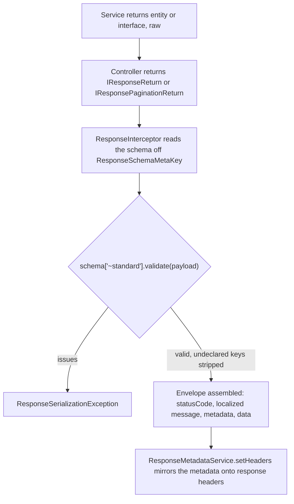

# Response Documentation

The response envelope lives in `src/common/response`.

## Overview

Response decorators wrap the handler result with metadata, a status code, and a localized message. Separate decorators cover:

- pagination
- file download
- custom headers

## Table of Contents

- [Overview](#overview)
- [Related Documents](#related-documents)
- [Response Decorators](#response-decorators)
    - [@Response](#response)
    - [@ResponsePagination](#responsepagination)
    - [@ResponseFile](#responsefile)
- [Serialization](#serialization)
    - [Declaring the Schema](#declaring-the-schema)
    - [A Route That Returns No Data](#a-route-that-returns-no-data)
    - [Nested Schemas](#nested-schemas)
    - [Hiding Fields](#hiding-fields)
    - [Serialization Flow](#serialization-flow)
- [Response Structure](#response-structure)
    - [Standard](#standard)
    - [Paginated](#paginated)
- [Caching](#caching)
- [Custom Headers](#custom-headers)

## Related Documents

- [Language Message Documentation][ref-doc-message]: Success and error message paths
- [Handling Error Documentation][ref-doc-handling-error]: Exception filters and error envelopes
- [Doc Documentation][ref-doc-doc]: OpenAPI from response schemas, with kit error responses only unless `@DocErrors` opts in
- [File Upload Documentation][ref-doc-file-upload]: File response and upload pipes
- [Request Validation Documentation][ref-doc-request-validation]: Input-boundary schemas (inbound mirror)

## Response Decorators

### @Response

Standard API response decorator with optional caching.

**Parameters:**

- `messagePath` (string): Path to response message for localization
- `options` (optional): `IResponseOptions`
    - `schema` (zod schema): The payload shape. Its absence declares a route that returns no data
    - `cache` (boolean | object): Enable caching

- `IResponseOptions` carries only `schema` and `cache`.
- Success HTTP status and body `statusCode` both follow `@HttpCode` when present, otherwise Nest method defaults (`POST` → 201, else 200).
- A handler overrides either at runtime via `metadata` on its return.
- The decorator also documents the success envelope and `DocSerializationErrorResponses.serialization`.

**Requirements:**

- Handler returns `IResponseReturn<T>`
- `ResponseInterceptor` reads `data` and `metadata` off that object, so a payload returned outside it reaches the envelope as no `data` at all

**Interceptor:** `ResponseInterceptor`:

- serializes the payload against `options.schema`
- wraps it into the standard envelope with metadata and a localized message via [MessageService][ref-doc-message]

**Usage:**

```typescript
@Response('user.get', { schema: UserProfileResponseSchema })
@Get('/get/:userId')
async get(
  @Param('userId', { schema: RequestMongoIdSchema }) userId: string
): Promise<IResponseReturn<UserProfileResponseDto>> {
  return this.userHttpService.getOne(userId);
}
```

**Custom Status Code:**

- `@Post('/create')` has no `@HttpCode`, so Nest answers `201 Created`.
- The interceptor takes `httpStatus` from the Express response status unless the handler returns `metadata.httpStatus`.

```typescript
@Response('user.create', { schema: DatabaseIdResponseSchema })
@Post('/create')
async create(
  @Body({ schema: UserCreateRequestSchema }) body: UserCreateRequestDto,
  @AuthJwtPayload('userId') createdBy: string
): Promise<IResponseReturn<DatabaseIdResponseDto>> {
  return this.userHttpService.createByAdmin(body, createdBy);
}
```

**Custom Message:**

The controller carries the message path and nothing else. The values that fill it come back from the HTTP service on `metadata.messageProperties`:

```typescript
// notification.shared.controller.ts
@Response('notification.markAllAsRead')
@HttpCode(HttpStatus.OK)
@Post('/update/read')
async markAllAsRead(
  @AuthJwtPayload('userId') userId: string
): Promise<IResponseReturn<void>> {
  return this.notificationHttpService.markAllAsRead(userId);
}

// notification.http.service.ts
async markAllAsRead(userId: string): Promise<IResponseReturn<void>> {
  const count = await this.notificationDomain.markAllAsRead(userId);

  return {
    metadata: {
      messageProperties: {
        count,
      },
    },
  };
}
```

`notification.markAllAsRead` resolves to `"{count} notifications marked as read."`, so `count` fills the placeholder.

`metadata` accepts a `messagePath` beside `messageProperties`.

- `ResponseInterceptor` reads the decorator's path first and then applies `responseMetadata?.messagePath ?? messagePath` (`src/common/response/interceptors/response.interceptor.ts`).
- A handler that returns a `messagePath` replaces the path its route declared.
- A handler that returns none keeps it.
- Every route in `src/` takes the second branch: the path on the decorator is the path that is sent.

### @ResponsePagination

- A paginated API response decorator with optional caching.
- It supports both offset-based and cursor-based pagination.
- Strategy comes from the handler return via `EnumPaginationType`, not from decorator options.

**Parameters:**

- `messagePath` (string): Path to response message for localization
- `options`: Configuration options
    - `schema` (zod schema, required): The shape of ONE item of the page
        - The interceptor wraps the page around it
    - `cache` (boolean | object): Enable caching

`IResponseOptions` / pagination options carry **schema and cache only**. They do not carry:

- `httpStatus`
- `statusCode`
- pagination `type`

- Success documents HTTP 200 with `baseSchema: ResponsePaginationSchema`.
- List `ApiQuery`s come from the zod query schema, not from this decorator.
- The decorator also publishes shared pagination error kits plus both offset and cursor kits.

**Requirements:**

- Handler returns `IResponsePaginationReturn<T>`
- List query DTO on `@Query({ schema })`
- HTTP service derives params via `PaginationQueryUtil` (see [Pagination Documentation][ref-doc-pagination])

**Interceptor:** `ResponsePaginationInterceptor`:

- validates pagination data
- supports offset and cursor-based pagination
- includes search/filter/sort metadata from `PaginationStoreKey`

**Offset-based Pagination:**

```typescript
@Doc({ summary: 'get all users' })
@ResponsePagination('user.list', { schema: UserListResponseSchema })
@Get('/list')
async list(
  @Query({ schema: UserListRequestSchema }) query: UserListRequestDto
): Promise<IResponsePaginationReturn<IUserList>> {
  return this.userHttpService.getListOffsetByAdmin(query);
}
```

`UserHttpService.getListOffsetByAdmin` runs `PaginationQueryUtil.offset`, merges the store patch, and forwards to the domain and repository.

- The page fields (`type`, `count`, `page`, `perPage`, `totalPage`, `hasNext`, `hasPrevious`, `nextPage`, `previousPage`) come from `PaginationService.offset`, which computes them in `offsetPage`.
- `page` is 1-based, so the first page reports `1`.
- `totalPage` is `Math.ceil(count / perPage)`, so a page with no rows reports `0`.
- The handler's generic is the ROW type the repository returns, and the schema on the decorator is what shapes that row on the way out (see [Pagination Documentation][ref-doc-pagination]).

**Cursor-based Pagination:**

```typescript
@Doc({ summary: 'list workspaces the caller is a member of' })
@ResponsePagination('workspace.list', { schema: WorkspaceResponseSchema })
@Get('/list')
async list(
  @Query({ schema: WorkspaceUserListRequestSchema }) query: WorkspaceUserListRequestDto,
  @AuthJwtPayload('userId') userId: string
): Promise<IResponsePaginationReturn<Workspace>> {
  return this.workspaceHttpService.getListCursorByMember(userId, query);
}
```

The page fields (`type`, `cursor` emitted as `nextCursor`, `perPage`, `hasNext`, optional `count`) come from `PaginationService.cursor`.

### @ResponseFile

File download response decorator for CSV and PDF downloads, with proper headers and streaming.

**Parameters:** optional `{ extension, maxDataExportConfigKey }`.

- `extension`: an `EnumFileExtensionDocument` (default `csv`).
    - It sets the media type the OpenAPI success response declares: `text/csv` or `application/pdf` from `ResponseFileMediaTypes`, with a binary string schema.
    - Error responses on the same route stay `application/json`.
- `maxDataExportConfigKey`: the config key holding the CSV row cap for this route (default `file.maxDataExport`, 1000). The user export passes `user.maxDataExport` (500).

**Requirements:**

- Handler returns `IResponseFileReturn` (`IResponseCsvReturn` | `IResponsePdfReturn`)
- `extension` is `EnumFileExtensionDocument.csv` or `EnumFileExtensionDocument.pdf`
- CSV data is a non-empty string (already converted)
- PDF data is a Buffer
- Optional `filename`:
    - If not provided, the interceptor fills the `response.filenameExportPattern` config (`export-{timestamp}.{extension}`) through `HelperStringService.fillPattern`, with the request timestamp and the literal `csv`. The generated fallback is therefore always a `.csv` name.
    - A PDF download carries an explicit `filename`.

**Interceptor:** `ResponseFileInterceptor`, in order:

1. Validates data based on extension type. These raise `ResponseFileDataInvalidException` (500, `51903`):
    - a missing payload
    - a CSV `data` that is missing, empty, or not a string
    - a PDF `data` that is missing or not a Buffer
2. Rejects a CSV with more data rows than the config value at `maxDataExportConfigKey ?? 'file.maxDataExport'` with `FileExceedMaxDataExportException` (422, `50104`).
3. Converts to Buffer.
4. Rejects a buffer larger than `file.maxSizeExportInBytes` (2 MB) with `FileExceedMaxSizeExportException` (422, `50105`).
5. Sets content headers (Content-Type, Content-Disposition, Content-Length).
6. Returns StreamableFile.

The row cap applies to CSV only.

A PDF is not row-counted, and the byte cap covers both.

**CSV export:**

`POST /admin/user/export` is the file-download route.

- `UserImportDomain.exportByAdmin` reads at most `user.maxDataExport` + 1 users and raises `FileExceedMaxDataExportException` when the extra row comes back.
- `UserImportHttpService.exportByAdmin` maps rows to `UserExportResponseDto` and returns a CSV string.
- The interceptor fills the filename from `response.filenameExportPattern` (`export-{timestamp}.csv`) because this handler omits `filename`.

```typescript
@Doc({ summary: 'export users via csv file' })
@ResponseFile({ maxDataExportConfigKey: 'user.maxDataExport' })
@HttpCode(HttpStatus.OK)
@Post('/export')
async export(
  @Query({ schema: UserExportRequestSchema }) query: UserExportRequestDto
): Promise<IResponseFileReturn> {
  return this.userImportHttpService.exportByAdmin(query);
}
```

- `IResponsePdfReturn` is the other half of `IResponseFileReturn`: a `Buffer`, `EnumFileExtensionDocument.pdf`, and an explicit `filename`. The interceptor accepts that shape.
- The only download route, `POST /admin/user/export`, serves CSV.

## Serialization

A route declares its payload shape on the decorator, and the interceptor validates the handler's payload against that schema before the envelope is sent.

- Every response schema in `src/` is a `z.object` at the top level, so a key the schema does not declare is stripped.
- A column added to the Prisma model therefore stays out of the response until someone declares it.

A route whose payload is a list of rows over a fixed enum declares that list as a named array field of an object, and `@Response` carries the object schema:

- `GET /admin/analytic/workspaces/invite-funnel` sends `{ "statuses": [ { "status": …, "count": … } ] }`.
- `GET /user/analytic/workspace/member-roles` sends `{ "roles": [ … ] }`.

Serialization is **fail-closed** in both directions. `ResponseSerializationException` is raised for:

- a payload that the schema rejects
- a handler that returns data on a route which declared no schema

> The inbound half is the mirror image: a request schema is `z.strictObject`, so an unknown key is rejected rather than dropped. See [Request Validation Documentation][ref-doc-request-validation].

### Declaring the Schema

- `@Response` takes the schema of the whole payload.
- `@ResponsePagination` takes the schema of one item and wraps the page around it.

```typescript
@Response('user.profile', { schema: UserProfileResponseSchema })
@Get('/profile/get')
async profile(
  @AuthJwtPayload('userId') userId: string
): Promise<IResponseReturn<IUserProfile>> {
  return this.userProfileHttpService.getProfile(userId);
}

@ResponsePagination('device.list', { schema: DeviceOwnershipResponseSchema })
@Get('/list')
async list(
  @Query({ schema: DeviceSharedListRequestSchema }) query: DeviceSharedListRequestDto,
  @AuthJwtPayload('userId') userId: string,
  @AuthJwtPayload('sessionId') sessionId: string
): Promise<IResponsePaginationReturn<IDeviceOwnershipDetail>> {
  return this.deviceHttpService.getListCursor(userId, sessionId, query);
}
```

A schema file exports the schema constant and the type inferred from it, and composes from a base rather than restating fields:

```typescript
export const DeviceOwnershipResponseSchema = DatabaseResponseSchema.omit({
    deletedAt: true,
    deletedBy: true,
}).extend({
    deviceId: z.string().meta({
        description: 'Device ownership ID',
        example: faker.database.mongodbObjectId(),
    }),
    userId: z.string().meta({
        description: 'User ID who owns the device',
        example: faker.database.mongodbObjectId(),
    }),
    /* the nested device, owner, and revocation fields follow */
});

export type DeviceOwnershipResponseDto = z.infer<
    typeof DeviceOwnershipResponseSchema
>;
```

- The `.meta({ description, example })` on each field is what the OpenAPI document is generated from.
- See [Doc Documentation][ref-doc-doc].

### A Route That Returns No Data

`@Response(messagePath)` with no `schema` declares a route whose body carries `statusCode`, `message`, and `metadata` and nothing else.

- Every handler returns an envelope: a route with no data is typed `Promise<IResponseReturn<void>>` and ends with `return {};`.
- Where the HTTP service passes `metadata` overrides, as `markAllAsRead` does with `messageProperties`, the handler returns the HTTP service's `IResponseReturn<void>` as is.

```typescript
@Response('role.delete')
@Delete('/delete/:roleId')
async delete(
  @Param('roleId', { schema: RequestMongoIdSchema }) roleId: string
): Promise<IResponseReturn<void>> {
  await this.roleHttpService.deleteByAdmin(roleId);

  return {};
}
```

### Nested Schemas

A nested object is a named schema referenced from the parent, which keeps one definition per shape and lets the OpenAPI document reuse it:

```typescript
device: DeviceResponseSchema.meta({
    description: 'Device information',
    example: { /* ... */ },
}),
revokedBy: UserRefResponseSchema.nullable().meta({
    description: 'User who revoked the device ownership',
    example: { /* ... */ },
}),
```

Stripping propagates: the nested schema strips its own undeclared keys the same way the parent does.

### Hiding Fields

- A field is hidden by leaving it out of the schema.
- There is no separate exclusion decorator.
- A shape that shows a field only on one route builds that route's schema from the shared one:

```typescript
// The base api-key shape carries no secret. Creation and reset are the two routes that return
// it, and they declare it by extending the base.
export const ApiKeyCreateResponseSchema = ApiKeyResponseSchema.extend({
    secret: z.string().meta({
        description: 'Secret key of ApiKey, only show at once',
        example: faker.string.alphanumeric(20),
    }),
});
```

To drop a field a base declares, derive with `.omit()`:

```typescript
export const DeviceOwnershipResponseSchema = DatabaseResponseSchema.omit({
    deletedAt: true,
    deletedBy: true,
}).extend({/* ... */});
```

### Serialization Flow



The shared `ResponseMetadataService` (`src/common/response/services/response.metadata.service.ts`) builds metadata and headers:

- `create()` returns a `ResponseMetadataDto` from the request store.
- `setHeaders(response, metadata)` mirrors it to response headers.
- The three response interceptors and the five app filters build their metadata and headers through it.

## Response Structure

### Standard

```typescript
{
  statusCode: number;
  message: string;
  metadata: {
    language: string;
    timestamp: number;
    timezone: string;
    version: string;
    repoVersion: string;
    requestId: string;
    correlationId: string;
  };
  data?: T;
}
```

### Paginated

```typescript
{
  statusCode: number;
  message: string;
  metadata: {
    // Base metadata
    language: string;
    timestamp: number;
    timezone: string;
    version: string;
    repoVersion: string;
    requestId: string;
    correlationId: string;

    // Pagination metadata
    type: 'offset' | 'cursor';
    search?: string;
    filters?: Record<string, any>;
    perPage: number;
    count?: number;
    hasNext: boolean;
    hasPrevious: boolean;
    orderBy: string[];   // `field:direction` entries, e.g. ['createdAt:desc']
    availableSearch: string[];
    availableOrderBy: string[];

    // Offset-specific fields (when type = 'offset')
    page?: number;
    totalPage?: number;
    nextPage?: number;
    previousPage?: number;

    // Cursor-specific fields (when type = 'cursor')
    nextCursor?: string;
    previousCursor?: string;   // declared on the DTO, never populated
  };
  data: T[];
}
```

`metadata.orderBy` is a string array, symmetric with `availableOrderBy` beside it.

- `ResponsePaginationInterceptor` flattens the service-level `IPaginationOrderBy[]` (`[{ createdAt: 'desc' }]`) into `field:direction` entries (`['createdAt:desc']`), which is also the format the `orderBy` query parameter accepts.
- An empty order renders `[]`.

Cursor pagination is forward-only:

- `ResponsePaginationInterceptor` assigns `nextCursor` from the service's `cursor` field.
- It leaves `previousCursor` unassigned, so that key is always `undefined` and is dropped from the JSON body.
- `hasPrevious` is only assigned on the offset branch, so it stays `false` for every cursor response.
- Neither field carries the information a "previous page" control would need.

## Caching

`@Response` and `@ResponsePagination` support optional caching via `ResponseCacheInterceptor` (extends NestJS CacheInterceptor with custom prefixes).

**Basic Caching:**

```typescript
@Response('hello.hello', {
  cache: true,
  schema: HelloResponseSchema,
})
@Get('/')
async hello(): Promise<IResponseReturn<HelloResponseDto>> {
  return this.helloHttpService.hello();
}
```

**Cache Key:**

```text
Apis:{key}
```

**Custom Cache Configuration:**

`cache` also accepts `{ key, ttl }`:

- `key` becomes `CacheKey`.
- `ttl` is milliseconds and becomes `CacheTTL`.
- `GET /public/hello` passes `cache: true`, so the interceptor default key from `response.keyPattern` (`Apis:{key}`) applies and TTL comes from `redis.cache.ttlInMs`.

See [NestJS Cache Manager](https://docs.nestjs.com/techniques/caching) and [Cache Documentation][ref-doc-cache] for configuration.

## Custom Headers

All responses automatically include these headers (set by interceptors):

- `x-custom-lang`: Response language (read from the request store `RequestLanguageStoreKey`, fallback config `message.language`)
- `x-timestamp`: Response timestamp
- `x-timezone`: Response timezone
- `x-version`: API version (read from the request store `RequestVersionStoreKey`, fallback config `app.urlVersion.version`)
- `x-repo-version`: Repository version
- `x-request-id`: Request identifier, the inbound value when it matches `RequestIdRegex`, otherwise a server UUID v7 (read from the request store `RequestIdStoreKey`)
- `x-correlation-id`: Request correlation identifier, resolved by the same rule (read from the request store `RequestCorrelationIdStoreKey`)

`ResponseMetadataService.setHeaders` writes all seven, on the success interceptors and on every exception filter.

- Each name is a constant:
    - `RequestCustomLangHeaderName`, `RequestIdHeaderName`, and `RequestCorrelationIdHeaderName` in `src/common/request/constants/request.constant.ts`
    - `ResponseTimestampHeaderName`, `ResponseTimezoneHeaderName`, `ResponseVersionHeaderName`, and `ResponseRepoVersionHeaderName` in `src/common/response/constants/response.constant.ts`
- All seven are in `request.cors.exposedHeader`, so a cross-origin browser client can read them.
- The same store-sourced `language`, `version`, `requestId`, and `correlationId` feed the response `metadata`.
- `requestId` and `correlationId` are required metadata fields, present on every response.
- `RequestRequestIdMiddleware` also sets `request.id` and `request.correlationId`. Nothing reads them: the response and the logger both read the request store.

<!-- REFERENCES -->

[ref-doc-message]: language-message.md
[ref-doc-handling-error]: handling-error.md
[ref-doc-doc]: doc.md
[ref-doc-file-upload]: file-upload.md
[ref-doc-pagination]: pagination.md
[ref-doc-cache]: cache.md
[ref-doc-request-validation]: request-validation.md
