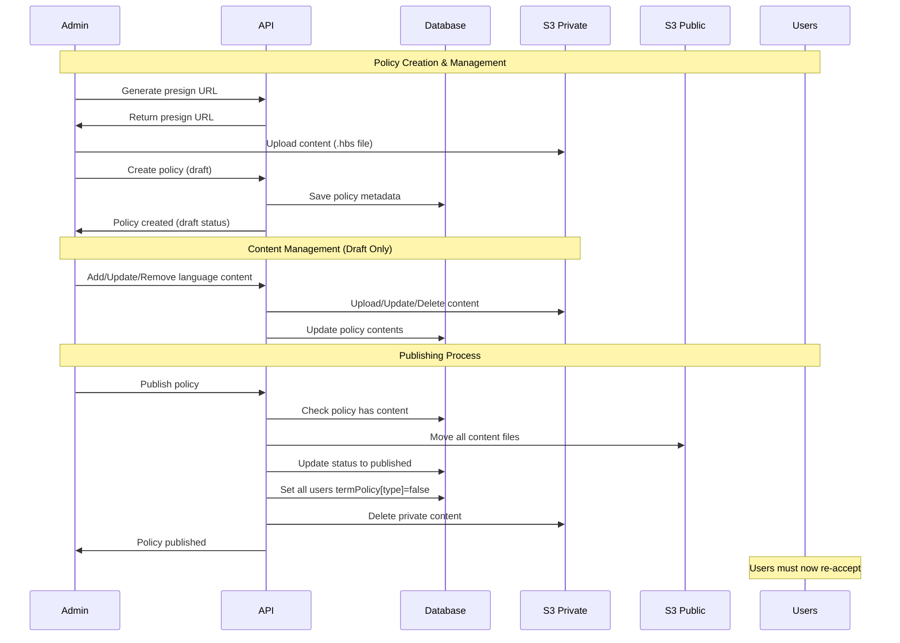
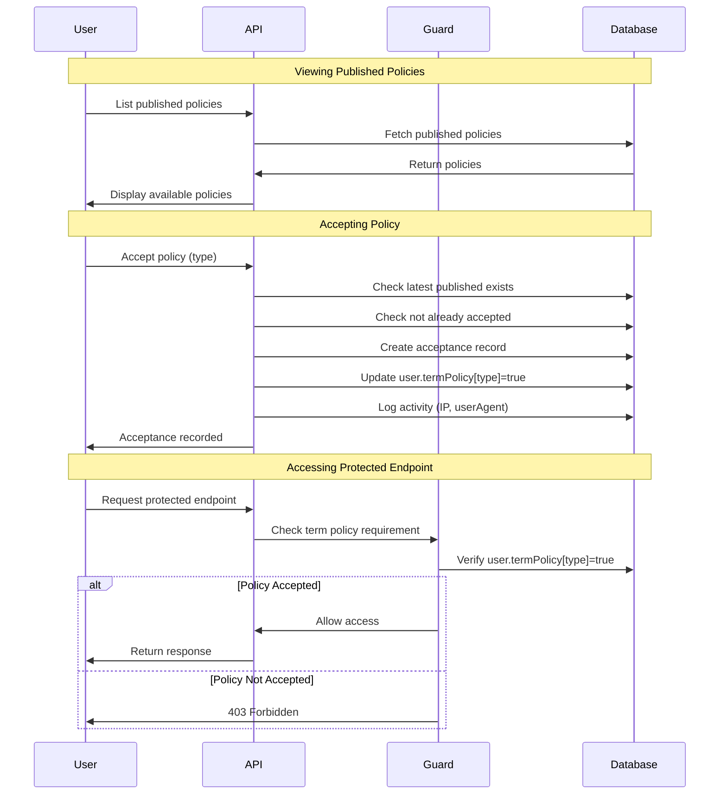
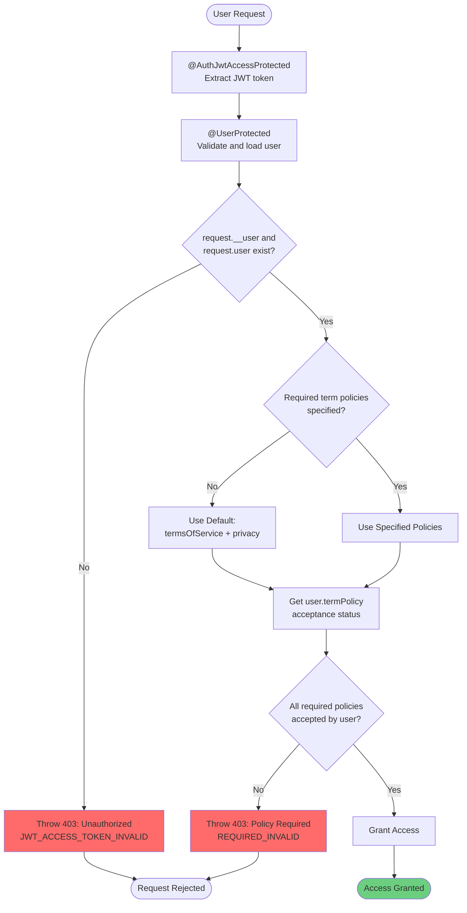

# Term Policy Document

## Overview

The Term Policy module manages legal agreements and user consent within the application. It provides a complete workflow for creating, versioning, managing, and enforcing user acceptance of legal policies such as terms of service, privacy policies, marketing consents, and cookie policies.

## Related Documents

- [Database Documentation][ref-doc-database] - Migration, seeding, and schema details
- [Authorization Documentation][ref-doc-authorization] - RBAC for admin operations
- [Authentication Documentation][ref-doc-authentication] - User authentication requirements
- [Presign Documentation][ref-doc-presign] - How to upload the contents

## Table of Contents

- [Overview](#overview)
- [Related Documents](#related-documents)
- [Policy Types](#policy-types)
- [Policy Status](#policy-status)
  - [Draft Status](#draft-status)
  - [Published Status](#published-status)
- [Flow](#flow)
  - [Admin Flow Diagram](#admin-flow-diagram)
  - [User Flow Diagram](#user-flow-diagram)
- [User Endpoints](#user-endpoints)
  - [List Published Policies](#list-published-policies)
  - [Accept Policy](#accept-policy)
  - [View Acceptance History](#view-acceptance-history)
- [Admin Endpoints](#admin-endpoints)
  - [Generate Presign URL](#generate-presign-url)
  - [Create Policy](#create-policy)
  - [Add Content](#add-content)
  - [Update Content](#update-content)
  - [Remove Content](#remove-content)
  - [Get Content](#get-content)
  - [Publish Policy](#publish-policy)
  - [List Policies](#list-policies)
  - [Delete Policy](#delete-policy)
- [TermPolicyAcceptanceProtected](#termpolicyacceptanceprotected)
  - [Basic Usage](#basic-usage)
  - [How It Works](#how-it-works)
  - [Default Behavior](#default-behavior)
  - [Important Notes](#important-notes)
- [Migration & Seeding](#migration--seeding)
- [Contribution](#contribution)

## Policy Types

Four policy types are available via `EnumTermPolicyType`:

| Type | Description |
|------|-------------|
| `termsOfService` | Terms of Service agreement |
| `privacy` | Privacy Policy |
| `marketing` | Marketing consent |
| `cookies` | Cookie Policy |

Each type can have multiple versions. Users must accept the latest published version to access protected endpoints.

## Policy Status

Term policies follow a two-stage status:

### Draft Status
- Policy created by admin
- Content files stored in **private S3 bucket**
- Can be edited, updated, or deleted
- Not visible to users
- Path: `{uploadContentPath}/{type}/{version}/{language}.hbs`

### Published Status
- Policy published by admin
- Content files moved to **public S3 bucket**
- Cannot be edited or deleted
- Visible to all users
- **Invalidates all existing user acceptances** for that policy type
- All active users must re-accept the new version
- Path: `{contentPublicPath}/{type}/{version}/{language}.hbs`

**Important**: When a new version is published, all users `termPolicy[type]` flags are set to `false`, requiring them to accept the new version before accessing protected endpoints.

## Flow

### Admin Flow Diagram



### User Flow Diagram



## User Endpoints

Users interact with term policies through acceptance and viewing their acceptance history.

### List Published Policies

Users can view all published policies available for acceptance:

```typescript
GET /term-policy/list
```

Returns policies with cursor pagination, optionally filtered by type.

### Accept Policy

To accept a specific policy type:

```typescript
POST /user/term-policy/accept
{
  "type": "termsOfService"
}
```

### View Acceptance History

Users can view their acceptance history:

```typescript
GET /user/term-policy/list/accepted
```

Returns all policies the user has accepted with timestamps and policy details.

## Admin Endpoints

Admins manage the complete lifecycle of term policies from creation to publishing.

### Generate Presign URL

Generate presigned URL for uploading content to S3:

```typescript
POST /term-policy/generate/content/presign
```

### Create Policy

Create new policy with initial content:

```typescript
POST /term-policy/create
```

### Add Content

Add new language variant to draft policy:

```typescript
PUT /term-policy/update/:termPolicyId/content/add
```

### Update Content

Replace existing language content in draft policy:

```typescript
PUT /term-policy/update/:termPolicyId/content/update
```

### Remove Content

Remove specific language variant from draft policy:

```typescript
DELETE /term-policy/update/:termPolicyId/content/remove
```

### Get Content

Get presigned URL to download policy content:

```typescript
POST /term-policy/get/:termPolicyId/content/:language
```

### Publish Policy

Publish policy and invalidate all user acceptances:

```typescript
PATCH /term-policy/publish/:termPolicyId
```
**Critical**: Publishing sets `termPolicy[type]` to `false` for all users, requiring re-acceptance. Once published, policy cannot be edited or deleted.

### List Policies

List all policies with optional filters:

```typescript
GET /term-policy/list?type=termsOfService&status=draft
```

### Delete Policy

Delete draft policy and remove S3 content:

```typescript
DELETE /term-policy/delete/:termPolicyId
```
Only draft policies can be deleted.

## TermPolicyAcceptanceProtected

The `@TermPolicyAcceptanceProtected()` decorator protects endpoints by requiring users to accept specific policies before accessing them.

**Important**: This decorator **requires** both `@UserProtected()` and `@AuthJwtAccessProtected()` to be applied. Without these decorators, the endpoint will return a 403 Forbidden error.

**Decorator order** (from top to bottom):

```typescript
@TermPolicyAcceptanceProtected()
@UserProtected()
@AuthJwtAccessProtected()
```

### Basic Usage

```typescript
@Controller('user')
export class UserController {
  
  // Requires termsOfService acceptance
  @TermPolicyAcceptanceProtected(EnumTermPolicyType.termsOfService)
  @UserProtected()
  @AuthJwtAccessProtected()
  @Get('/profile')
  async getProfile() {
    return { message: 'Profile data' };
  }
  
  // Requires both termsOfService and privacy acceptance
  @TermPolicyAcceptanceProtected(
    EnumTermPolicyType.termsOfService,
    EnumTermPolicyType.privacy
  )
  @UserProtected()
  @AuthJwtAccessProtected()
  @Get('/settings')
  async getSettings() {
    return { message: 'Settings data' };
  }
  
  // Requires marketing consent
  @TermPolicyAcceptanceProtected(EnumTermPolicyType.marketing)
  @UserProtected()
  @AuthJwtAccessProtected()
  @Get('/newsletter')
  async getNewsletter() {
    return { message: 'Newsletter content' };
  }
  
  // Default: requires termsOfService and privacy
  @TermPolicyAcceptanceProtected()
  @UserProtected()
  @AuthJwtAccessProtected()
  @Get('/dashboard')
  async getDashboard() {
    return { message: 'Dashboard data' };
  }
}
```

### How It Works



### Important Notes

- `@TermPolicyAcceptanceProtected()` **requires** `@UserProtected()` and `@AuthJwtAccessProtected()` to be applied
- Decorator order from top to bottom: `@TermPolicyAcceptanceProtected()` → `@UserProtected()` → `@AuthJwtAccessProtected()`
- For more details about `@AuthJwtAccessProtected()`, see [Authentication Documentation][ref-doc-authentication]
- For more details about `@UserProtected()`, see [Authorization Documentation][ref-doc-authorization]
- Without the required decorators, the endpoint will throw a 403 Forbidden error
- If no term policies are specified, it defaults to requiring `termsOfService` and `privacy` acceptance
- All specified term policies must be accepted by the user for access to be granted
- Incorrect decorator ordering will result in runtime errors

## Migration & Seeding

Template migration seed available at:

```
src/migration/seeds/migration.template-term-policy.seed.ts
```

This seed file provides:
- Sample term policies for all types
- Multi-language content examples
- Published policy setup

For detailed migration and seeding instructions, see [Database Documentation][ref-doc-database].

## Contribution

Special thanks to [Gzerox][ref-contributor-gzerox] for contributing to the Term Policy module implementation.


<!-- REFERENCES -->

<!-- BADGE LINKS -->

[ack-contributors-shield]: https://img.shields.io/github/contributors/andrechristikan/ack-nestjs-boilerplate?style=for-the-badge
[ack-forks-shield]: https://img.shields.io/github/forks/andrechristikan/ack-nestjs-boilerplate?style=for-the-badge
[ack-stars-shield]: https://img.shields.io/github/stars/andrechristikan/ack-nestjs-boilerplate?style=for-the-badge
[ack-issues-shield]: https://img.shields.io/github/issues/andrechristikan/ack-nestjs-boilerplate?style=for-the-badge
[ack-license-shield]: https://img.shields.io/github/license/andrechristikan/ack-nestjs-boilerplate?style=for-the-badge
[nestjs-shield]: https://img.shields.io/badge/nestjs-%23E0234E.svg?style=for-the-badge&logo=nestjs&logoColor=white
[nodejs-shield]: https://img.shields.io/badge/Node.js-339933?style=for-the-badge&logo=nodedotjs&logoColor=white
[typescript-shield]: https://img.shields.io/badge/TypeScript-007ACC?style=for-the-badge&logo=typescript&logoColor=white
[mongodb-shield]: https://img.shields.io/badge/MongoDB-white?style=for-the-badge&logo=mongodb&logoColor=4EA94B
[jwt-shield]: https://img.shields.io/badge/JWT-000000?style=for-the-badge&logo=JSON%20web%20tokens&logoColor=white
[jest-shield]: https://img.shields.io/badge/-jest-%23C21325?style=for-the-badge&logo=jest&logoColor=white
[pnpm-shield]: https://img.shields.io/badge/pnpm-%232C8EBB.svg?style=for-the-badge&logo=pnpm&logoColor=white&color=F9AD00
[docker-shield]: https://img.shields.io/badge/docker-%230db7ed.svg?style=for-the-badge&logo=docker&logoColor=white
[github-shield]: https://img.shields.io/badge/GitHub-100000?style=for-the-badge&logo=github&logoColor=white
[linkedin-shield]: https://img.shields.io/badge/LinkedIn-0077B5?style=for-the-badge&logo=linkedin&logoColor=white

<!-- CONTACTS -->

[ref-author-linkedin]: https://linkedin.com/in/andrechristikan
[ref-author-email]: mailto:andrechristikan@gmail.com
[ref-author-github]: https://github.com/andrechristikan
[ref-author-paypal]: https://www.paypal.me/andrechristikan
[ref-author-kofi]: https://ko-fi.com/andrechristikan

<!-- Repo LINKS -->

[ref-ack]: https://github.com/andrechristikan/ack-nestjs-boilerplate
[ref-ack-issues]: https://github.com/andrechristikan/ack-nestjs-boilerplate/issues
[ref-ack-stars]: https://github.com/andrechristikan/ack-nestjs-boilerplate/stargazers
[ref-ack-forks]: https://github.com/andrechristikan/ack-nestjs-boilerplate/network/members
[ref-ack-contributors]: https://github.com/andrechristikan/ack-nestjs-boilerplate/graphs/contributors
[ref-ack-license]: LICENSE.md

<!-- THIRD PARTY -->

[ref-nestjs]: http://nestjs.com
[ref-nestjs-swagger]: https://docs.nestjs.com/openapi/introduction
[ref-nestjs-swagger-types]: https://docs.nestjs.com/openapi/types-and-parameters
[ref-prisma]: https://www.prisma.io
[ref-prisma-mongodb]: https://www.prisma.io/docs/orm/overview/databases/mongodb#commonalities-with-other-database-provider
[ref-prisma-setup]: https://www.prisma.io/docs/getting-started/setup-prisma/add-to-existing-project#switching-databases
[ref-mongodb]: https://docs.mongodb.com/
[ref-redis]: https://redis.io
[ref-bullmq]: https://bullmq.io
[ref-nodejs]: https://nodejs.org/
[ref-typescript]: https://www.typescriptlang.org/
[ref-docker]: https://docs.docker.com
[ref-dockercompose]: https://docs.docker.com/compose/
[ref-pnpm]: https://pnpm.io
[ref-12factor]: https://12factor.net
[ref-commander]: https://nest-commander.jaymcdoniel.dev
[ref-package-json]: package.json
[ref-jwt]: https://jwt.io
[ref-jest]: https://jestjs.io/docs/getting-started
[ref-git]: https://git-scm.com
[ref-google-console]: https://console.cloud.google.com/
[ref-google-client-secret]: https://developers.google.com/identity/protocols/oauth2

[ref-doc-root]: ../readme.md
[ref-doc-activity-log]: activity-log.md
[ref-doc-authentication]: authentication.md
[ref-doc-authorization]: authorization.md
[ref-doc-cache]: cache.md
[ref-doc-configuration]: configuration.md
[ref-doc-database]: database.md
[ref-doc-environment]: environment.md
[ref-doc-feature-flag]: feature-flag.md
[ref-doc-file-upload]: file-upload.md
[ref-doc-handling-error]: handling-error.md
[ref-doc-installation]: installation.md
[ref-doc-logger]: logger.md
[ref-doc-message]: message.md
[ref-doc-pagination]: pagination.md
[ref-doc-project-structure]: project-structure.md
[ref-doc-queue]: queue.md
[ref-doc-request-validation]: request-validation.md
[ref-doc-response]: response.md
[ref-doc-security-and-middleware]: security-and-middleware.md
[ref-doc-doc]: doc.md
[ref-doc-third-party-integration]: third-party-integration.md
[ref-doc-presign]: presign.md
[ref-doc-term-policy]: term-policy.md

<!-- CONTRIBUTOR -->

[ref-contributor-gzerox]: https://github.com/Gzerox
