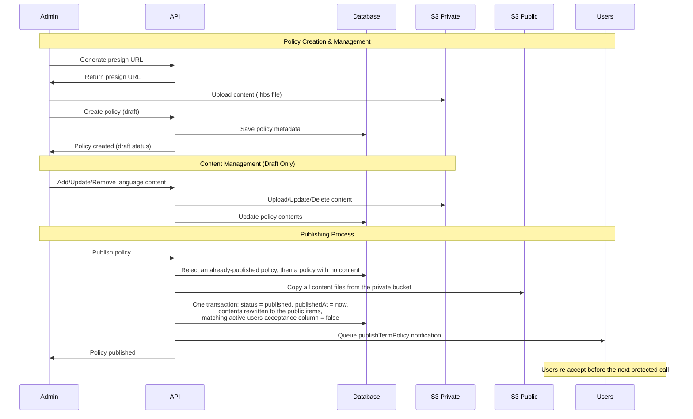
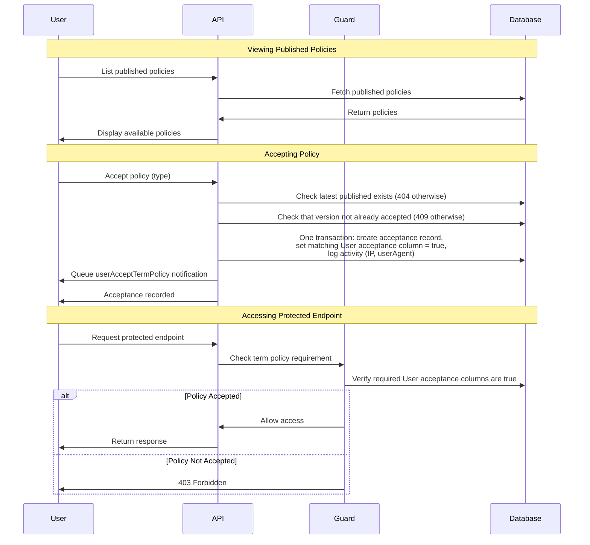
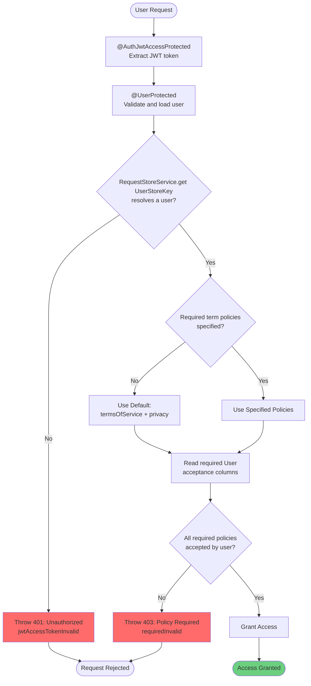

# Term Policy Document

## Overview

Term Policy stores versioned legal documents (terms of service, privacy policy, marketing consent, cookie policy) and records user acceptance.

## Related Documents

- [Database Documentation][ref-doc-database] - Migration, seeding, and schema details
- [Authorization Documentation][ref-doc-authorization] - RBAC for admin operations
- [Authentication Documentation][ref-doc-authentication] - User authentication requirements
- [Presign Documentation][ref-doc-presign] - How to upload the contents
- [Analytic Documentation][ref-doc-analytic] - Admin acceptance-rate and time-to-accept metrics under `/admin/analytic/term-policies/*`

## Table of Contents

- [Overview](#overview)
- [Related Documents](#related-documents)
- [Policy Types](#policy-types)
- [Policy Status](#policy-status)
  - [Draft Status](#draft-status)
  - [Published Status](#published-status)
- [Flow](#flow)
  - [Admin Flow Diagram](#admin-flow-diagram)
  - [User Flow Diagram](#user-flow-diagram)
- [User Endpoints](#user-endpoints)
  - [List Published Policies](#list-published-policies)
  - [Accept Policy](#accept-policy)
  - [View Acceptance History](#view-acceptance-history)
- [Admin Endpoints](#admin-endpoints)
  - [Generate Presign URL](#generate-presign-url)
  - [Create Policy](#create-policy)
  - [Add Content](#add-content)
  - [Update Content](#update-content)
  - [Remove Content](#remove-content)
  - [Get Content](#get-content)
  - [Publish Policy](#publish-policy)
  - [List Policies](#list-policies)
  - [Delete Policy](#delete-policy)
- [TermPolicyAcceptanceProtected](#termpolicyacceptanceprotected)
  - [Basic Usage](#basic-usage)
  - [How It Works](#how-it-works)
  - [Important Notes](#important-notes)
- [Migration & Seeding](#migration--seeding)
- [Contribution](#contribution)

## Policy Types

Four policy types are available via `EnumTermPolicyType`:

| Type | Description |
|------|-------------|
| `termsOfService` | Terms of Service agreement |
| `privacy` | Privacy Policy |
| `marketing` | Marketing consent |
| `cookies` | Cookie Policy |

Each type can have multiple versions. A user reaches protected endpoints only after accepting the latest published version.

## Policy Status

Term policies follow a two-stage status:

### Draft Status
- Policy created by admin
- Content files stored in **private S3 bucket**
- Can be edited, updated, or deleted
- Not visible to users
- Key: `term-policies/{type}/v{version}/{language}.hbs` (from `termPolicy.uploadContentPath`)

### Published Status
- Policy published by admin
- Content files exist in both buckets: the private originals the draft was uploaded to, and a copy in the **public S3 bucket**
- Cannot be edited or deleted
- Visible to all users
- **Invalidates all existing user acceptances** for that policy type
- Every active user re-accepts the new version before reaching protected endpoints again
- Key: `term-policies/{type}/v{version}/{language}.hbs` (from `termPolicy.contentPublicPath`)

Both paths resolve to the same key, so the two copies differ by bucket alone. The record's `contents` point at the public copy, each entry carrying the `access` of the bucket it names.

**Important**: When a new version is published, the matching `User` acceptance column (`termsOfServiceAccepted`, `privacyAccepted`, `cookiesAccepted`, or `marketingAccepted`) is set to `false` for every active, non-deleted user, requiring them to accept the new version before accessing protected endpoints.

## Flow

### Admin Flow Diagram


```mermaid
sequenceDiagram
    participant Admin
    participant API
    participant Database
    participant S3 Private
    participant S3 Public
    participant Users

    Note over Admin,Users: Policy Creation & Management
    
    Admin->>API: Generate presign URL
    API->>Admin: Return presign URL
    Admin->>S3 Private: Upload content (.hbs file)
    
    Admin->>API: Create policy (draft)
    API->>Database: Save policy metadata
    API->>Admin: Policy created (draft status)
    
    Note over Admin,S3 Private: Content Management (Draft Only)
    
    Admin->>API: Add/Update/Remove language content
    API->>S3 Private: Upload/Update/Delete content
    API->>Database: Update policy contents
    
    Note over Admin,Users: Publishing Process
    
    Admin->>API: Publish policy
    API->>Database: Reject an already-published policy, then a policy with no content
    API->>S3 Public: Copy all content files from the private bucket
    API->>Database: One transaction: status = published, publishedAt = now,<br/>contents rewritten to the public items,<br/>matching active users acceptance column = false
    API->>Users: Queue publishTermPolicy notification
    API->>Admin: Policy published
    
    Note over Users: Users re-accept before the next protected call
```

Publishing is the one admin action that fans out to every user: after the transaction commits it queues a `publishTermPolicy` job, which emails every active user who still has the `transactional` + `email` notification setting enabled, in batches of `email.batchSize`.

### User Flow Diagram


```mermaid
sequenceDiagram
    participant User
    participant API
    participant Guard
    participant Database

    Note over User,Database: Viewing Published Policies
    
    User->>API: List published policies
    API->>Database: Fetch published policies
    Database->>API: Return policies
    API->>User: Display available policies
    
    Note over User,Database: Accepting Policy
    
    User->>API: Accept policy (type)
    API->>Database: Check latest published exists (404 otherwise)
    API->>Database: Check that version not already accepted (409 otherwise)
    API->>Database: One transaction: create acceptance record,<br/>set matching User acceptance column = true,<br/>log activity (IP, userAgent)
    API->>User: Queue userAcceptTermPolicy notification
    API->>User: Acceptance recorded
    
    Note over User,Database: Accessing Protected Endpoint
    
    User->>API: Request protected endpoint
    API->>Guard: Check term policy requirement
    Guard->>Database: Verify required User acceptance columns are true
    alt Policy Accepted
        Guard->>API: Allow access
        API->>User: Return response
    else Policy Not Accepted
        Guard->>User: 403 Forbidden
    end
```

## User Endpoints

Users interact with term policies through acceptance and viewing their acceptance history.

### List Published Policies

Users can view all published policies available for acceptance:

```typescript
GET /public/term-policy/list
```

Returns policies with cursor pagination, optionally filtered by type.

### Accept Policy

To accept a specific policy type:

```typescript
POST /shared/user/term-policy/accept
{
  "type": "termsOfService"
}
```

The request names only the type; the server resolves it to the **latest published version** of that type and records the acceptance against that record. The duplicate check is per policy record, not per type, so a user who accepted version 1 accepts version 2 again once it is published. Accepting the same version twice returns `409` (`alreadyAccepted`). When no published policy exists for the type, it returns `404` (`notFound`).

### View Acceptance History

Users can view their acceptance history:

```typescript
GET /shared/user/term-policy/acceptance/list
```

Returns all policies the user has accepted with timestamps and policy details.

## Admin Endpoints

Admins manage the complete lifecycle of term policies from creation to publishing.

### Generate Presign URL

Generate presigned URL for uploading content to S3:

```typescript
POST /admin/term-policy/content/presign/generate
{
  "type": "termsOfService",
  "version": 1,
  "language": "en",
  "size": 1024
}
```

The API derives the S3 key itself from `type`, `version`, and `language`; the client does not supply it. The response is the standard presign payload (`key`, `mime`, `extension`, `presignUrl`, `expiredInSeconds`) against the **private** bucket. Requesting a presign for a type and version already published returns `400` (`statusInvalid`).

### Create Policy

Create new policy with initial content:

```typescript
POST /admin/term-policy/create
```

### Add Content

Add new language variant to draft policy:

```typescript
PUT /admin/term-policy/content/:termPolicyId/add
```

### Update Content

Replace existing language content in draft policy:

```typescript
PUT /admin/term-policy/content/:termPolicyId/update
```

### Remove Content

Remove specific language variant from draft policy:

```typescript
DELETE /admin/term-policy/content/:termPolicyId/remove
```

### Get Content

Get presigned URL to download policy content:

```typescript
GET /admin/term-policy/content/:termPolicyId/:language/get
```

Works on draft and published policies alike. The signature targets the bucket named by the stored content's own `access`: the private bucket for a draft, the public one for a published policy.

### Publish Policy

Publish policy and invalidate all user acceptances:

```typescript
PATCH /admin/term-policy/publish/:termPolicyId
```
**Critical**: Publishing sets the matching `User` acceptance column to `false` for every active, non-deleted user, requiring re-acceptance. Existing `TermPolicyUserAcceptance` records remain as acceptance history. Publishing an already-published policy returns `400` (`statusInvalid`); publishing one with no content returns `400` (`contentEmpty`). Once published, a policy cannot be edited or deleted, and its content files exist in both buckets: the public copy the record points at, and the private original the draft was uploaded to.

### List Policies

List all policies with optional filters:

```typescript
GET /admin/term-policy/list?type=termsOfService&status=draft
```

Offset pagination, unlike the public list. `type` and `status` each accept a comma-delimited set of values.

### Delete Policy

Delete draft policy and remove S3 content:

```typescript
DELETE /admin/term-policy/delete/:termPolicyId
```
Only draft policies can be deleted; anything else returns `400` (`statusInvalid`). The record is hard deleted.

## TermPolicyAcceptanceProtected

The `@TermPolicyAcceptanceProtected()` decorator protects endpoints by requiring users to accept specific policies before accessing them.

The guard reads the user out of the request store, which `@UserProtected()` fills and `@AuthJwtAccessProtected()` feeds. Without both, it resolves no user and throws `401 Unauthorized` (`jwtAccessTokenInvalid`).

**Decorator order** (from top to bottom):

```typescript
@TermPolicyAcceptanceProtected()
@UserProtected()
@AuthJwtAccessProtected()
```

### Basic Usage

```typescript
@Controller({
  version: '1',
  path: '/user/term-policy',
})
export class TermPolicySharedController {
  @TermPolicyAcceptanceProtected()
  @UserProtected()
  @AuthJwtAccessProtected()
  @Get('/acceptance/list')
  async listAccepted(
    @PaginationCursorQuery({
      availableOrderBy: TermPolicyAcceptanceDefaultAvailableOrderBy,
    })
    pagination: IPaginationQueryCursorParams<Prisma.TermPolicyUserAcceptanceWhereInput>,
    @AuthJwtPayload('userId') userId: string
  ): Promise<IResponsePagingReturn<ITermPolicyUserAcceptance>> {
    return this.termPolicyAcceptanceHttpService.getListUserAccepted(
      userId,
      pagination
    );
  }

  @TermPolicyAcceptanceProtected()
  @UserProtected()
  @AuthJwtAccessProtected()
  @Post('/accept')
  async accept(
    @UserCurrent() user: IUser,
    @Body({ schema: TermPolicyAcceptRequestSchema }) body: TermPolicyAcceptRequestDto
  ): Promise<IResponseReturn<void>> {
    return this.termPolicyAcceptanceHttpService.userAccept(user, body);
  }
}
```

The decorator takes optional `EnumTermPolicyType` arguments. With none, it requires `termsOfService` and `privacy`. Shared and admin routes in this checkout pass no arguments.

### How It Works


```mermaid
flowchart TD
    Start([User Request]) --> JwtGuard[ @AuthJwtAccessProtected<br/>Extract JWT token]
    JwtGuard --> UserGuard[ @UserProtected<br/>Validate and load user]
    UserGuard --> CheckUser{RequestStoreService.get UserStoreKey<br/>resolves a user?}
    
    CheckUser -->|No| ErrorUser[Throw 401: Unauthorized<br/>jwtAccessTokenInvalid]
    CheckUser -->|Yes| CheckRequired{Required term policies<br/>specified?}
    
    CheckRequired -->|No| SetDefault[Use Default:<br/>termsOfService + privacy]
    CheckRequired -->|Yes| UseSpecified[Use Specified Policies]
    
    SetDefault --> GetTermPolicy[Read required User<br/>acceptance columns]
    UseSpecified --> GetTermPolicy
    
    GetTermPolicy --> CheckAcceptance{All required policies<br/>accepted by user?}
    
    CheckAcceptance -->|No| ErrorRequired[Throw 403: Policy Required<br/>requiredInvalid]
    CheckAcceptance -->|Yes| GrantAccess[Grant Access]
    
    GrantAccess --> Success([Access Granted])
    
    ErrorUser --> End([Request Rejected])
    ErrorRequired --> End
    
    style ErrorUser fill:#ff6b6b
    style ErrorRequired fill:#ff6b6b
    style Success fill:#6bcf7f
```

### Important Notes

- `@TermPolicyAcceptanceProtected()` reads the user `@UserProtected()` stored, which depends on `@AuthJwtAccessProtected()`
- Decorator order from top to bottom: `@TermPolicyAcceptanceProtected()` → `@UserProtected()` → `@AuthJwtAccessProtected()`
- For more details about `@AuthJwtAccessProtected()`, see [Authentication Documentation][ref-doc-authentication]
- For more details about `@UserProtected()`, see [Authorization Documentation][ref-doc-authorization]
- Without the required decorators, the guard finds no user and throws `401 Unauthorized` (`jwtAccessTokenInvalid`)
- If no term policies are specified, it defaults to requiring `termsOfService` and `privacy` acceptance
- Access is granted only when the user has accepted every specified term policy
- A user missing any required acceptance gets `403 Forbidden` (`requiredInvalid`)
- Incorrect decorator ordering fails the same way as a missing decorator: the guard runs before the user is in the store, so the request is rejected with `401`

## Migration & Seeding

Two seeds cover term policies:

```
src/migration/seeds/migration.term-policy.seed.ts           # command: termPolicy
src/migration/seeds/migration.template-term-policy.seed.ts  # command: template-termPolicy
```

- `termPolicy` is the seed wired into `pnpm migration:seed` and `pnpm migration:remove`. It upserts the rows in `src/migration/data/migration.term-policy.data.ts`: one version 1 record per type, all `published`, with empty `contents`.
- `template-termPolicy` is run on its own. For each type it uploads the bundled `.hbs` document to the private bucket, copies it to the public content path, and upserts a published version 1 record whose single `en` content entry is the public item, so a seeded policy sits in both buckets like any published one. It throws when S3 is not initialized, and its `remove()` is a no-op.

For detailed migration and seeding instructions, see [Database Documentation][ref-doc-database].

## Contribution

Special thanks to [Gzerox][ref-contributor-gzerox] for contributing to the Term Policy module implementation.


<!-- REFERENCES -->

[ref-doc-database]: database.md
[ref-doc-authorization]: authorization.md
[ref-doc-authentication]: authentication.md
[ref-doc-presign]: presign.md
[ref-doc-analytic]: analytic.md

[ref-contributor-gzerox]: https://github.com/Gzerox
