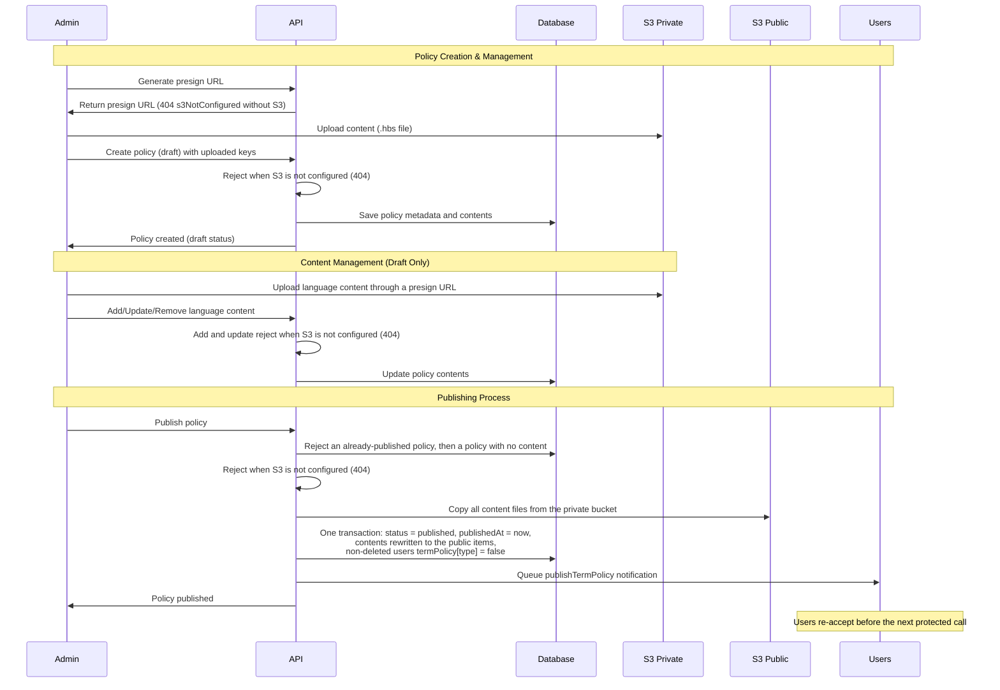
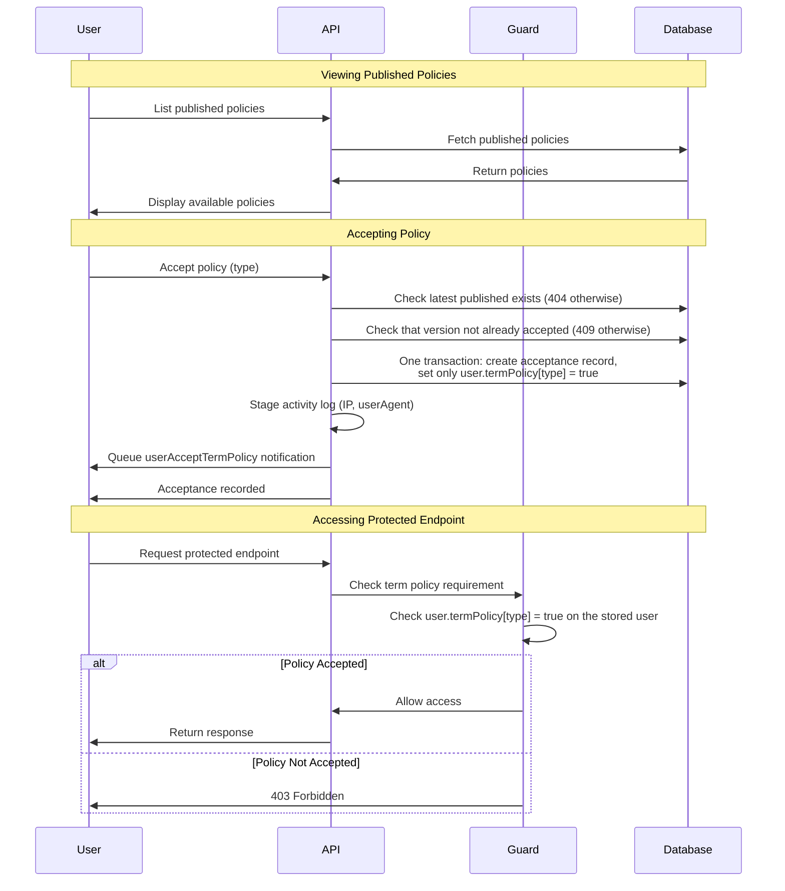
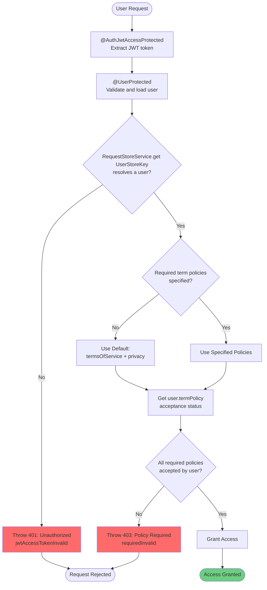

# Term Policy Document

## Overview

Term Policy stores versioned legal documents (terms of service, privacy policy, marketing consent, cookie policy) and records user acceptance.

## Related Documents

- [Database Documentation][ref-doc-database]: Migration, seeding, and schema
- [Authorization Documentation][ref-doc-authorization]: Admin RBAC on term-policy routes
- [Authentication Documentation][ref-doc-authentication]: JWT and session context
- [File Upload Documentation][ref-doc-file-upload]: Content upload and admin content GET (presign)
- [Analytic Documentation][ref-doc-analytic]: Admin acceptance-rate and time-to-accept metrics under `/admin/analytic/term-policies/*`
- [Email Documentation][ref-doc-email]: SES templates for policy publication (not the HTML bodies)

## Table of Contents

- [Overview](#overview)
- [Related Documents](#related-documents)
- [Policy Types](#policy-types)
- [Policy Status](#policy-status)
    - [Draft Status](#draft-status)
    - [Published Status](#published-status)
- [Flow](#flow)
    - [Admin Flow Diagram](#admin-flow-diagram)
    - [User Flow Diagram](#user-flow-diagram)
- [User Endpoints](#user-endpoints)
    - [List Published Policies](#list-published-policies)
    - [Accept Policy](#accept-policy)
    - [View Acceptance History](#view-acceptance-history)
- [Admin Endpoints](#admin-endpoints)
    - [Generate Presign URL](#generate-presign-url)
    - [Create Policy](#create-policy)
    - [Add Content](#add-content)
    - [Update Content](#update-content)
    - [Remove Content](#remove-content)
    - [Get Content](#get-content)
    - [Publish Policy](#publish-policy)
    - [List Policies](#list-policies)
    - [Delete Policy](#delete-policy)
- [TermPolicyAcceptanceProtected](#termpolicyacceptanceprotected)
    - [Basic Usage](#basic-usage)
    - [How It Works](#how-it-works)
    - [Important Notes](#important-notes)
- [Migration & Seeding](#migration--seeding)

## Policy Types

Four policy types are available via `EnumTermPolicyType`:

| Type             | Description                |
| ---------------- | -------------------------- |
| `termsOfService` | Terms of Service agreement |
| `privacy`        | Privacy Policy             |
| `marketing`      | Marketing consent          |
| `cookies`        | Cookie Policy              |

- Each type can have multiple versions.
- A user reaches protected endpoints only after accepting the latest published version.

## Policy Status

Term policies follow a two-stage status:

### Draft Status

- Policy created by admin
- Content files stored in **private S3 bucket**
- Can be edited, updated, or deleted
- Not visible to users
- Key: `term-policies/{type}/v{version}/{language}.hbs` (from `termPolicy.uploadContentPath`)

### Published Status

- Policy published by admin
- Content files exist in both buckets: the private originals the draft was uploaded to, and a copy in the **public S3 bucket**
- Cannot be edited or deleted
- Visible to all users
- **Invalidates all existing user acceptances** for that policy type
- Every non-deleted user re-accepts the new version before reaching protected endpoints again
- Key: `term-policies/{type}/v{version}/{language}.hbs` (from `termPolicy.contentPublicPath`)

- Both paths resolve to the same key, so the two copies differ by bucket alone.
- The record's `contents` point at the public copy, each entry carrying the `access` of the bucket it names.
- Publishing a new version writes `termPolicy: { update: { [type]: false } }` for every non-deleted user, whatever the user's status.
- The nested `update` changes only the flag of that type, so the other flags of the user stay as they are.
- Each user accepts the new version before reaching protected endpoints again.

## Flow

### Admin Flow Diagram


```mermaid
sequenceDiagram
    participant Admin
    participant API
    participant Database
    participant S3 Private
    participant S3 Public
    participant Users

    Note over Admin,Users: Policy Creation & Management

    Admin->>API: Generate presign URL
    API->>Admin: Return presign URL (404 s3NotConfigured without S3)
    Admin->>S3 Private: Upload content (.hbs file)

    Admin->>API: Create policy (draft) with uploaded keys
    API->>API: Reject when S3 is not configured (404)
    API->>Database: Save policy metadata and contents
    API->>Admin: Policy created (draft status)

    Note over Admin,S3 Private: Content Management (Draft Only)

    Admin->>S3 Private: Upload language content through a presign URL
    Admin->>API: Add/Update/Remove language content
    API->>API: Add and update reject when S3 is not configured (404)
    API->>Database: Update policy contents

    Note over Admin,Users: Publishing Process

    Admin->>API: Publish policy
    API->>Database: Reject an already-published policy, then a policy with no content
    API->>API: Reject when S3 is not configured (404)
    API->>S3 Public: Copy all content files from the private bucket
    API->>Database: One transaction: status = published, publishedAt = now,<br/>contents rewritten to the public items,<br/>non-deleted users termPolicy[type] = false
    API->>Users: Queue publishTermPolicy notification
    API->>Admin: Policy published

    Note over Users: Users re-accept before the next protected call
```

Publishing is the one admin action that fans out to every user. After the transaction commits it queues one `publishTermPolicy` job:

- A policy already `published` fails the status pre-check with `400` (`statusInvalid`) and queues nothing.
- The status update matches the policy only while it is `draft`, so one of two concurrent publishes commits.
    - The losing publish queues nothing and answers `400` (`statusInvalid`) when its update runs after the winner commits.
    - It answers `500` when the two transactions overlap: MongoDB raises a write conflict (`P2034`) and nothing retries it.
- The job is queued after the commit.
    - When the add fails, the request answers `500`.
    - When the add fails, the policy stays `published` and no email goes out.
    - A later publish is refused by the status pre-check, so nothing queues the job again.
- The job id is `publishTermPolicy-{termPolicyId}`, with no deduplication TTL.
- The job targets every non-deleted user, whatever the user's status.
    - Each user gets one marker per term policy, which stops a duplicate `Notification` row and a second batch.
    - A repeat send is possible at the SES boundary when the `sentAt` update fails or the worker stalls after the send. See [Notification Documentation][ref-doc-notification].
    - A user's notification setting does not apply.
- The job pages users with an `id` cursor and sends in batches of `email.batchSize` (50).
- Each batch is one email job with a delay of `index * email.batchDelayInMs`.
- An email job marks a recipient sent only when SES reports `Success`.
- An email job fails when any recipient failed.

Job ids, markers, retries, what happens when the orchestration job exhausts its attempts, and Sentry reporting: [Notification Documentation][ref-doc-notification].

### User Flow Diagram


```mermaid
sequenceDiagram
    participant User
    participant API
    participant Guard
    participant Database

    Note over User,Database: Viewing Published Policies

    User->>API: List published policies
    API->>Database: Fetch published policies
    Database->>API: Return policies
    API->>User: Display available policies

    Note over User,Database: Accepting Policy

    User->>API: Accept policy (type)
    API->>Database: Check latest published exists (404 otherwise)
    API->>Database: Check that version not already accepted (409 otherwise)
    API->>Database: One transaction: create acceptance record,<br/>set only user.termPolicy[type] = true
    API->>API: Stage activity log (IP, userAgent)
    API->>User: Queue userAcceptTermPolicy notification
    API->>User: Acceptance recorded

    Note over User,Database: Accessing Protected Endpoint

    User->>API: Request protected endpoint
    API->>Guard: Check term policy requirement
    Guard->>Guard: Check user.termPolicy[type] = true on the stored user
    alt Policy Accepted
        Guard->>API: Allow access
        API->>User: Return response
    else Policy Not Accepted
        Guard->>User: 403 Forbidden
    end
```

## User Endpoints

Users interact with term policies through acceptance and viewing their acceptance history.

### List Published Policies

Users can view all published policies available for acceptance:

```typescript
GET / public / term - policy / list;
```

Returns policies with cursor pagination, optionally filtered by type.

### Accept Policy

To accept a specific policy type:

```typescript
POST /shared/user/term-policy/accept
{
  "type": "termsOfService"
}
```

- The request names only the type. The server resolves it to the **latest published version** of that type and records the acceptance against that record.
- The duplicate check is per policy record, not per type, so a user who accepted version 1 accepts version 2 again once it is published.
- Accepting the same version twice returns `409` (`alreadyAccepted`).
- The acceptance writes `termPolicy: { update: { [type]: true } }` on the user, so only that one flag changes.
- When no published policy exists for the type, it returns `404` (`notFound`).

### View Acceptance History

Users can view their acceptance history:

```typescript
GET / shared / user / term - policy / acceptance / list;
```

Returns all policies the user has accepted with timestamps and policy details.

## Admin Endpoints

Admins manage the complete lifecycle of term policies from creation to publishing.

Content lives in S3, so these routes need a configured S3 integration. Without one, each of these throws `AwsS3NotConfiguredException` (`404`, `s3NotConfigured`, message `aws.error.s3NotConfigured`):

- generate presign
- create
- add content
- update content
- get content
- publish

Behavior without S3:

- Publishing checks S3 before it copies anything, so a policy is never published with empty contents.
- Remove content and delete run without S3.
- Delete then removes only the record.

### Generate Presign URL

Generate presigned URL for uploading content to S3:

```typescript
POST /admin/term-policy/content/presign/generate
{
  "type": "termsOfService",
  "version": 1,
  "language": "en",
  "size": 1024
}
```

The API derives the S3 key itself from `type`, `version`, and `language`. The client does not supply it.

Response:

- the standard presign payload (`key`, `mime`, `extension`, `presignUrl`, `expiredInSeconds`)
- against the **private** bucket

Requesting a presign for a type and version already published returns `400` (`statusInvalid`).

### Create Policy

Create a draft policy with its initial content entries:

```typescript
POST /admin/term-policy/create
{
  "type": "termsOfService",
  "version": 1,
  "contents": [{ "language": "en", "key": "term-policies/termsOfService/v1/en.hbs", "size": 1024 }]
}
```

- Each entry names a key the client already uploaded through a presign URL. The API records it against the private bucket and uploads nothing.
- A duplicate `type` and `version` returns `409` (`exist`).
- Two entries with the same language fail the request schema and return `422` with status code `50300` (`request.error.validation`) from the validation pipe.

### Add Content

Add new language variant to draft policy (`409` `contentExist` when the language already has content):

```typescript
PUT /admin/term-policy/content/:termPolicyId/add
```

### Update Content

Replace existing language content in draft policy:

```typescript
PUT /admin/term-policy/content/:termPolicyId/update
```

### Remove Content

Remove specific language variant from the draft record (`404` `contentNotFound` when the language has none). The S3 object stays in place:

```typescript
DELETE /admin/term-policy/content/:termPolicyId/remove
```

Add, update, remove, and get content read the stored contents through `TermPolicyUtil.toContents`. A stored content with an unknown language or access answers `500` (`contentInvalid`).

### Get Content

Get presigned URL to download policy content:

```typescript
GET /admin/term-policy/content/:termPolicyId/:language/get
```

- It works on draft and published policies alike.
- The signature targets the bucket named by the stored content's own `access`: the private bucket for a draft, the public one for a published policy.

### Publish Policy

Publish policy and invalidate all user acceptances:

```typescript
PATCH /admin/term-policy/publish/:termPolicyId
```

Publishing:

- sets `termPolicy[type]` to `false` for every non-deleted user, whatever the status, so each one accepts again
- queues the publication email described under [Admin Flow Diagram](#admin-flow-diagram)
- an already-published policy returns `400` (`statusInvalid`)
- a policy with no content returns `400` (`contentEmpty`)
- a stored content with an unknown language or access returns `500` (`contentInvalid`)

Once published:

- A policy cannot be edited or deleted.
- Its content files exist in both buckets: the public copy the record points at, and the private original the draft was uploaded to.

### List Policies

List all policies with optional filters:

```typescript
GET /admin/term-policy/list?type=termsOfService&status=draft
```

Offset pagination, unlike the public list. `type` and `status` each accept a comma-delimited set of values.

### Delete Policy

Delete draft policy and remove S3 content:

```typescript
DELETE /admin/term-policy/delete/:termPolicyId
```

- Only draft policies can be deleted.
- Any other policy returns `400` (`statusInvalid`).
- The record is hard deleted.

## TermPolicyAcceptanceProtected

The `@TermPolicyAcceptanceProtected()` decorator protects endpoints by requiring users to accept specific policies before accessing them.

The guard reads the user out of the request store, which `@UserProtected()` fills and `@AuthJwtAccessProtected()` feeds. Without both, it resolves no user and throws `401 Unauthorized` (`jwtAccessTokenInvalid`).

**Decorator order** (from top to bottom):

```typescript
@TermPolicyAcceptanceProtected()
@UserProtected()
@AuthJwtAccessProtected()
```

### Basic Usage

```typescript
@Controller({
    version: '1',
    path: '/user/term-policy',
})
export class TermPolicySharedController {
    @Doc({ summary: 'list of terms or policies accepted by the user' })
    @ResponsePagination('termPolicy.listAccepted', {
        schema: TermPolicyUserAcceptanceResponseSchema,
    })
    @TermPolicyAcceptanceProtected()
    @UserProtected()
    @AuthJwtAccessProtected()
    @ApiKeyProtected()
    @RequestThrottle({ user: true })
    @Get('/acceptance/list')
    async listAccepted(
        @Query({ schema: TermPolicyAcceptedListRequestSchema })
        query: TermPolicyAcceptedListRequestDto,
        @AuthJwtPayload('userId') userId: string
    ): Promise<IResponsePaginationReturn<ITermPolicyUserAcceptance>> {
        return this.termPolicyAcceptanceHttpService.getListUserAccepted(
            userId,
            query
        );
    }

    @Doc({ summary: 'user accepts term or policy' })
    @Response('termPolicy.accept')
    @TermPolicyAcceptanceProtected()
    @UserProtected()
    @AuthJwtAccessProtected()
    @ApiKeyProtected()
    @RequestThrottle({ user: true })
    @HttpCode(HttpStatus.OK)
    @Post('/accept')
    async accept(
        @UserCurrent() user: IUser,
        @Body({ schema: TermPolicyAcceptRequestSchema })
        body: TermPolicyAcceptRequestDto
    ): Promise<IResponseReturn<void>> {
        await this.termPolicyAcceptanceHttpService.userAccept(user, body);

        return {};
    }
}
```

- The decorator takes optional `EnumTermPolicyType` arguments.
- With none, it requires `termsOfService` and `privacy`.
- Shared and admin routes pass no arguments.

### How It Works


```mermaid
flowchart TD
    Start([User Request]) --> JwtGuard[ @AuthJwtAccessProtected<br/>Extract JWT token]
    JwtGuard --> UserGuard[ @UserProtected<br/>Validate and load user]
    UserGuard --> CheckUser{RequestStoreService.get UserStoreKey<br/>resolves a user?}

    CheckUser -->|No| ErrorUser[Throw 401: Unauthorized<br/>jwtAccessTokenInvalid]
    CheckUser -->|Yes| CheckRequired{Required term policies<br/>specified?}

    CheckRequired -->|No| SetDefault[Use Default:<br/>termsOfService + privacy]
    CheckRequired -->|Yes| UseSpecified[Use Specified Policies]

    SetDefault --> GetTermPolicy[Get user.termPolicy<br/>acceptance status]
    UseSpecified --> GetTermPolicy

    GetTermPolicy --> CheckAcceptance{All required policies<br/>accepted by user?}

    CheckAcceptance -->|No| ErrorRequired[Throw 403: Policy Required<br/>requiredInvalid]
    CheckAcceptance -->|Yes| GrantAccess[Grant Access]

    GrantAccess --> Success([Access Granted])

    ErrorUser --> End([Request Rejected])
    ErrorRequired --> End

    style ErrorUser fill:#ff6b6b
    style ErrorRequired fill:#ff6b6b
    style Success fill:#6bcf7f
```

### Important Notes

- `@TermPolicyAcceptanceProtected()` reads the user `@UserProtected()` stored, which depends on `@AuthJwtAccessProtected()`
- Decorator order from top to bottom: `@TermPolicyAcceptanceProtected()` → `@UserProtected()` → `@AuthJwtAccessProtected()`
- For more details about `@AuthJwtAccessProtected()`, see [Authentication Documentation][ref-doc-authentication]
- For more details about `@UserProtected()`, see [Authorization Documentation][ref-doc-authorization]
- Without the required decorators, the guard finds no user and throws `401 Unauthorized` (`jwtAccessTokenInvalid`)
- If no term policies are specified, it defaults to requiring `termsOfService` and `privacy` acceptance
- Access is granted only when the user has accepted every specified term policy
- A user missing any required acceptance gets `403 Forbidden` (`requiredInvalid`)
- Incorrect decorator ordering fails the same way as a missing decorator: the guard runs before the user is in the store, so the request is rejected with `401`

## Migration & Seeding

Two seeds cover term policies:

```
src/migration/seeds/migration.term-policy.seed.ts           # command: termPolicy
src/migration/seeds/migration.template-term-policy.seed.ts  # command: templateTermPolicy
```

- `termPolicy` is the seed wired into `pnpm migration:seed` and `pnpm migration:remove`.
    - It upserts the rows in `src/migration/data/migration.term-policy.data.ts`: one version 1 record per type, all `published`, with empty `contents`.
    - Details of that seed (actor, order, remove): [Database Documentation][ref-doc-database].
- `templateTermPolicy` is run on its own. For each type it:
    1. uploads the bundled `.hbs` document to the private bucket
    2. copies it to the public content path
    3. upserts a published version 1 record whose single `en` content entry is the public item, so a seeded policy sits in both buckets like any published one

    When S3 is not configured it logs a warning and skips, and its `remove()` is a no-op.

```bash
pnpm migration templateTermPolicy --type seed
pnpm migration templateTermPolicy --type remove
```

<!-- REFERENCES -->

[ref-doc-database]: database.md
[ref-doc-authorization]: authorization.md
[ref-doc-authentication]: authentication.md
[ref-doc-file-upload]: file-upload.md#presign-upload
[ref-doc-analytic]: analytic.md
[ref-doc-email]: email.md
[ref-doc-notification]: notification.md#term-policy-publication-email
