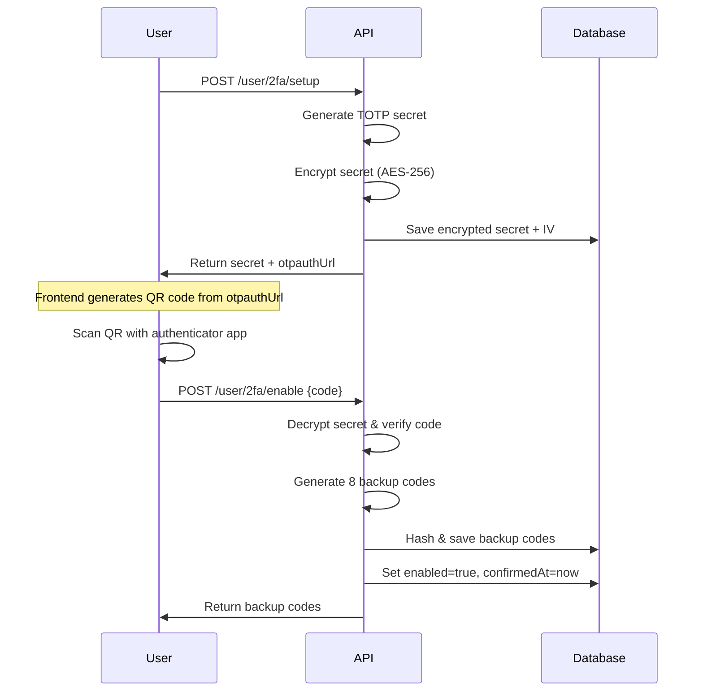
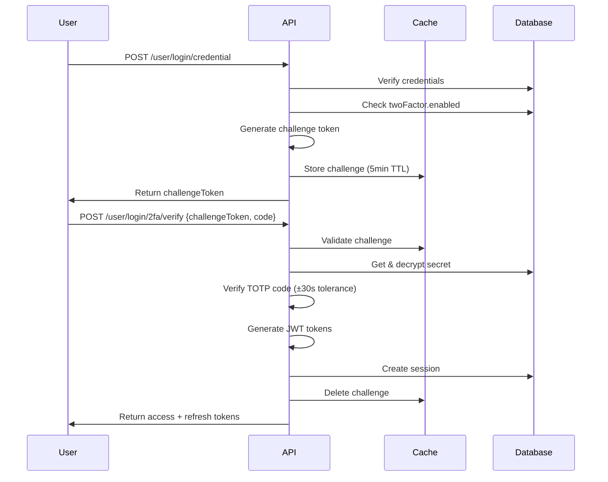
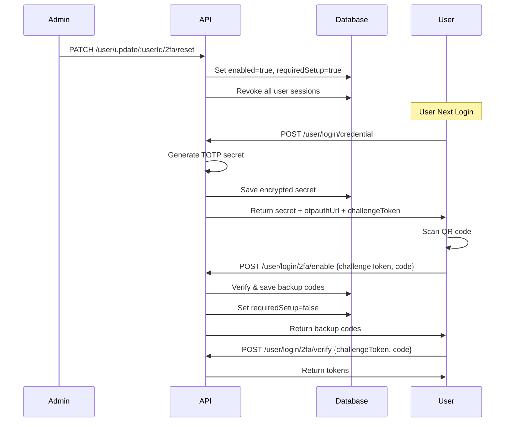
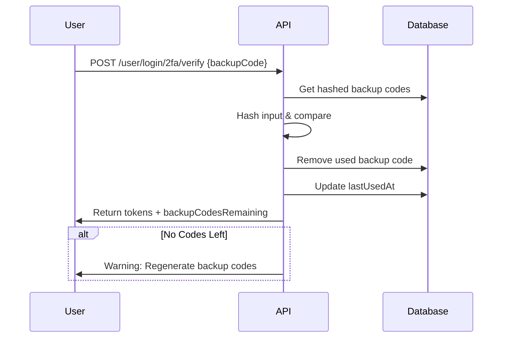

# Two Factor Documentation

> ⚠️ `Future Plan:` Will add two factor when reset password, change password, and regenerate backup codes.

## Overview

Two-Factor Authentication (2FA) adds an additional security layer to user authentication using Time-based One-Time Password (TOTP) algorithm. This implementation supports both authenticator apps (Google Authenticator, Authy, etc.) and backup codes for account recovery.

**Key Features:**
- TOTP-based verification (RFC 6238 compliant)
- 8 one-time backup codes for recovery
- Admin-controlled force setup
- AES-256 encryption for secret storage
- Challenge-based verification flow
- Session revocation on security changes

## Related Documents

- [Authentication Documentation][ref-doc-authentication] - JWT token management and login flows
- [Security and Middleware Documentation][ref-doc-security-and-middleware] - Rate limiting and security headers
- [Cache Documentation][ref-doc-cache] - Redis implementation for challenge tokens
- [Activity Log Documentation][ref-doc-activity-log] - Events tracking

## Table of Contents

- [Overview](#overview)
- [Related Documents](#related-documents)
- [Configuration](#configuration)
    - [Environment Variables](#environment-variables)
    - [Configuration Details](#configuration-details)
- [Where 2FA is Used](#where-2fa-is-used)
    - [Shared Endpoints](#shared-endpoints)
    - [Login Endpoints](#login-endpoints)
    - [Admin Endpoints](#admin-endpoints)
- [Authentication Flows](#authentication-flows)
    - [Setup Flow](#setup-flow)
    - [Login Flow (2FA Enabled)](#login-flow-2fa-enabled)
    - [Admin Force Setup Flow](#admin-force-setup-flow)
    - [Backup Code Usage Flow](#backup-code-usage-flow)
- [Error Handling](#error-handling)
    - [HTTP Status Codes](#http-status-codes)
- [Contribution](#contribution)

## Configuration

### Environment Variables
```env
AUTH_TWO_FACTOR_ISSUER=YourAppName
AUTH_TWO_FACTOR_ENCRYPTION_KEY=your-32-character-encryption-key-here
```

### Configuration Details

Located in `src/configs/auth.config.ts`:

| Setting | Value | Description |
|---------|-------|-------------|
| `issuer` | `YourAppName` | Displayed in authenticator apps |
| `digits` | `6` | TOTP code length (standard) |
| `step` | `30` | Time window in seconds |
| `window` | `1` | Clock skew tolerance (±30 seconds) |
| `secretLength` | `32` | Base32 secret length |
| `challengeTtlInMs` | `300000` | Challenge token TTL (5 minutes) |
| `backupCodes.count` | `8` | Number of backup codes generated |
| `backupCodes.length` | `10` | Characters per backup code (A-Z, 0-9) |

## Where 2FA is Used

### Shared Endpoints
- `GET /shared/user/2fa/status` - Check current 2FA status
- `POST /shared/user/2fa/setup` - Get TOTP secret and otpauthUrl
- `POST /shared/user/2fa/enable` - Enable 2FA with code verification
- `DELETE /shared/user/2fa/disable` - Disable 2FA with code verification
- `POST /shared/user/2fa/regenerate-backup-codes` - Generate new backup codes

### Login Endpoints
- `POST /public/user/login/credential` - Login with email/password
- `POST /public/user/login/social/google` - Login with Google OAuth
- `POST /public/user/login/social/apple` - Login with Apple Sign In
- `POST /public/user/login/2fa/verify` - Verify TOTP code or backup code
- `POST /public/user/login/2fa/enable` - Complete forced 2FA setup during login

### Admin Endpoints
- `PATCH /admin/user/update/:userId/2fa/reset` - Force reset user's 2FA

**Note:** See Swagger documentation for detailed request/response schemas.

## Authentication Flows

### Setup Flow

User enables 2FA for their account:


### Login Flow (2FA Enabled)

User logs in with 2FA enabled:


### Admin Force Setup Flow

Admin forces user to setup 2FA on next login:


### Backup Code Usage Flow

User uses backup code when authenticator app is unavailable:


## Error Handling

### HTTP Status Codes

| Status | Error Code | Description |
|--------|------------|-------------|
| 400 | `twoFactorNotEnabled` | 2FA not enabled for this user |
| 400 | `twoFactorAlreadyEnabled` | 2FA already active |
| 400 | `twoFactorRequiredSetup` | Must complete setup first |
| 400 | `twoFactorNotRequiredSetup` | Setup already completed |
| 401 | `twoFactorInvalid` | Invalid TOTP code or backup code |
| 401 | `twoFactorChallengeInvalid` | Challenge token expired or invalid |
| 403 | `inactiveForbidden` | Account inactive |
| 403 | `emailNotVerified` | Email not verified |
| 404 | `notFound` | User not found |

## Contribution

Special thanks to [ak2g][ref-contributor-ak2g] for main contributor for this feature.

<!-- REFERENCES -->

<!-- BADGE LINKS -->

[ack-contributors-shield]: https://img.shields.io/github/contributors/andrechristikan/ack-nestjs-boilerplate?style=for-the-badge
[ack-forks-shield]: https://img.shields.io/github/forks/andrechristikan/ack-nestjs-boilerplate?style=for-the-badge
[ack-stars-shield]: https://img.shields.io/github/stars/andrechristikan/ack-nestjs-boilerplate?style=for-the-badge
[ack-issues-shield]: https://img.shields.io/github/issues/andrechristikan/ack-nestjs-boilerplate?style=for-the-badge
[ack-license-shield]: https://img.shields.io/github/license/andrechristikan/ack-nestjs-boilerplate?style=for-the-badge
[nestjs-shield]: https://img.shields.io/badge/nestjs-%23E0234E.svg?style=for-the-badge&logo=nestjs&logoColor=white
[nodejs-shield]: https://img.shields.io/badge/Node.js-339933?style=for-the-badge&logo=nodedotjs&logoColor=white
[typescript-shield]: https://img.shields.io/badge/TypeScript-007ACC?style=for-the-badge&logo=typescript&logoColor=white
[mongodb-shield]: https://img.shields.io/badge/MongoDB-white?style=for-the-badge&logo=mongodb&logoColor=4EA94B
[jwt-shield]: https://img.shields.io/badge/JWT-000000?style=for-the-badge&logo=JSON%20web%20tokens&logoColor=white
[jest-shield]: https://img.shields.io/badge/-jest-%23C21325?style=for-the-badge&logo=jest&logoColor=white
[pnpm-shield]: https://img.shields.io/badge/pnpm-%232C8EBB.svg?style=for-the-badge&logo=pnpm&logoColor=white&color=F9AD00
[docker-shield]: https://img.shields.io/badge/docker-%230db7ed.svg?style=for-the-badge&logo=docker&logoColor=white
[github-shield]: https://img.shields.io/badge/GitHub-100000?style=for-the-badge&logo=github&logoColor=white
[linkedin-shield]: https://img.shields.io/badge/LinkedIn-0077B5?style=for-the-badge&logo=linkedin&logoColor=white

<!-- CONTACTS -->

[ref-author-linkedin]: https://linkedin.com/in/andrechristikan
[ref-author-email]: mailto:andrechristikan@gmail.com
[ref-author-github]: https://github.com/andrechristikan
[ref-author-paypal]: https://www.paypal.me/andrechristikan
[ref-author-kofi]: https://ko-fi.com/andrechristikan

<!-- Repo LINKS -->

[ref-ack]: https://github.com/andrechristikan/ack-nestjs-boilerplate
[ref-ack-issues]: https://github.com/andrechristikan/ack-nestjs-boilerplate/issues
[ref-ack-stars]: https://github.com/andrechristikan/ack-nestjs-boilerplate/stargazers
[ref-ack-forks]: https://github.com/andrechristikan/ack-nestjs-boilerplate/network/members
[ref-ack-contributors]: https://github.com/andrechristikan/ack-nestjs-boilerplate/graphs/contributors
[ref-ack-license]: LICENSE.md

<!-- THIRD PARTY -->

[ref-nestjs]: http://nestjs.com
[ref-nestjs-swagger]: https://docs.nestjs.com/openapi/introduction
[ref-nestjs-swagger-types]: https://docs.nestjs.com/openapi/types-and-parameters
[ref-prisma]: https://www.prisma.io
[ref-mongodb]: https://docs.mongodb.com/
[ref-redis]: https://redis.io
[ref-bullmq]: https://bullmq.io
[ref-nodejs]: https://nodejs.org/
[ref-typescript]: https://www.typescriptlang.org/
[ref-docker]: https://docs.docker.com
[ref-dockercompose]: https://docs.docker.com/compose/
[ref-pnpm]: https://pnpm.io
[ref-12factor]: https://12factor.net
[ref-commander]: https://nest-commander.jaymcdoniel.dev
[ref-package-json]: package.json
[ref-jwt]: https://jwt.io
[ref-jest]: https://jestjs.io/docs/getting-started
[ref-git]: https://git-scm.com
[ref-google-console]: https://console.cloud.google.com/
[ref-google-client-secret]: https://developers.google.com/identity/protocols/oauth2

<!-- DOCUMENTS -->

[ref-doc-root]: ../readme.md
[ref-doc-activity-log]: activity-log.md
[ref-doc-authentication]: authentication.md
[ref-doc-authorization]: authorization.md
[ref-doc-cache]: cache.md
[ref-doc-configuration]: configuration.md
[ref-doc-database]: database.md
[ref-doc-environment]: environment.md
[ref-doc-feature-flag]: feature-flag.md
[ref-doc-file-upload]: file-upload.md
[ref-doc-handling-error]: handling-error.md
[ref-doc-installation]: installation.md
[ref-doc-logger]: logger.md
[ref-doc-message]: message.md
[ref-doc-pagination]: pagination.md
[ref-doc-project-structure]: project-structure.md
[ref-doc-queue]: queue.md
[ref-doc-request-validation]: request-validation.md
[ref-doc-response]: response.md
[ref-doc-security-and-middleware]: security-and-middleware.md
[ref-doc-doc]: doc.md
[ref-doc-third-party-integration]: third-party-integration.md
[ref-doc-presign]: presign.md
[ref-doc-term-policy]: term-policy.md
[ref-doc-two-factor]: two-factor.md

<!-- CONTRIBUTOR -->

[ref-contributor-gzerox]: https://github.com/Gzerox
[ref-contributor-ak2g]: https://github.com/ak2g