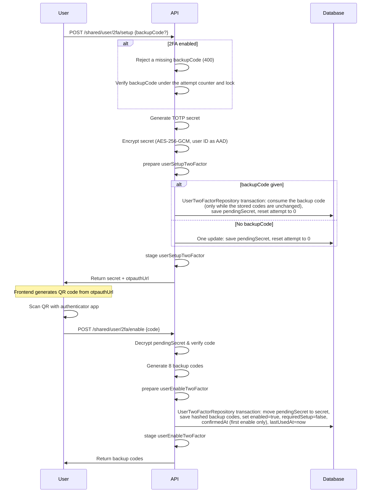
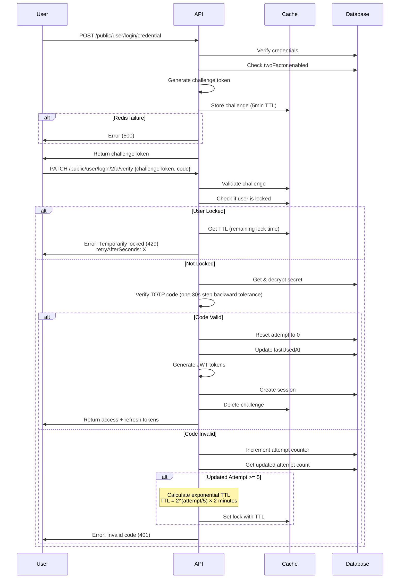
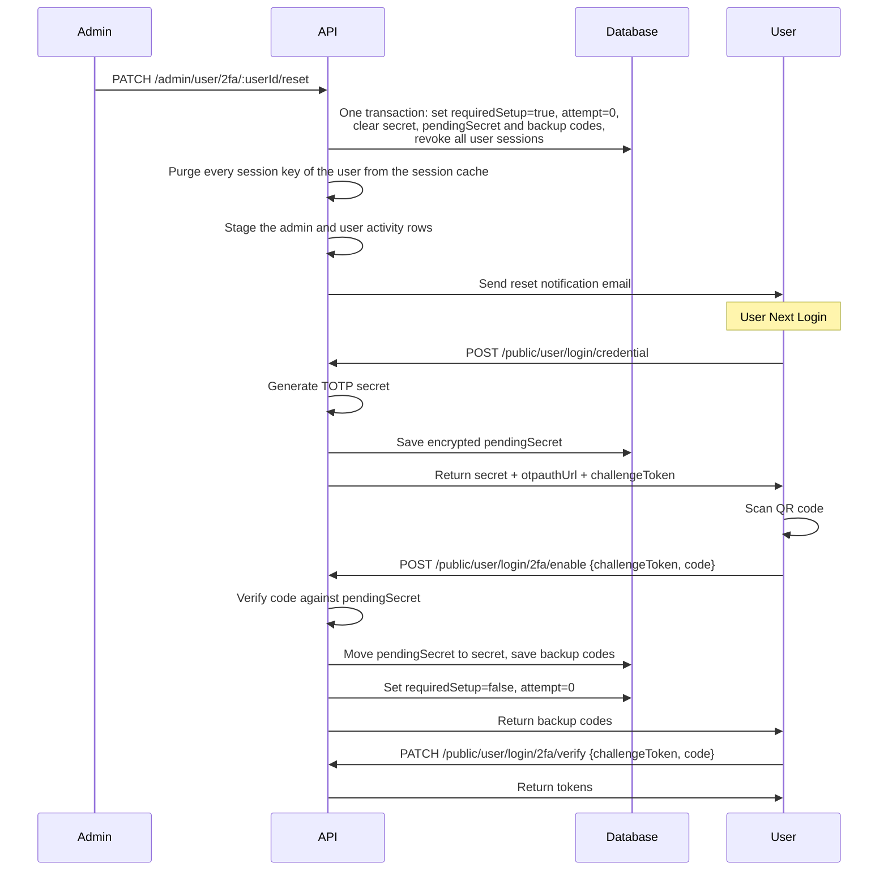
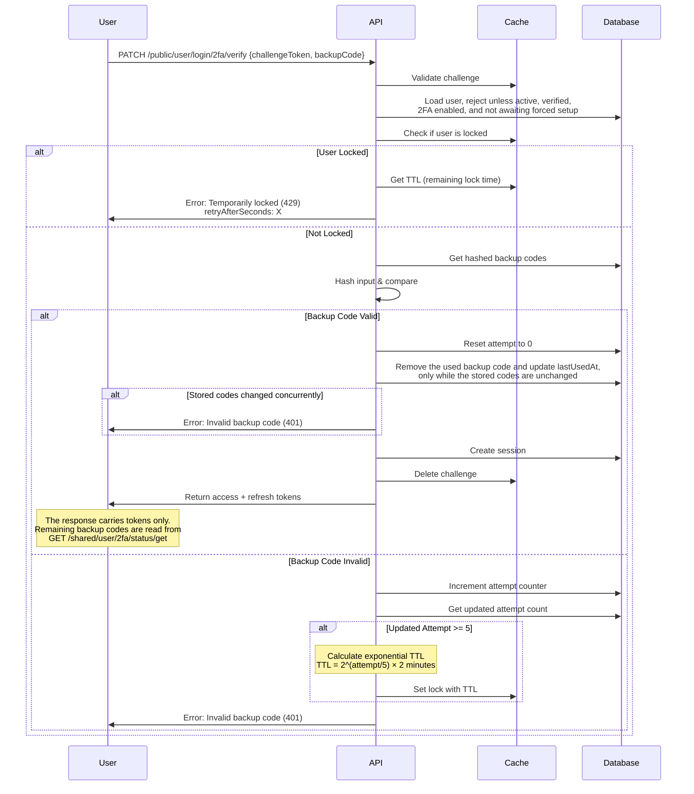
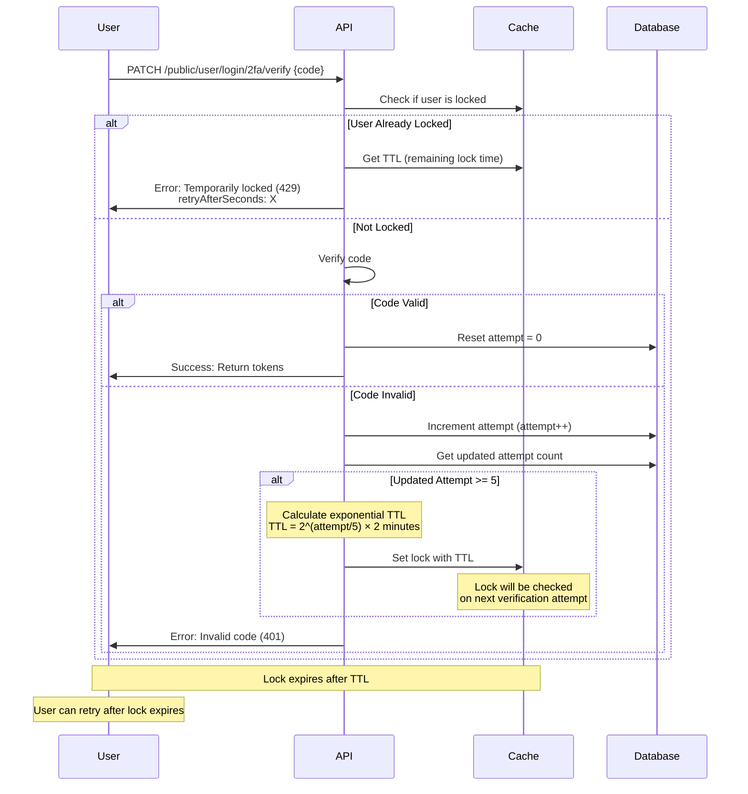
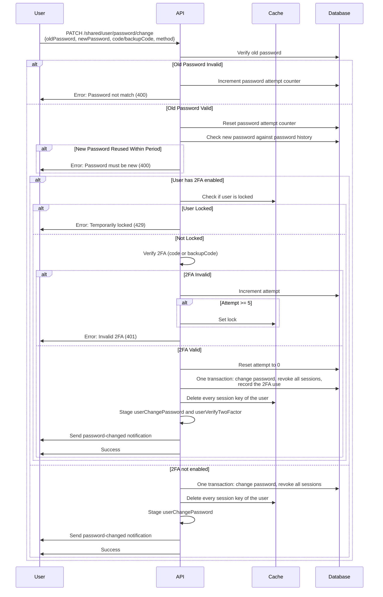
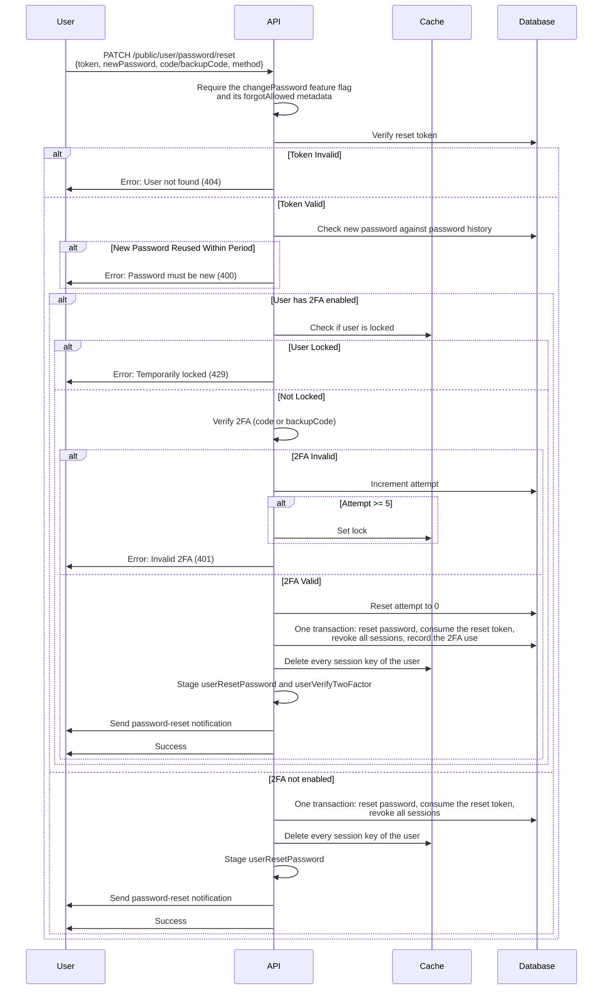
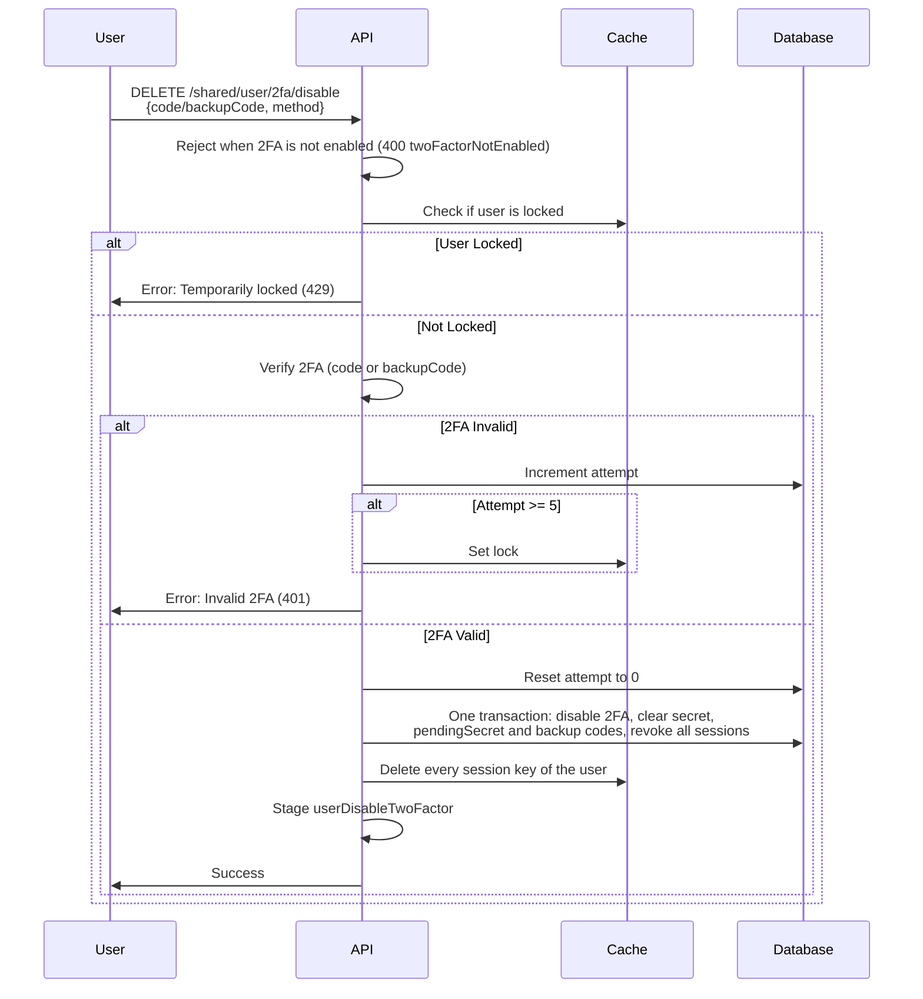

# Two Factor Documentation

## Overview

Login can require a TOTP (RFC 6238) from an authenticator app, plus one-time backup codes.

- TOTP-based verification (RFC 6238)
- 8 one-time backup codes for recovery
- Admin-controlled force setup
- AES-256-GCM encryption for secret storage, keyed by `AUTH_TWO_FACTOR_ENCRYPTION_KEY` and bound to the user ID
- Challenge-based verification flow
- Session revocation on security changes
- Account protection with failed attempts tracking
- 2FA on login, password change, password reset, disable 2FA, and backup code regeneration

## Related Documents

- [Authentication Documentation][ref-doc-authentication] - JWT token management and login flows
- [Security and Middleware Documentation][ref-doc-security-and-middleware] - Rate limiting and security headers
- [Cache Documentation][ref-doc-cache] - Redis implementation for challenge tokens
- [Activity Log Documentation][ref-doc-activity-log] - Events tracking

## Table of Contents

- [Overview](#overview)
- [Related Documents](#related-documents)
- [Configuration](#configuration)
    - [Environment Variables](#environment-variables)
    - [Configuration Details](#configuration-details)
- [Security Features](#security-features)
    - [Failed Attempts Protection](#failed-attempts-protection)
    - [Temporary Lock Mechanism](#temporary-lock-mechanism)
- [Where 2FA is Used](#where-2fa-is-used)
    - [Shared Endpoints (User Operations)](#shared-endpoints-user-operations)
    - [Public Endpoints](#public-endpoints)
    - [Admin Endpoints](#admin-endpoints)
- [Authentication Flows](#authentication-flows)
    - [Setup Flow](#setup-flow)
    - [Login Flow (2FA Enabled)](#login-flow-2fa-enabled)
    - [Admin Force Setup Flow](#admin-force-setup-flow)
    - [Backup Code Usage Flow](#backup-code-usage-flow)
    - [Temporary Lock Flow](#temporary-lock-flow)
    - [Admin Reset 2FA Flow](#admin-reset-2fa-flow)
    - [Password Operations with 2FA Flow](#password-operations-with-2fa-flow)
- [Error Handling](#error-handling)
    - [HTTP Status Codes](#http-status-codes)
- [Contribution](#contribution)

## Configuration

### Environment Variables
```env
AUTH_TWO_FACTOR_ISSUER=
AUTH_TWO_FACTOR_ENCRYPTION_KEY=
```

### Configuration Details

Located in `src/configs/auth.config.ts`:

| Setting | Value | Description |
|---------|-------|-------------|
| `strategy` | `totp` | OTP strategy passed to `otplib` |
| `algorithm` | `sha1` | HMAC algorithm passed to `otplib` |
| `issuer` | from `AUTH_TWO_FACTOR_ISSUER`, no code default | Displayed in authenticator apps |
| `digits` | `6` | TOTP code length (standard) |
| `periodInSeconds` | `ms('30s') / 1000` | TOTP time window in seconds, the unit otplib takes |
| `window` | `1` | Backward-only tolerance: `epochTolerance` is `[window × periodInSeconds, 0]`, so one 30 second step in the past is accepted and none in the future |
| `secretLength` | `32` | Base32 secret length |
| `challengeTtlInMs` | `ms('5m')` | Challenge token TTL (5 minutes) |
| `challengeKeyPattern` | `TwoFactor:Challenge:{token}` | Redis key pattern for challenge tokens |
| `lockKeyPattern` | `TwoFactor:Lock:{userId}` | Redis key pattern for attempt locks |
| `backupCodes.count` | `8` | Number of backup codes generated |
| `backupCodes.length` | `10` | Characters per backup code (A-Z, 0-9) |
| `maxAttempt` | `5` | Maximum failed verification attempts before lock |
| `lockAttemptDurationInMs` | `ms('2m')` | Base lock duration in milliseconds (2 minutes) |
| `encryption.key` | from `AUTH_TWO_FACTOR_ENCRYPTION_KEY` | Root secret for the stored TOTP secrets: exactly 64 base64url characters (48 random bytes), validated by `RequestEncryptionSecretSchema` |

### Secret Storage

`AuthTwoFactorDomain` seals every TOTP secret with `HelperEncryptionService.aes256Encrypt`, using `auth.twoFactor.encryption.key`, the purpose `auth.twoFactor.secret`, and the user ID as authenticated data, so a secret copied onto another user's row fails to decrypt. `TwoFactor` holds two sealed values:

- `pendingSecret`: written by every setup, never used to verify a login
- `secret`: the confirmed authenticator; enable moves `pendingSecret` here and clears `pendingSecret`

A code checked against a missing secret, or a secret that fails to decrypt, raises `409 twoFactorSecretUnavailable`. The decrypt failure is also reported to Sentry as an operator fault (a wrong key or a damaged value), not a user error. `pnpm generate:secret:encryption` generates the key (see [Installation][ref-doc-installation]).

## Security Features

### Failed Attempts Protection

Failed 2FA verification is counted to block brute-force guessing:
- Each failed TOTP code or backup code verification increments the attempt counter
- Counter is stored in the `TwoFactor.attempt` field
- Counter resets to 0 when user successfully verifies with valid code or backup code
- Both TOTP codes and backup codes share the same counter (combined limit)

**Counter tracking:**
```
Attempt 1 (TOTP failed) → attempt = 1
Attempt 2 (Backup code failed) → attempt = 2
Attempt 3 (TOTP failed) → attempt = 3
Attempt 4 (TOTP success) → attempt = 0 (reset)
```

### Temporary Lock Mechanism

When a user reaches the maximum allowed attempts (5 failed verifications), 2FA verification locks with exponential backoff.

1. Lock check happens **before** verification attempt
2. If locked, return error with `retryAfterSeconds` (HTTP 429)
3. If not locked, proceed with verification
4. If verification fails:
   - Increment attempt counter first
   - **After increment**, check if counter reached max (5)
   - If reached max, set lock in cache with exponential TTL
   - Return invalid code error (HTTP 401)
5. Lock is stored in Redis cache with automatic expiration
6. Lock duration increases exponentially based on attempt count

A Redis failure while writing or clearing the lock is logged and the request continues; the attempt counter in the database still increments. A Redis failure while storing the login challenge answers 500, and a failure while deleting a used challenge is logged. Details: [Cache][ref-doc-cache].

**Lock timing:**
- Lock is set **after** the 5th failed attempt
- Lock prevents **next** verification attempt
- User receives HTTP 429 on **next** attempt (not the 5th)

**Lock duration calculation:**
- Formula: `TTL = 2^(attempt / maxAttempt) × lockAttemptDurationInMs`
- Base lock duration: 2 minutes (configurable via `lockAttemptDurationInMs`)

**Lock duration examples:**
```
After 5th failed attempt (attempt=5):
  TTL = 2^(5/5) × 2 minutes = 2^1 × 2 = 4 minutes

After 6th failed attempt (attempt=6):
  TTL = 2^(6/5) × 2 minutes = 2^1.2 × 2 ≈ 4.6 minutes

After 7th failed attempt (attempt=7):
  TTL = 2^(7/5) × 2 minutes = 2^1.4 × 2 ≈ 5.3 minutes
```

**User experience flow:**
1. User enters wrong code 5 times → gets HTTP 401 (invalid code)
2. Lock is set in background
3. User tries again (6th attempt) → gets HTTP 429 with `retryAfterSeconds: 240` (4 minutes)
4. User waits 4 minutes
5. Lock expires automatically
6. User can try again
7. If fails again, new lock with longer duration (exponential backoff)

**Recovery process:**
- Lock automatically expires after TTL duration (no admin intervention needed)
- Attempt counter persists in database until successful verification
- Each subsequent lock (after retry) increases duration exponentially
- Counter resets to 0 only on successful verification
- Admin can force reset 2FA to clear both counter and lock

## Where 2FA is Used

### Shared Endpoints (User Operations)
**2FA Management:**
- `GET /shared/user/2fa/status/get` - Check current 2FA status
- `POST /shared/user/2fa/setup` - Get TOTP secret and otpauthUrl (**requires an unused backup code while 2FA is enabled**)
- `POST /shared/user/2fa/enable` - Enable 2FA with code verification
- `DELETE /shared/user/2fa/disable` - **Disable 2FA (requires an authenticator code or a backup code)**
- `POST /shared/user/2fa/backup-code/regenerate` - **Regenerate backup codes (requires an authenticator code)**

`disable` accepts either method: the body carries `method` (`code` or `backupCodes`) with the matching `code` / `backupCode`. `backup-code/regenerate` takes a `code` field only and pins the method to `code` on the server, so a backup code cannot be used to rotate the backup codes. The credential being replaced never authorises its own replacement. Both routes run the same verification path as login, so both are subject to the attempt counter and the temporary lock.

`setup` takes an optional `backupCode`. While 2FA is disabled the body may be empty. While 2FA is enabled a missing `backupCode` returns `400 twoFactorBackupCodeRequired`; a supplied one is verified under the attempt counter and the lock, and consumed in the same transaction that stores the new `pendingSecret`. The account keeps its confirmed `secret` and remaining backup codes until `enable` confirms the new authenticator, which is the recovery path when the confirmed secret is unreadable (`409 twoFactorSecretUnavailable`).

**Password Operations (require 2FA if enabled):**
- `PATCH /shared/user/password/change` - **Change password (requires 2FA verification if enabled)**

### Public Endpoints
**Login Flow:**
- `POST /public/user/login/credential` - Login with email/password
- `POST /public/user/login/social/google` - Login with Google OAuth
- `POST /public/user/login/social/apple` - Login with Apple Sign In
- `PATCH /public/user/login/2fa/verify` - Verify TOTP code or backup code
- `POST /public/user/login/2fa/enable` - Complete forced 2FA setup during login

**Password Recovery (require 2FA if enabled):**
- `PATCH /public/user/password/reset` - **Reset password (requires 2FA verification if enabled)**

### Admin Endpoints
- `PATCH /admin/user/2fa/:userId/reset` - Force reset user's 2FA (clears lock and resets attempts)

Request and response schemas for each route are in the Swagger document.

## Authentication Flows

### Setup Flow

User enables 2FA for their account:

```mermaid
sequenceDiagram
    participant User
    participant API
    participant Database

    User->>API: POST /shared/user/2fa/setup {backupCode?}
    alt 2FA enabled
        API->>API: Reject a missing backupCode (400)
        API->>API: Verify backupCode under the attempt counter and lock
    end
    API->>API: Generate TOTP secret
    API->>API: Encrypt secret (AES-256-GCM, user ID as AAD)
    API->>API: prepare userSetupTwoFactor
    alt backupCode given
        API->>Database: UserTwoFactorRepository transaction: consume the backup code<br/>(only while the stored codes are unchanged),<br/>save pendingSecret, reset attempt to 0
    else No backupCode
        API->>Database: One update: save pendingSecret, reset attempt to 0
    end
    API->>API: stage userSetupTwoFactor
    API->>User: Return secret + otpauthUrl
    Note over User: Frontend generates QR code from otpauthUrl
    User->>User: Scan QR with authenticator app
    User->>API: POST /shared/user/2fa/enable {code}
    API->>API: Decrypt pendingSecret & verify code
    API->>API: Generate 8 backup codes
    API->>API: prepare userEnableTwoFactor
    API->>Database: UserTwoFactorRepository transaction: move pendingSecret to secret,<br/>save hashed backup codes, set enabled=true, requiredSetup=false,<br/>confirmedAt (first enable only), lastUsedAt=now
    API->>API: stage userEnableTwoFactor
    API->>User: Return backup codes
```

### Login Flow (2FA Enabled)

User logs in with 2FA enabled:

```mermaid
sequenceDiagram
    participant User
    participant API
    participant Cache
    participant Database

    User->>API: POST /public/user/login/credential
    API->>Database: Verify credentials
    API->>Database: Check twoFactor.enabled
    API->>API: Generate challenge token
    API->>Cache: Store challenge (5min TTL)
    alt Redis failure
        API->>User: Error (500)
    end
    API->>User: Return challengeToken
    User->>API: PATCH /public/user/login/2fa/verify {challengeToken, code}
    API->>Cache: Validate challenge
    API->>Cache: Check if user is locked
    alt User Locked
        API->>Cache: Get TTL (remaining lock time)
        API->>User: Error: Temporarily locked (429)<br/>retryAfterSeconds: X
    else Not Locked
        API->>Database: Get & decrypt secret
        API->>API: Verify TOTP code (one 30s step backward tolerance)
        alt Code Valid
            API->>Database: Reset attempt to 0
            API->>Database: Update lastUsedAt
            API->>API: Generate JWT tokens
            API->>Database: Create session
            API->>Cache: Delete challenge
            API->>User: Return access + refresh tokens
        else Code Invalid
            API->>Database: Increment attempt counter
            API->>Database: Get updated attempt count
            alt Updated Attempt >= 5
                Note over API: Calculate exponential TTL<br/>TTL = 2^(attempt/5) × 2 minutes
                API->>Cache: Set lock with TTL
            end
            API->>User: Error: Invalid code (401)
        end
    end
```

### Admin Force Setup Flow

Admin forces a user who already has 2FA enabled to set it up again on next login. The endpoint rejects the admin resetting their own account (`notSelf`), an unknown user (`notFound`), a blocked user (`blockedInvalid`), and a user whose 2FA is not enabled (`twoFactorNotEnabled`).

```mermaid
sequenceDiagram
    participant Admin
    participant API
    participant Database
    participant User

    Admin->>API: PATCH /admin/user/2fa/:userId/reset
    API->>Database: One transaction: set requiredSetup=true, attempt=0,<br/>clear secret, pendingSecret and backup codes,<br/>revoke all user sessions
    API->>API: Purge every session key of the user from the session cache
    API->>API: Stage the admin and user activity rows
    API->>User: Send reset notification email
    
    Note over User: User Next Login
    User->>API: POST /public/user/login/credential
    API->>API: Generate TOTP secret
    API->>Database: Save encrypted pendingSecret
    API->>User: Return secret + otpauthUrl + challengeToken
    User->>User: Scan QR code
    User->>API: POST /public/user/login/2fa/enable {challengeToken, code}
    API->>API: Verify code against pendingSecret
    API->>Database: Move pendingSecret to secret, save backup codes
    API->>Database: Set requiredSetup=false, attempt=0
    API->>User: Return backup codes
    User->>API: PATCH /public/user/login/2fa/verify {challengeToken, code}
    API->>User: Return tokens
```

### Backup Code Usage Flow

User uses backup code when authenticator app is unavailable:

```mermaid
sequenceDiagram
    participant User
    participant API
    participant Cache
    participant Database

    User->>API: PATCH /public/user/login/2fa/verify {challengeToken, backupCode}
    API->>Cache: Validate challenge
    API->>Database: Load user, reject unless active, verified,<br/>2FA enabled, and not awaiting forced setup
    API->>Cache: Check if user is locked
    alt User Locked
        API->>Cache: Get TTL (remaining lock time)
        API->>User: Error: Temporarily locked (429)<br/>retryAfterSeconds: X
    else Not Locked
        API->>Database: Get hashed backup codes
        API->>API: Hash input & compare
        alt Backup Code Valid
            API->>Database: Reset attempt to 0
            API->>Database: Remove the used backup code and update lastUsedAt,<br/>only while the stored codes are unchanged
            alt Stored codes changed concurrently
                API->>User: Error: Invalid backup code (401)
            end
            API->>Database: Create session
            API->>Cache: Delete challenge
            API->>User: Return access + refresh tokens
            Note over User: The response carries tokens only.<br/>Remaining backup codes are read from<br/>GET /shared/user/2fa/status/get
        else Backup Code Invalid
            API->>Database: Increment attempt counter
            API->>Database: Get updated attempt count
            alt Updated Attempt >= 5
                Note over API: Calculate exponential TTL<br/>TTL = 2^(attempt/5) × 2 minutes
                API->>Cache: Set lock with TTL
            end
            API->>User: Error: Invalid backup code (401)
        end
    end
```

### Temporary Lock Flow

System behavior when user reaches maximum attempts:

```mermaid
sequenceDiagram
    participant User
    participant API
    participant Cache
    participant Database

    User->>API: PATCH /public/user/login/2fa/verify {code}
    API->>Cache: Check if user is locked
    
    alt User Already Locked
        API->>Cache: Get TTL (remaining lock time)
        API->>User: Error: Temporarily locked (429)<br/>retryAfterSeconds: X
    else Not Locked
        API->>API: Verify code
        alt Code Valid
            API->>Database: Reset attempt = 0
            API->>User: Success: Return tokens
        else Code Invalid
            API->>Database: Increment attempt (attempt++)
            API->>Database: Get updated attempt count
            
            alt Updated Attempt >= 5
                Note over API: Calculate exponential TTL<br/>TTL = 2^(attempt/5) × 2 minutes
                API->>Cache: Set lock with TTL
                Note over Cache: Lock will be checked<br/>on next verification attempt
            end
            
            API->>User: Error: Invalid code (401)
        end
    end
    
    Note over User,Cache: Lock expires after TTL
    Note over User: User can retry after lock expires
```

### Admin Reset 2FA Flow

Admin can force reset user's 2FA if needed (optional, user can also wait for lock to expire):
```mermaid
sequenceDiagram
    participant User
    participant Admin
    participant API
    participant Database
    participant Cache

    Note over User: User locked out or lost access
    User->>Admin: Request 2FA reset
    
    Admin->>API: PATCH /admin/user/2fa/:userId/reset
    par
        API->>Database: One transaction: reset 2FA (set requiredSetup=true),<br/>clear attempt counter, revoke all sessions
    and
        API->>Cache: Clear lock (if exists; a failure is logged)
    end
    API->>Cache: Delete every session key of the user
    API->>API: Stage adminUserResetTwoFactor and userResetTwoFactorByAdmin
    API->>Admin: Success confirmation
    
    Admin->>User: 2FA has been reset
    
    Note over User: User must setup 2FA again on next login
    User->>API: POST /public/user/login/credential
    API->>User: Return secret + otpauthUrl + challengeToken
    User->>API: POST /public/user/login/2fa/enable {code}
    API->>Database: Complete setup, attempt=0
    User->>API: PATCH /public/user/login/2fa/verify {code}
    API->>User: Return tokens
```

### Password Operations with 2FA Flow

When user has 2FA enabled, password operations require additional verification:

**Change Password:**

```mermaid
sequenceDiagram
    participant User
    participant API
    participant Cache
    participant Database

    User->>API: PATCH /shared/user/password/change<br/>{oldPassword, newPassword, code/backupCode, method}
    API->>Database: Verify old password
    alt Old Password Invalid
        API->>Database: Increment password attempt counter
        API->>User: Error: Password not match (400)
    else Old Password Valid
        API->>Database: Reset password attempt counter
        API->>Database: Check new password against password history
        alt New Password Reused Within Period
            API->>User: Error: Password must be new (400)
        end
        alt User has 2FA enabled
            API->>Cache: Check if user is locked
            alt User Locked
                API->>User: Error: Temporarily locked (429)
            else Not Locked
                API->>API: Verify 2FA (code or backupCode)
                alt 2FA Invalid
                    API->>Database: Increment attempt
                    alt Attempt >= 5
                        API->>Cache: Set lock
                    end
                    API->>User: Error: Invalid 2FA (401)
                else 2FA Valid
                    API->>Database: Reset attempt to 0
                    API->>Database: One transaction: change password, revoke all sessions,<br/>record the 2FA use
                    API->>Cache: Delete every session key of the user
                    API->>API: Stage userChangePassword and userVerifyTwoFactor
                    API->>User: Send password-changed notification
                    API->>User: Success
                end
            end
        else 2FA not enabled
            API->>Database: One transaction: change password, revoke all sessions
            API->>Cache: Delete every session key of the user
            API->>API: Stage userChangePassword
            API->>User: Send password-changed notification
            API->>User: Success
        end
    end
```

The password-history check is what makes the reuse window real: a password still held in history for `auth.password.periodInDays` is rejected before the 2FA step, so a user cannot rotate back to a recent password by passing 2FA.

**Reset Password (Forgot Password):**

```mermaid
sequenceDiagram
    participant User
    participant API
    participant Cache
    participant Database

    User->>API: PATCH /public/user/password/reset<br/>{token, newPassword, code/backupCode, method}
    API->>API: Require the changePassword feature flag<br/>and its forgotAllowed metadata
    API->>Database: Verify reset token
    alt Token Invalid
        API->>User: Error: User not found (404)
    else Token Valid
        API->>Database: Check new password against password history
        alt New Password Reused Within Period
            API->>User: Error: Password must be new (400)
        end
        alt User has 2FA enabled
            API->>Cache: Check if user is locked
            alt User Locked
                API->>User: Error: Temporarily locked (429)
            else Not Locked
                API->>API: Verify 2FA (code or backupCode)
                alt 2FA Invalid
                    API->>Database: Increment attempt
                    alt Attempt >= 5
                        API->>Cache: Set lock
                    end
                    API->>User: Error: Invalid 2FA (401)
                else 2FA Valid
                    API->>Database: Reset attempt to 0
                    API->>Database: One transaction: reset password, consume the reset token,<br/>revoke all sessions, record the 2FA use
                    API->>Cache: Delete every session key of the user
                    API->>API: Stage userResetPassword and userVerifyTwoFactor
                    API->>User: Send password-reset notification
                    API->>User: Success
                end
            end
        else 2FA not enabled
            API->>Database: One transaction: reset password, consume the reset token,<br/>revoke all sessions
            API->>Cache: Delete every session key of the user
            API->>API: Stage userResetPassword
            API->>User: Send password-reset notification
            API->>User: Success
        end
    end
```

**Disable 2FA:**

```mermaid
sequenceDiagram
    participant User
    participant API
    participant Cache
    participant Database

    User->>API: DELETE /shared/user/2fa/disable<br/>{code/backupCode, method}
    API->>API: Reject when 2FA is not enabled (400 twoFactorNotEnabled)
    API->>Cache: Check if user is locked
    alt User Locked
        API->>User: Error: Temporarily locked (429)
    else Not Locked
        API->>API: Verify 2FA (code or backupCode)
        alt 2FA Invalid
            API->>Database: Increment attempt
            alt Attempt >= 5
                API->>Cache: Set lock
            end
            API->>User: Error: Invalid 2FA (401)
        else 2FA Valid
            API->>Database: Reset attempt to 0
            API->>Database: One transaction: disable 2FA, clear secret,<br/>pendingSecret and backup codes, revoke all sessions
            API->>Cache: Delete every session key of the user
            API->>API: Stage userDisableTwoFactor
            API->>User: Success
        end
    end
```

## Error Handling

### HTTP Status Codes

| Status | Error Code | Description |
|--------|------------|-------------|
| 400 | `twoFactorNotEnabled` | 2FA not enabled for this user |
| 400 | `twoFactorAlreadyEnabled` | 2FA already active |
| 400 | `twoFactorRequiredSetup` | Must complete setup first |
| 400 | `twoFactorNotRequiredSetup` | Setup already completed |
| 400 | `twoFactorSetupRequired` | No `pendingSecret` is stored: `POST /shared/user/2fa/setup` (or the forced-setup login) has not run |
| 400 | `twoFactorMethodRequired` | `method` missing on a request that must verify 2FA |
| 400 | `twoFactorBackupCodeRequired` | `POST /shared/user/2fa/setup` called while 2FA is enabled, without `backupCode` |
| 409 | `twoFactorSecretUnavailable` | The secret a code is checked against is missing or fails to decrypt |
| 401 | `twoFactorInvalid` | Invalid TOTP code or backup code |
| 401 | `twoFactorChallengeInvalid` | Challenge token expired or invalid |
| 429 | `twoFactorAttemptTemporaryLock` | Too many failed attempts, temporarily locked with `retryAfterSeconds` |
| 403 | `inactiveForbidden` | Account inactive |
| 403 | `emailNotVerified` | Email not verified |
| 404 | `notFound` | User not found |

`twoFactorAttemptTemporaryLock` answers a verification attempted while the account is locked. The remaining lock time is interpolated into the localized `message` string (`Please try again after {retryAfterSeconds}s.`) and carries no separate response field. The lock is written once the attempt counter reaches 5, and each further lockout lasts exponentially longer.

## Contribution

Special thanks to [ak2g][ref-contributor-ak2g] for main contributor for this feature.

<!-- REFERENCES -->

[ref-doc-authentication]: authentication.md
[ref-doc-security-and-middleware]: security-and-middleware.md
[ref-doc-cache]: cache.md
[ref-doc-activity-log]: activity-log.md
[ref-doc-installation]: installation.md

[ref-contributor-ak2g]: https://github.com/ak2g
