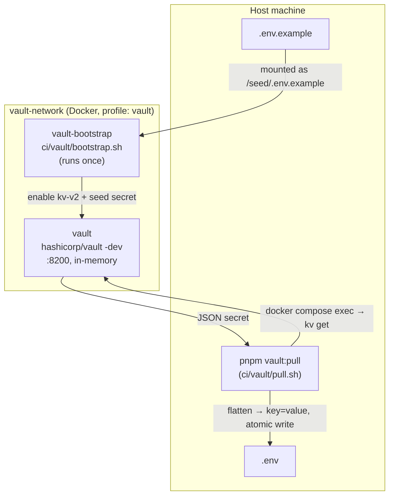
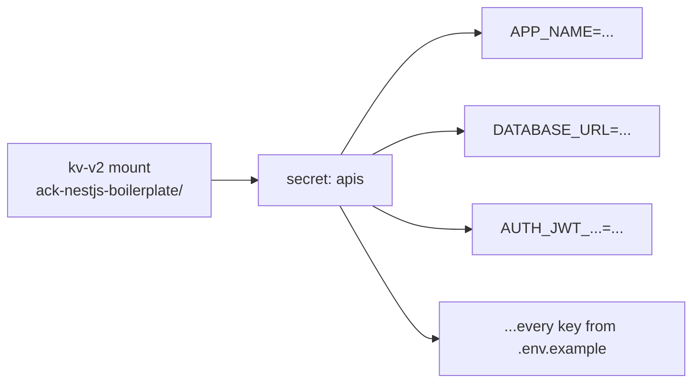
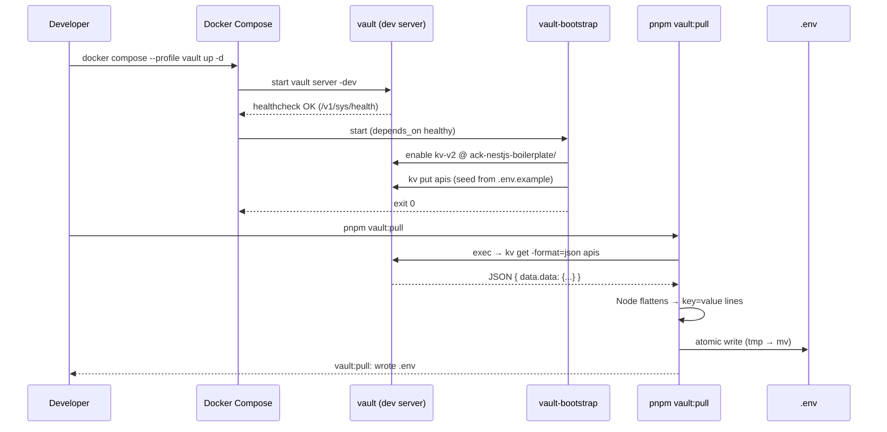

# Vault Documentation

## Overview

ACK NestJS Boilerplate ships an optional [HashiCorp Vault][ref-vault] setup for **local development secret management**. Instead of hand-editing a `.env` file, secrets live in Vault and are pulled into `.env` on demand with a single command.

The Vault stack is wired through Docker Compose and gated behind the `vault` Compose profile, so it never starts unless you explicitly opt in. The server runs in **dev mode** (`vault server -dev`): in-memory storage, auto-unsealed, single root token.

> **Note**: The bundled config runs Vault in **dev mode** (`vault server -dev`), meaning in-memory storage, auto-unsealed, with a single root token. That is the simplest way to wire it locally. What you use this setup for is your decision. This document describes the bundled config and the `vault:pull` workflow, not how to provision or harden Vault for any particular environment. See [Scope](#scope) for what is and isn't covered here.

## Related Documents

- [Installation Documentation][ref-doc-installation] - For the full Docker setup walkthrough
- [Environment Documentation][ref-doc-environment] - For the environment variables seeded into Vault
- [Configuration Documentation][ref-doc-configuration] - For how the app consumes `.env` at startup
- [Third Party Integration Documentation][ref-doc-third-party-integration] - For other external integrations

## Table of Contents

- [Overview](#overview)
- [Related Documents](#related-documents)
- [Scope](#scope)
- [Why Vault](#why-vault)
- [Architecture](#architecture)
- [Components](#components)
  - [`vault` service](#vault-service)
  - [`vault-bootstrap` service](#vault-bootstrap-service)
  - [`vault:pull` script](#vaultpull-script)
- [KV Layout](#kv-layout)
- [Installation & Usage](#installation--usage)
  - [Prerequisites](#prerequisites)
  - [Step 1: Start Vault](#step-1-start-vault)
  - [Step 2: Pull Secrets into `.env`](#step-2-pull-secrets-into-env)
  - [Step 3: Run the App](#step-3-run-the-app)
  - [Updating a Secret](#updating-a-secret)
- [How It Works](#how-it-works)
- [Configuration Reference](#configuration-reference)

## Scope

This document describes the Vault config bundled in this repository and the `vault:pull` workflow. The bundled server runs in dev mode, so the local workflow *resembles* a real "fetch secrets from Vault, inject into the runtime" pattern without the surrounding machinery.

**Covered here:**
- The bundled dev-mode Vault server (in-memory, auto-unsealed, root token `admin123`).
- The one-shot bootstrap that seeds secrets from `.env.example`.
- The `pnpm vault:pull` script that fetches the secret into `.env`.

**Not covered here.** These depend on your environment and are left to you:
- **Deploying** Vault (clustering, persistent storage backend, high availability).
- **Unsealing** securely (Shamir keys, auto-unseal via cloud KMS / Transit).
- **Authenticating** without a root token (AppRole, OIDC, Kubernetes auth, short-lived tokens).
- **Hardening** (TLS, audit devices, policies, network isolation, secret rotation).

The table below contrasts the bundled config with what a hardened deployment would need. It is informational, not a migration checklist:

| Concern | Bundled config | A hardened deployment (your responsibility) |
|---|---|---|
| Storage | In-memory, lost on restart | Persistent backend (Raft / cloud KMS) |
| Unseal | Auto-unsealed | Shamir or auto-unseal |
| Auth | Root token | AppRole / OIDC / short-lived tokens |
| Seeding | From `.env.example` | Policy-managed, never from committed files |
| Secret delivery | `pnpm vault:pull` → `.env` | CI/CD fetches at deploy time, injects into env |
| Transport | Plain HTTP | TLS |

## Why Vault

A plain `.env` file works, but it has friction in a team:

- Secrets get copy-pasted across machines and drift out of sync.
- There is no single source of truth, so everyone maintains their own `.env`.
- Onboarding means manually filling dozens of values.

The dev Vault setup addresses this **for local development**:

- **One source of truth.** Secrets live in the KV store, seeded once from `.env.example`.
- **One command to sync.** `pnpm vault:pull` rewrites `.env` from Vault.
- **Mirrors production conceptually.** The pull step mimics the "fetch from Vault, inject into env" pattern a real CI pipeline uses, so the local workflow *feels* like prod without being prod.

> **Note**: Vault is entirely optional. If you skip the `vault` profile, the project works exactly as documented in [Installation][ref-doc-installation] with a hand-managed `.env`.

## Architecture



Two containers, gated by the `vault` profile, plus one host-side script:

1. **`vault`** boots an in-memory dev server.
2. **`vault-bootstrap`** waits for it, enables the KV engine, and seeds the secret from `.env.example` (first run only).
3. **`pnpm vault:pull`** reads the secret back out and writes your local `.env`.

## Components

### `vault` service

The Vault server, defined in `docker-compose.yml`.

| Property | Value |
|---|---|
| Image | `hashicorp/vault:latest` |
| Mode | `vault server -dev` (in-memory, auto-unsealed) |
| Root token | `admin123` (`VAULT_DEV_ROOT_TOKEN_ID`) |
| Listener | `0.0.0.0:8200`, published on host `:8200` |
| Network | `vault-network` (alias `vault`) |
| Profile | `vault` |
| Capability | `IPC_LOCK` (mlock for memory protection) |

A healthcheck polls `/v1/sys/health` so dependent services wait until the API is ready.

### `vault-bootstrap` service

A one-shot seeder that runs `ci/vault/bootstrap.sh` and exits. It depends on the `vault` healthcheck, so it only runs once Vault is up.

What `bootstrap.sh` does (idempotent, safe on every boot):

1. Wait for the Vault API (`until vault status`).
2. Enable a **kv-v2** engine at mount `ack-nestjs-boilerplate/` if it does not exist yet.
3. If the secret path has no data (first run only), read `.env.example` line by line, skipping blanks and `#` comments, then write every `KEY=value` pair into the secret with a single `vault kv put`.

Because dev Vault data is in-memory, it is re-seeded automatically every time the stack restarts.

### `vault:pull` script

`ci/vault/pull.sh`, exposed as `pnpm vault:pull`. This is the **producer**: it pulls the `apis` secret out of the running dev Vault and writes it to `.env` at the repo root.

Key behaviors:

- Resolves the KV path **on the host**, then injects it as an argument into the container shell.
- Runs `vault kv get -format=json` **inside** the vault container via `docker compose exec`, using `127.0.0.1:8200` (in-container loopback) and the dev root token from the container's own env.
- Pipes the JSON through **Node** (already a project dependency, so no `jq` needed) to flatten `.data.data` into `key=value` lines.
- Writes to a **temp file first**, then `mv` over `.env` only on success, so a failed fetch never truncates your existing `.env`.

## KV Layout

The secret lives in a **kv-v2** engine. The path is composed from two parts:

| Part | Default | Env var |
|---|---|---|
| Mount | `ack-nestjs-boilerplate` | `KV_MOUNT` |
| App | `apis` | `KV_APP` |

Full path: **`ack-nestjs-boilerplate/apis`**



Each environment variable from `.env.example` becomes one field on the `apis` secret.

## Installation & Usage

### Prerequisites

- Docker and Docker Compose (see [Installation][ref-doc-installation] for versions).
- A `.env.example` at the repo root. This is the seed source.

### Step 1: Start Vault

The Vault services only start with the `vault` profile:

```bash
# Start the dev Vault server + run the one-shot bootstrap seeder
docker compose --profile vault up -d
```

On first boot this enables the KV engine and seeds `ack-nestjs-boilerplate/apis` from `.env.example`. Check the bootstrap log to confirm:

```bash
docker compose logs vault-bootstrap
# bootstrap: enabling kv-v2 at ack-nestjs-boilerplate/...
# bootstrap: seeding ack-nestjs-boilerplate/apis from .env.example...
# bootstrap: done.
```

### Step 2: Pull Secrets into `.env`

```bash
# Fetch the `apis` secret and (over)write ./.env
pnpm vault:pull
# vault:pull: wrote .env
```

Your `.env` now contains every key from the Vault secret.

### Step 3: Run the App

From here the workflow is unchanged. The app reads `.env` exactly as it always does:

```bash
pnpm start:dev
```

> **Note**: Vault is only used to **produce** `.env`. The application itself does not talk to Vault at runtime; it reads the generated `.env` like any other setup.

### Updating a Secret

To change a value, update it in Vault, then re-pull. Open a shell in the vault container:

```bash
docker compose --profile vault exec vault sh

# Inside the container, authenticate with the dev root token:
export VAULT_TOKEN=admin123

# Update a single field (kv-v2 patch keeps the others)
vault kv patch ack-nestjs-boilerplate/apis APP_DEBUG=true
exit
```

Back on the host, sync your `.env`:

```bash
pnpm vault:pull
```

> **Note**: Dev Vault is in-memory. Any change you make is lost when the stack restarts. On the next boot it is re-seeded from `.env.example`. Treat `.env.example` as the durable source of defaults.

## How It Works

End-to-end sequence from a cold start to a populated `.env`:



## Configuration Reference

The defaults work out of the box. Override via environment variables if needed.

| Variable | Used by | Default | Purpose |
|---|---|---|---|
| `VAULT_DEV_ROOT_TOKEN_ID` | `vault` service | `admin123` | Dev root token |
| `VAULT_DEV_LISTEN_ADDRESS` | `vault` service | `0.0.0.0:8200` | Dev listener bind address |
| `VAULT_ADDR` | `bootstrap.sh` | `http://vault:8200` | Vault API address (network alias) |
| `KV_MOUNT` | `bootstrap.sh` / `pull.sh` | `ack-nestjs-boilerplate` | kv-v2 mount path |
| `KV_APP` | `bootstrap.sh` / `pull.sh` | `apis` | Secret name under the mount |
| `VAULT_ADDR_INTERNAL` | `pull.sh` | `http://127.0.0.1:8200` | In-container loopback for `exec` |

<!-- REFERENCES -->

[ref-vault]: https://developer.hashicorp.com/vault

[ref-doc-installation]: installation.md
[ref-doc-environment]: environment.md
[ref-doc-configuration]: configuration.md
[ref-doc-third-party-integration]: third-party-integration.md
