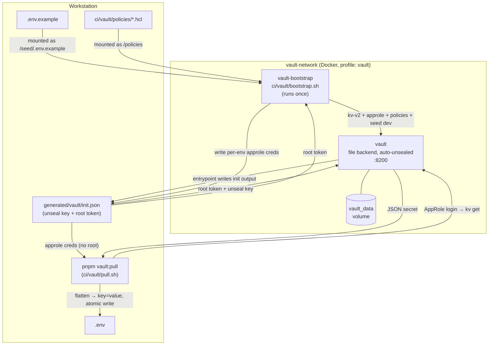
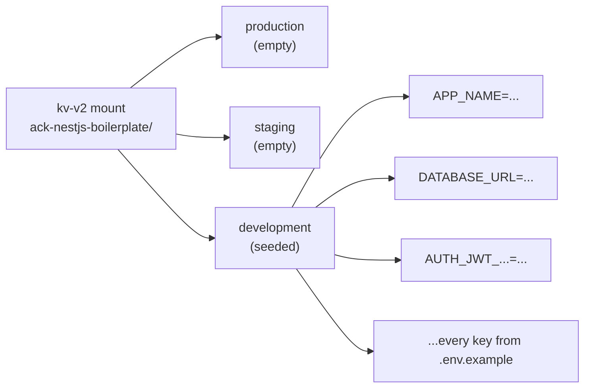
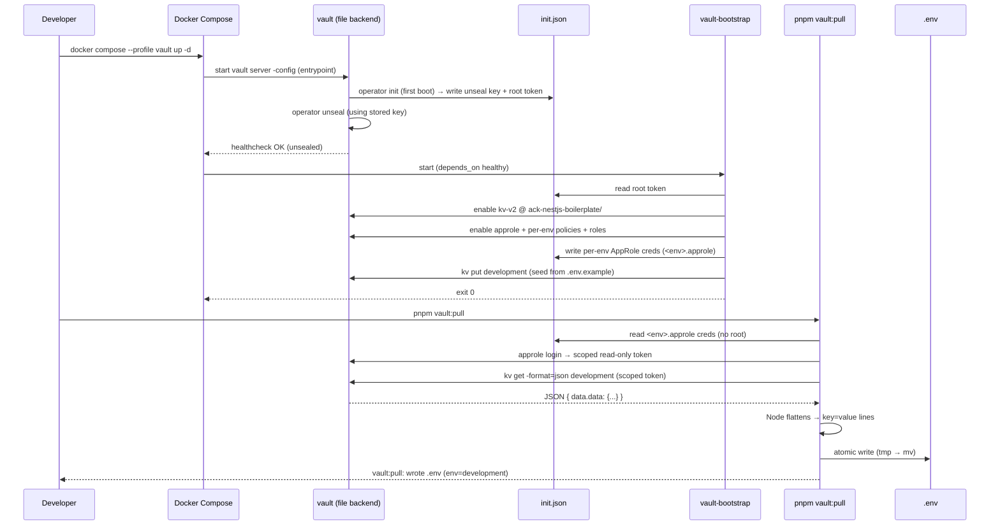

# Vault Documentation

## Overview

> [!IMPORTANT]
> Local-development setup only. The unseal key and root token are written to `generated/vault/init.json` so the stack unseals itself unattended. A dev convenience, not a production pattern. See [Scope](#scope).

Optional [HashiCorp Vault][ref-vault] setup for **local development secret management**. Secrets live in Vault; `pnpm vault:pull` writes them into `.env` on demand.

- Wired through Docker Compose, gated behind the `vault` profile (never starts unless you opt in).
- **File storage backend**, persistent across restarts.
- Container entrypoint **auto-initializes and auto-unseals** on every boot.
- Layout mirrors production: one kv-v2 mount per project, one path per environment, a read-only [AppRole][ref-approle] per environment.

## Related Documents

- [Installation Documentation][ref-doc-installation] - For the full Docker setup walkthrough
- [Environment Documentation][ref-doc-environment] - For the environment variables seeded into Vault
- [Configuration Documentation][ref-doc-configuration] - For how the app consumes `.env` at startup
- [Third Party Integration Documentation][ref-doc-third-party-integration] - For other external integrations

## Table of Contents

- [Overview](#overview)
- [Related Documents](#related-documents)
- [Scope](#scope)
- [Why Vault](#why-vault)
- [Architecture](#architecture)
- [Components](#components)
  - [`vault` service](#vault-service)
  - [`vault-bootstrap` service](#vault-bootstrap-service)
  - [`vault:pull` script](#vaultpull-script)
- [KV Layout](#kv-layout)
- [Installation & Usage](#installation--usage)
  - [Prerequisites](#prerequisites)
  - [Step 1: Start Vault](#step-1-start-vault)
  - [Step 2: Pull Secrets into `.env`](#step-2-pull-secrets-into-env)
  - [Step 3: Run the App](#step-3-run-the-app)
  - [Reading the Root Token](#reading-the-root-token)
  - [Updating a Secret](#updating-a-secret)
  - [Resetting Vault](#resetting-vault)
- [How It Works](#how-it-works)
- [Configuration Reference](#configuration-reference)

## Scope

Covers the bundled Vault config and the `vault:pull` workflow. The server is persistent and auto-unsealed, so the local flow resembles a real "authenticate, fetch, inject" pattern without the production machinery.

**Covered here:**
- File-backed Vault server (persistent), auto-init + auto-unseal via the entrypoint.
- One-shot bootstrap: kv-v2 mount, AppRole auth, per-env read-only policies, seeds `development` from `.env.example`.
- `pnpm vault:pull`: fetches an env's secret into a local env file via a scoped AppRole token.

**Not covered (yours to build for production):**
- **Deploy**: clustering, Raft HA, managed Vault.
- **Unseal**: Shamir split across operators, or KMS / Transit auto-unseal. Never the key on disk.
- **Auth**: OIDC / JWT with bound claims, Kubernetes auth, short-lived tokens. No root.
- **Hardening**: TLS, audit devices, secret rotation, network isolation.

Development vs production. Informational, not a migration checklist:

| Concern | Development (this boilerplate) | Production (your responsibility) |
|---|---|---|
| Storage | File backend, persisted to a Docker volume | Raft HA or managed Vault |
| Unseal | Auto-unsealed by the entrypoint, key on disk | KMS / Transit auto-unseal, key never on disk |
| Auth | Per-env AppRole; root token only mints AppRole creds | OIDC / JWT with bound claims, root revoked after setup |
| Policies | Read-only per env, applied from committed `.hcl` files | Same files applied via IaC (for example Terraform) |
| Seeding | `development` only, from `.env.example` | Policy-managed, never from committed files |
| Secret delivery | `pnpm vault:pull` writes a local env file | CI/CD fetches at deploy time, injects into the runtime env |
| Transport | Plain HTTP | TLS |

## Why Vault

> [!NOTE]
> Vault is optional. Skip the `vault` profile and the project runs exactly as in [Installation][ref-doc-installation] with a hand-managed `.env`.

A plain `.env` works, but in a team:

- Secrets drift out of sync across machines.
- No single source of truth; everyone keeps their own `.env`.
- Onboarding means manually filling dozens of values.

This setup fixes that **for local development**:

- **One source of truth.** Secrets in the kv-v2 store, seeded once from `.env.example`.
- **One command to sync.** `pnpm vault:pull` rewrites `.env`.
- **Mirrors production.** Mount, per-env paths, and read-only policies match what production needs. Only auth differs: AppRole stands in for GitHub OIDC/JWT. Swap `approle` for `jwt` (bound OIDC claims) for production.

## Architecture



Two containers (gated by the `vault` profile) plus one local script:

1. **`vault`**: file-backed server. Entrypoint auto-inits and auto-unseals, writing the unseal key + root token to `generated/vault/init.json`.
2. **`vault-bootstrap`**: provisions the kv-v2 mount, AppRole auth, per-env read-only policies, and seeds `development` from `.env.example` (first run only).
3. **`pnpm vault:pull`**: logs in with an env's AppRole, reads its secret, writes a local env file.

## Components

### `vault` service

Defined in `docker-compose.yml`. Runs `ci/vault/entrypoint.sh` instead of `-dev` mode so data persists.

| Property | Value |
|---|---|
| Image | `hashicorp/vault:latest` |
| Mode | `vault server -config=/vault/config.hcl`, file backend, auto-init + auto-unseal via `entrypoint.sh` |
| Storage | `vault_data` volume mounted at `/vault/file` (owned by the image's `vault` user, so it is writable without root) |
| Init output | `generated/vault/` (mounted at `/vault/init`): `init.json` (unseal key + root token from `operator init`) and per-env `<env>.approle` creds written by bootstrap |
| Listener | `0.0.0.0:8200`, published on host `:8200`, TLS disabled |
| Network | `vault-network` (alias `vault`) |
| Profile | `vault` |
| Capability | `IPC_LOCK` (mlock for memory protection) |

- Entrypoint: start server in background, wait for API, `operator init` once on a fresh volume (writes `init.json`), then unseal with the stored key on every boot.
- Healthcheck polls `/v1/sys/health`: healthy only once unsealed, so dependents wait for a ready Vault.

### `vault-bootstrap` service

One-shot provisioner (`ci/vault/bootstrap.sh`), then exits. Depends on the `vault` healthcheck, so it runs only after Vault is unsealed and `init.json` exists.

`bootstrap.sh` (idempotent, safe on every boot):

1. Read the root token from `init.json` and authenticate.
2. Enable a **kv-v2** engine at mount `ack-nestjs-boilerplate/` if missing.
3. Enable **AppRole** auth if missing (local stand-in for production's OIDC/JWT).
4. Per environment (`production`, `staging`, `development`):
   - Apply a read-only policy from `ci/vault/policies/<env>-ro.hcl` (one env path, no write, no cross-env access).
   - Create AppRole `ack-nestjs-boilerplate-<env>` with only that policy and a short token TTL.
   - Mint `role_id` + `secret_id`, persist to `generated/vault/<env>.approle`, so `vault:pull` authenticates without root.
5. Seed `development` from `.env.example`, first run only (empty path). `production` and `staging` stay empty: a dev box must never hold real production secrets.

Roles: bootstrap is the privileged **broker** (holds root, delivers scoped creds). `vault:pull` is a pure **consumer** that never touches root.

Storage is persistent: re-seeding happens only when `development` is empty. Edits in Vault survive restarts.

### `vault:pull` script

`ci/vault/pull.sh`, exposed as `pnpm vault:pull`. The **producer**: pulls one env's secret and writes it to a local env file.

```bash
sh ci/vault/pull.sh [ENV] [OUT]
# ENV defaults to development, OUT defaults to .env
```

- Resolves the KV path from `ENV`; runs auth + read **inside** the vault container via `docker compose exec` over `127.0.0.1:8200` (in-container loopback).
- Reads the AppRole creds bootstrap minted to `generated/vault/<env>.approle` (no root), logs in for a **scoped, read-only token**, runs `kv get` with it. Mirrors production, where a workload holds delivered scoped creds, not root.
- Flattens `.data.data` to `key=value` via **Node** (already a dependency, no `jq`).
- Writes a **temp file first**, then `mv` on success, so a failed fetch never truncates an existing env file.

## KV Layout

> [!TIP]
> `project/env` scales to multiple projects: each project gets its own kv-v2 mount, isolating policies, audit, and access. For a second project, give it its own `KV_MOUNT` and policy files.

**kv-v2** engine, structured **project then environment**: mount is the project, each environment is a path under it.

| Part | Default | Env var |
|---|---|---|
| Mount (project) | `ack-nestjs-boilerplate` | `KV_MOUNT` |
| Environments | `production staging development` | `KV_ENVS` |
| Seeded environment | `development` | `KV_SEED_ENV` |

Full paths: **`ack-nestjs-boilerplate/{production,staging,development}`**



- Each `.env.example` variable becomes one field on the `development` secret.
- `production` and `staging` exist (own policies + AppRoles) but stay empty until you fill them through a secure channel.

## Installation & Usage

### Prerequisites

- Docker and Docker Compose (see [Installation][ref-doc-installation] for versions).
- A `.env.example` at the repo root. The seed source.

### Step 1: Start Vault

Vault services start only with the `vault` profile:

```bash
# Start the Vault server + run the one-shot bootstrap provisioner
docker compose --profile vault up -d
```

First boot: entrypoint inits + unseals, bootstrap provisions and seeds `development`. Confirm via logs:

```bash
docker compose logs vault
# entrypoint: initializing vault...
# entrypoint: unsealing vault...
# entrypoint: vault unsealed and ready.

docker compose logs vault-bootstrap
# bootstrap: enabling kv-v2 at ack-nestjs-boilerplate/...
# bootstrap: enabling approle auth...
# bootstrap: writing policy ack-nestjs-boilerplate-development-ro...
# bootstrap: seeding ack-nestjs-boilerplate/development from .env.example...
# bootstrap: done.
```

### Step 2: Pull Secrets into `.env`

```bash
# Fetch the development secret and (over)write ./.env
pnpm vault:pull
# vault:pull: wrote .env (env=development)
```

`.env` now holds every key from the `development` secret. Target another env with explicit args:

```bash
sh ci/vault/pull.sh staging .env.staging
```

### Step 3: Run the App

> [!NOTE]
> Vault only **produces** an env file. The app never talks to Vault at runtime; it reads the generated `.env`.

Unchanged from here. The app reads `.env` as usual:

```bash
pnpm start:dev
```

### Reading the Root Token

Root token + unseal key are in `generated/vault/init.json` (gitignored):

```bash
# root token only
sed -n 's/.*"root_token": *"\([^"]*\)".*/\1/p' generated/vault/init.json

# or the whole init output
cat generated/vault/init.json
```

Use the root token for the UI at `http://localhost:8200` (token auth) or the CLI.

### Updating a Secret

> [!NOTE]
> Storage is persistent. The change survives restarts and is **not** re-seeded away on next boot. Re-seeding happens only when `development` is empty (a fresh volume).

Update in Vault, then re-pull. Auth with the root token from `init.json`:

```bash
docker compose --profile vault exec vault sh -c '
  export VAULT_TOKEN=$(sed -n "s/.*\"root_token\": *\"\([^\"]*\)\".*/\1/p" /vault/init/init.json)
  vault kv patch ack-nestjs-boilerplate/development APP_DEBUG=true
'
```

Sync `.env`:

```bash
pnpm vault:pull
```

### Resetting Vault

> [!WARNING]
> Keep the data volume and `generated/vault/init.json` in sync. Delete the volume and the entrypoint re-inits, overwriting `init.json`. Delete `init.json` while the volume persists and auto-unseal fails (key gone).

Wipe all data and re-initialize (new unseal key + root token):

```bash
docker compose --profile vault down
docker volume rm ack-nestjs-boilerplate_vault_data
docker compose --profile vault up -d
```

## How It Works

Cold start to a populated `.env`:



## Configuration Reference

Defaults work out of the box. Override via environment variables if needed.

| Variable | Used by | Default | Purpose |
|---|---|---|---|
| `VAULT_CONFIG` | `entrypoint.sh` | `/vault/config.hcl` | Server config file path |
| `INIT_FILE` | `entrypoint.sh` / `bootstrap.sh` | `/vault/init/init.json` | Init output (unseal key + root token) |
| `VAULT_ADDR` | `bootstrap.sh` | `http://vault:8200` | Vault API address (network alias) |
| `KV_MOUNT` | `bootstrap.sh` / `pull.sh` | `ack-nestjs-boilerplate` | kv-v2 mount path (the project) |
| `KV_ENVS` | `bootstrap.sh` | `production staging development` | Environments to provision |
| `KV_SEED_ENV` | `bootstrap.sh` | `development` | The only env seeded from `.env.example` |
| `VAULT_ADDR_INTERNAL` | `pull.sh` | `http://127.0.0.1:8200` | In-container loopback for `exec` |

Relevant files:

| File | Role |
|---|---|
| `ci/vault/config.hcl` | Server config: file storage at `/vault/file`, TCP listener, UI |
| `ci/vault/entrypoint.sh` | Auto-init + auto-unseal wrapper around `vault server` |
| `ci/vault/bootstrap.sh` | Provisions mount, AppRole, policies, and seeds `development` |
| `ci/vault/policies/<env>-ro.hcl` | Read-only policy per environment |
| `ci/vault/pull.sh` | Fetches an env's secret into a local env file |

<!-- REFERENCES -->

[ref-vault]: https://developer.hashicorp.com/vault
[ref-approle]: https://developer.hashicorp.com/vault/docs/auth/approle

[ref-doc-installation]: installation.md
[ref-doc-environment]: environment.md
[ref-doc-configuration]: configuration.md
[ref-doc-third-party-integration]: third-party-integration.md
